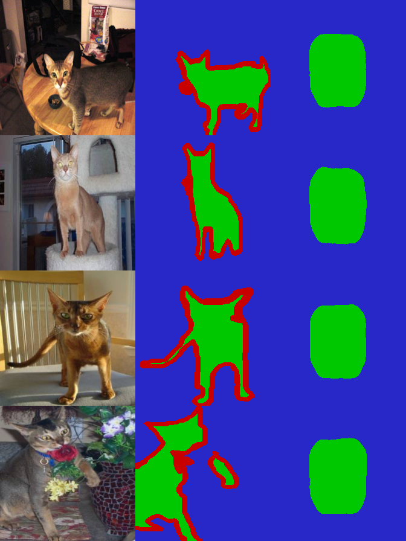
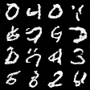
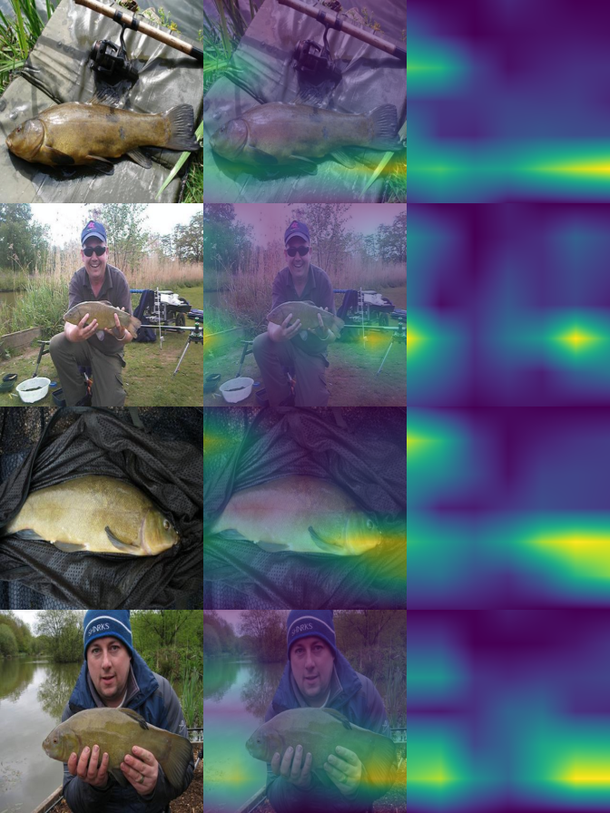
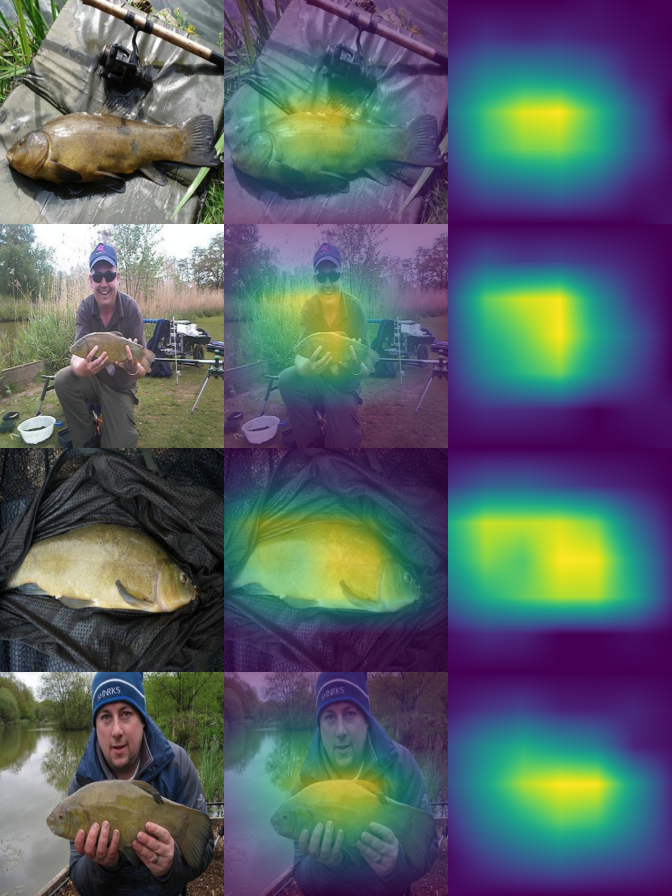

# Demos

Trainers and inference exes that ride on top of the chapter-aligned
classification stack. Top-level `Main*Train.lean` files are the
chapters themselves (MLP, CNN, ResNet, MobileNet, EfficientNet,
ConvNeXt, ViT); these demos extend the framework into adjacent
domains — segmentation, generative models, language modeling,
explainability — without changing the underlying codegen path.

Build any of these with `lake exe <name>` after the relevant
chapter trainer has produced its checkpoint.

---

## UNet — image segmentation

Encoder-decoder UNet on Oxford-IIIT Pets, 224×224 RGB → 3-class
trimap (foreground / background / boundary). 7.76M params; the
new primitives are bilinear upsample (forward + VJP + codegen)
and channel concat.

`MainUnetPetsTrain.lean`, `MainAutoencoderPetsTrain.lean`,
`MainPetsPredict.lean`. See `planning/unet_demo.md`.

```bash
lake exe unet-pets-train
lake exe pets-predict           # uses the trained checkpoint
```

Sample output (input | ground-truth mask | predicted mask, 4 val
images stacked):



Foreground (animal) green, background blue, boundary red. The
predicted mask matches the ground truth pretty closely after
~50 epochs of training.

---

## DDPM — diffusion generative models

Denoising Diffusion Probabilistic Models on MNIST and CIFAR-10.
Tiny UNets predict ε(x_t, t); reverse process via DDIM (η=0).
Cosine α schedule, time conditioning via tiled `t/T_max` channel.

`MainMnistDdpmTrain.lean` + `Sample`, `MainCifarDdpmTrain.lean` +
`Sample`. See `planning/ddpm_demo.md`.

### MNIST (tiny UNet, base 16, 50 epochs)

```bash
lake exe mnist-ddpm-train data 50
lake exe mnist-ddpm-sample runs/mnist_samples.ppm
```



64 digits sampled from N(0, I) noise. Recognizable 0–9 digits
emerge after ~50 epochs of training; the tile-channel time
conditioning is enough for legibility on this dataset.

### CIFAR-10 (base 80, 70 epochs)

```bash
lake exe cifar-ddpm-train data 70
lake exe cifar-ddpm-sample runs/cifar_samples.ppm
```


16 images sampled from noise. Recognizable cars, birds, animals,
some scenes — soft and CIFAR-resolution-blurry, but the
categories are visible. ~7 hours of training on rocm gfx1100.

A bottleneck-attention variant (`cifar-ddpm-attn-train`) and a
sincos-time-embedding variant (`cifar-ddpm-sincos-train`) ship
the codegen primitives but did not improve sample quality at
this training budget — see "Phase 3 partial" in
`planning/ddpm_demo.md` for the full negative-result writeup.

---

## TinyGPT — character-level language model

Char-level transformer on Karpathy's tinyshakespeare. Three new
codegen primitives shipped to support it:

- `tokenPositionEmbed` (one-hot → embed + learnable position)
- `lmHead` (per-position dense + reshape into `useSeg` loss path)
- `causalMask` flag on `transformerEncoder`

212K params (T=64, D=64, 4 layers, 2 heads). Trains in ~11 min on
gfx1100 for 10K Adam steps. See `planning/tinygpt_demo.md`.

```bash
./download_shakespeare.sh             # downloads tinyshakespeare.txt
python3 preprocess_shakespeare.py     # builds train.bin / val.bin / vocab.txt
lake exe tinygpt-shakespeare train    # trains, saves params
lake exe tinygpt-shakespeare sample 600 80 "ROMEO:"
```

Sample output after 10K steps (loss 1.45 nats/char ≈ 2.10 bits/char):

```text
ROMEO:
I prately I head.

LORD CAY:
God the goodness hath storn, so given to my love
To request and of the faces; with sun
Do not only to witness musrer Claudio.

POMPEY:
Alack, perpeal to amend my heart desires,
That one you to thine more, would I know,
And spuress and the seals destaint in heirs;
is more news, that she now to Lamentio.

KING RICHARD III:
What all strangthes me not I am not me:
To hich dost Grey, If thou know me not to such ounts?
```

Real Shakespeare character names (KING RICHARD III, KING HENRY
VI, ISABELLA, POMPEY, PRINCE, ROMEO), reference to Claudio (from
*Measure for Measure*), coherent multi-line dialog with proper
cadence and punctuation. Semantic coherence drops past the 64-char
context window — exactly what the planning doc predicted.

A `bigram-shakespeare` baseline (single dense V→V predicting next
char given current char) also lives here as a smoke test that the
data pipeline + sampler work end-to-end without the transformer.

---

## GradCAM — explainability

Class Activation Maps via Zhou-2016's closed form for any spec
ending in `globalAvgPool → dense`. No backward pass needed —
the per-channel weight is just `dense_W[c, k]`. Compiles a
`forward_cam` vmfb that returns the pre-GAP feature map flat
(via the `stopAtGAP` flag in the codegen), then computes the
heatmap in C: `heat[i,j] = ReLU(Σ_k W[k, tgt] · A[k, i, j])`,
bilinear-upsamples to image resolution, and overlays.

`MainGradCAM.lean`. See `planning/gradcam.md`.

```bash
lake exe gradcam convnext 16   # 16 imagenette val images via ConvNeXt-T
lake exe gradcam r34 16        # same images via ResNet-34
```

ConvNeXt-T attention (input | overlay | heatmap, 4 images):



ResNet-34 attention on the same 4 images:



The contrast is the story: ConvNeXt-T's attention is diffuse —
it lights up on the fish *and* the angler; ResNet-34's is sharply
focal and locks onto the fish body. Same input, different "what
each network sees" — a real architectural difference rendered
visible.

---

## Inspect — checkpoint diagnostics

`MainInspectConvNeXt.lean` runs the eval forward over the full
Imagenette val set against a trained ConvNeXt-T checkpoint and
prints per-class accuracy, prediction histogram, and first-batch
logit stats. Useful when a training run "looks fine in MSE" but
you want to confirm the model isn't degenerate (always-one-class,
saturated logits, etc.) — built when one of our ConvNeXt runs
collapsed and we needed to dig in.

```bash
lake exe inspect-convnext
```

---

## Layout

```
demos/
├── README.md                              # this file
├── figures/                               # rendered outputs for the README
├── MainUnetPetsTrain.lean                 # UNet segmentation trainer
├── MainAutoencoderPetsTrain.lean          # plain autoencoder baseline (no skips)
├── MainPetsPredict.lean                   # render predicted masks from checkpoint
├── MainMnistDdpmTrain.lean / Sample       # DDPM on MNIST
├── MainCifarDdpmTrain.lean  / Sample      # DDPM on CIFAR-10
├── MainCifarDdpmAttnTrain.lean / Sample   # bottleneck-attention variant (codegen ✓, recipe ✗)
├── MainCifarDdpmSincosTrain.lean / Sample # sincos t-embed variant (small negative)
├── MainTinyGptShakespeare.lean            # char-level transformer
├── MainBigramShakespeare.lean             # bigram baseline (validates data pipeline)
├── MainGradCAM.lean                       # closed-form CAM for GAP+dense networks
└── MainInspectConvNeXt.lean               # checkpoint diagnostics
```

Per-demo planning docs live in `planning/` at the repo root.
