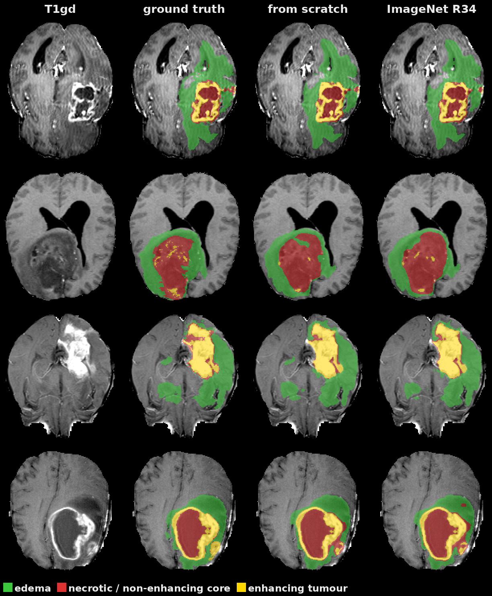
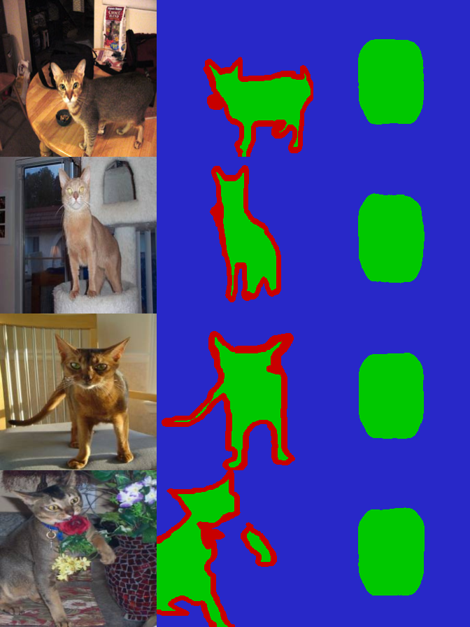
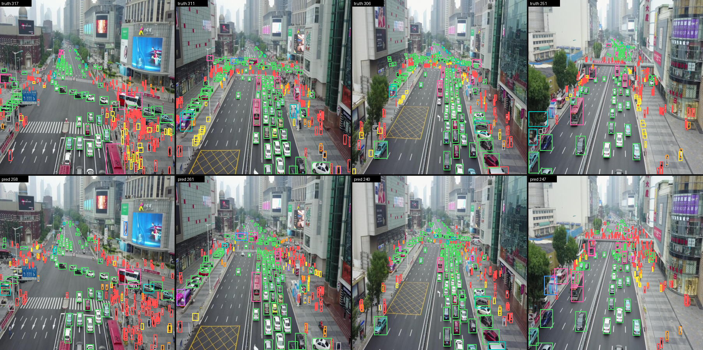
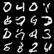
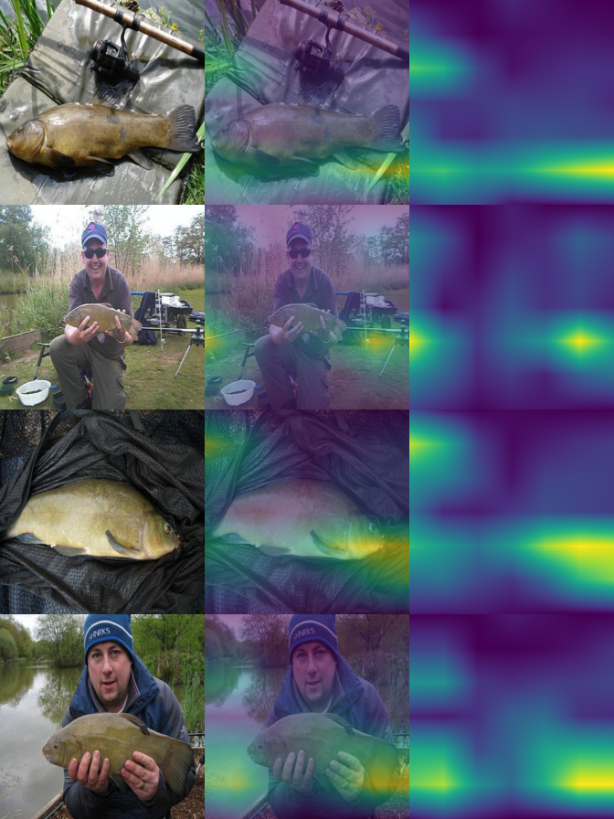
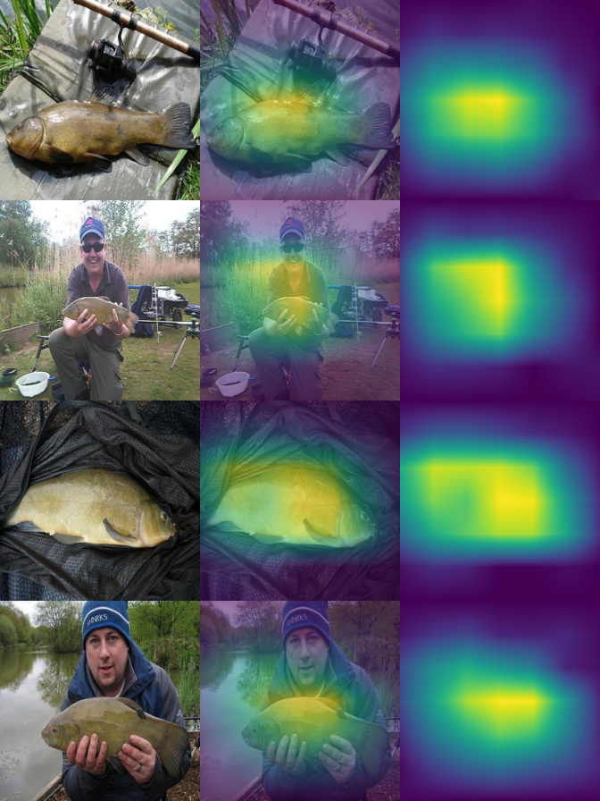

# Demos

Trainers and inference exes that ride on top of the chapter-aligned
classification stack. Top-level `Main*Train.lean` files are the
chapters themselves (MLP, CNN, ResNet, MobileNet, EfficientNet,
ConvNeXt, ViT); these demos extend the framework into adjacent
domains — segmentation, generative models, language modeling,
explainability — without changing the underlying codegen path.

Build any of these with `lake exe <name>` after the relevant
chapter trainer has produced its checkpoint.

---

## ResNet-34 UNet — brain-tumour segmentation (BraTS)

The segmentation demo. A ResNet-34 encoder (the Ch-5 architecture, reused
verbatim as the contracting path) + a UNet decoder, on MSD Task01_BrainTumour:
224×224 axial slices, 4 co-registered MRI modalities (FLAIR / T1w / T1gd / T2w)
→ 4 tumour classes. 24.5M params, plain per-pixel CE, 10 epochs.

`MainUnetBratsR34.lean`, `MainBratsPredict.lean`. See
`planning/r34_brats_retrain.md`.

```bash
./download_brats.sh
python3 preprocess_brats.py data/brats/Task01_BrainTumour data/brats224 \
        --size 224 --seed 0            # same patient split as data/brats
./scripts/run_brats_r34_ab.sh 10 data/brats224 # both arms, one per GPU
lake exe brats-predict net=r34 arm=scratch,r34 out.ppm
```

| arm | mIoU | WT | TC | ET |
|---|---|---|---|---|
| `r34` (ImageNet bootstrap) | 0.742 | 0.911 | 0.870 | 0.858 |
| `scratch` (He-init) | 0.740 | 0.910 | 0.869 | 0.856 |



`T1gd | ground truth | +scratch | +r34`. Edema green, non-enhancing/necrotic
core red, enhancing tumour yellow — the yellow rim around a red core is a
textbook ring-enhancing glioblastoma.

**Two things this demo measures, and they are not the same size.**

*Skips are worth ~10 points.* Same backbone and schedule, decoder with and
without the encoder concat: **0.635 → 0.740 mIoU**, the largest gain on ET
(+0.12), the thinnest structure — a skipless decoder has to rebuild every
boundary from a 7×7 bottleneck. Run the ablation with `noskip`.

*Transfer buys one epoch, not a better model.* The two arms differ in exactly
one field (`bootstrapBackboneRange`), so 86.8% of params start pretrained vs
random and everything else is identical. At **epoch 1** the bootstrapped arm is
already at ET Dice 0.818 while the control sits at 0.184, still collapsed on
the hard classes. By epoch 2 the control has caught up, and the peaks above are
a tie (+0.002, noise at n=1). The honest claim is sample-efficiency: same
quality, one epoch sooner. Transfer's payoff scales inversely with dataset
size, and 14,415 slices is a lot — a data-fraction sweep is the experiment that
would show it properly.

The backbone is `.lake/build/jax_r34_imagenet.bin`, trained by this stack on
ImageNet to 72% top-1. Nothing is downloaded. Its stem is 3-channel RGB and
BraTS needs 4, so the transferable weights are not a prefix — hence
`bootstrapBackboneRange`, which patches a byte *range* and leaves the fresh
stem He-init. It self-checks on every run: the patched window must be
byte-equal to the checkpoint and the stem must be untouched, or it throws.

---

## UNet — earlier segmentation demos

`MainUnetPetsTrain.lean` / `MainPetsPredict.lean` — encoder-decoder UNet on
Oxford-IIIT Pets, 224×224 RGB → 3-class trimap, 7.76M params. This is where
the two seg primitives came from: bilinear upsample (forward + VJP) and channel
concat, exposed as `.unetDown` / `.unetUp`.

`MainUnetBratsTrain.lean` — a from-scratch UNet on BraTS at native 240×240.

```bash
lake exe unet-pets-train && lake exe pets-predict
lake exe unet-brats-train data/brats 10 ce
```



> **Correction.** This section used to carry a long loss-design ablation —
> CE collapsing onto background, Dice failing to rescue it, weighted-CE
> over-predicting, and a wcesqrt+cos+pb+aug "fix". **That analysis was void.**
> The collapse it was built on was a *data* bug, not a property of the loss:
> the shuffle permuted images by record and labels by 4 bytes, so image *k* was
> trained against another slice's mask (fixed in `ca83835`). Post-fix, plain
> per-pixel CE segments at epoch 1 — mIoU ~0.69, WT/TC/ET 0.875/0.813/0.837,
> every tumour class off the floor. The figures `brats_ce_vs_wce.png` and
> `brats_aug_result.png` are kept only as a record of the wrong turn. The
> lesson worth keeping is the one that generalizes: a silent data-pairing bug
> is indistinguishable from a hard learning problem, and we spent a chapter
> theorizing about the latter.

---

## FPN detector — object detection on VisDrone

Multi-scale detection on real drone-altitude imagery. A ResNet-34 backbone
(trained by this stack on ImageNet) feeds an FPN top-down neck into three
anchor heads at strides 8/16/32, with a DIoU box loss, focal objectness and
class-weighted CE. 448 px input, 10 VisDrone classes.

VisDrone is the point: a median image holds **70 objects** and many are 2–5 px
after the resize, which is the regime where a single coarse grid structurally
cannot work and multi-scale detection stops being decoration.

`MainYolov1VisdroneFpn.lean`. See `planning/visdrone_detector.md`.

```bash
./download_visdrone.sh
# ⚠ write the anchor priors from the values hardcoded in the demo — do NOT
# re-run k-means, or encoder and model silently disagree
python3 preprocess_visdrone.py data/visdrone data/visdrone_fpn \
    --size 448 --grid 14 --fpn data/visdrone
python3 preprocess_visdrone.py data/visdrone data/visdrone448 --size 448 --grid 14

CUDA_VISIBLE_DEVICES=0 FPN_TAG=run1 lake exe yolov1-visdrone-fpn data/visdrone_fpn
CUDA_VISIBLE_DEVICES=0 FPN_TAG=run1 lake exe yolov1-visdrone-fpn \
    infer data/visdrone_fpn runs/fpn_run1
python3 scripts/yolo_map_visdrone.py runs/fpn_run1/logits.bin \
    data/visdrone448/val.bin --grid 14 --fpn data/visdrone
python3 scripts/fpn_render.py runs/fpn_run1/logits.bin data/visdrone_fpn/val.bin \
    --fpn data/visdrone --gt data/visdrone448/val.full_gt.bin \
    --out demos/figures/visdrone_fpn.png
```

⚠ `FPN_TAG` must be set on `infer` too. Without it the eval silently loads a
different arm's weights, and the only tell is an epoch sweep whose rows are
identical. It cost this thread a full day once.

Knobs: `FPN_BACKBONE` (`r34` / `r50`), `FPN_AUG`, `FPN_EPOCHS`, `FPN_TOWER`,
`FPN_NOBOOTSTRAP`.



Truth on top, prediction below, on the four densest val frames. **mAP@0.5 =
0.1526** at 12 epochs — 99.6% of a hand-written PyTorch replica of this same
architecture (0.1532), and 65 fps on one RTX 4060 Ti. A YOLOv8s at the same
budget scores 0.140; its published-style 0.391 comes from 8× the epochs, higher
resolution and full augmentation, so that gap is recipe rather than architecture.

The lesson is in the per-class split rather than the mean: car reaches 0.573
while bicycle sits at 0.015, a 38× spread. Detection on aerial imagery does not
degrade uniformly — it collapses on whatever is small *and* rare, and an
averaged mAP hides exactly that.

---

## DDPM — diffusion generative models

Denoising Diffusion Probabilistic Models on MNIST and CIFAR-10.
Tiny UNets predict ε(x_t, t); reverse process via DDIM (η=0).
Cosine α schedule, time conditioning via tiled `t/T_max` channel.

`MainMnistDdpmTrain.lean` + `Sample`, `MainCifarDdpmTrain.lean` +
`Sample`. See `planning/ddpm_demo.md`.

### MNIST (tiny UNet, base 16, 50 epochs)

```bash
lake exe mnist-ddpm-train data 50
lake exe mnist-ddpm-sample runs/mnist_samples.ppm
```



64 digits sampled from N(0, I) noise. Recognizable 0–9 digits
emerge after ~50 epochs of training; the tile-channel time
conditioning is enough for legibility on this dataset.

### CIFAR-10 (base 80, 70 epochs)

```bash
lake exe cifar-ddpm-train data 70
lake exe cifar-ddpm-sample runs/cifar_samples.ppm
```


16 images sampled from noise. Recognizable cars, birds, animals,
some scenes — soft and CIFAR-resolution-blurry, but the
categories are visible. ~7 hours of training on rocm gfx1100.

A bottleneck-attention variant (`cifar-ddpm-attn-train`) and a
sincos-time-embedding variant (`cifar-ddpm-sincos-train`) ship
the codegen primitives but did not improve sample quality at
this training budget — see "Phase 3 partial" in
`planning/ddpm_demo.md` for the full negative-result writeup.
Each has a matching sampler — `cifar-ddpm-attn-sample` and
`cifar-ddpm-sincos-sample` — taking the same optional output-path
argument as `cifar-ddpm-sample` (default
`runs/2026-05-07-cifar-ddpm/samples.ppm`), if you want to see the
negative result rather than read about it.

---

## TinyGPT — character-level language model

Char-level transformer on Karpathy's tinyshakespeare. Three new
codegen primitives shipped to support it:

- `tokenPositionEmbed` (one-hot → embed + learnable position)
- `lmHead` (per-position dense + reshape into `useSeg` loss path)
- `causalMask` flag on `transformerEncoder`

212K params (T=64, D=64, 4 layers, 2 heads). Trains in ~11 min on
gfx1100 for 10K Adam steps. See `planning/tinygpt_demo.md`.

```bash
./download_shakespeare.sh             # downloads tinyshakespeare.txt
python3 preprocess_shakespeare.py     # builds train.bin / val.bin / vocab.txt
lake exe tinygpt-shakespeare train    # trains, saves params
lake exe tinygpt-shakespeare sample 600 80 "ROMEO:"
```

Sample output after 10K steps (loss 1.45 nats/char ≈ 2.10 bits/char):

```text
ROMEO:
I prately I head.

LORD CAY:
God the goodness hath storn, so given to my love
To request and of the faces; with sun
Do not only to witness musrer Claudio.

POMPEY:
Alack, perpeal to amend my heart desires,
That one you to thine more, would I know,
And spuress and the seals destaint in heirs;
is more news, that she now to Lamentio.

KING RICHARD III:
What all strangthes me not I am not me:
To hich dost Grey, If thou know me not to such ounts?
```

Real Shakespeare character names (KING RICHARD III, KING HENRY
VI, ISABELLA, POMPEY, PRINCE, ROMEO), reference to Claudio (from
*Measure for Measure*), coherent multi-line dialog with proper
cadence and punctuation. Semantic coherence drops past the 64-char
context window — exactly what the planning doc predicted.

A `bigram-shakespeare` baseline (single dense V→V predicting next
char given current char) also lives here as a smoke test that the
data pipeline + sampler work end-to-end without the transformer.

---

## GradCAM — explainability

Class Activation Maps via Zhou-2016's closed form for any spec
ending in `globalAvgPool → dense`. No backward pass needed —
the per-channel weight is just `dense_W[c, k]`. Compiles a
`forward_cam` vmfb that returns the pre-GAP feature map flat
(via the `stopAtGAP` flag in the codegen), then computes the
heatmap in C: `heat[i,j] = ReLU(Σ_k W[k, tgt] · A[k, i, j])`,
bilinear-upsamples to image resolution, and overlays.

`MainGradCAM.lean`. See `planning/gradcam.md`.

```bash
lake exe gradcam convnext 16   # 16 imagenette val images via ConvNeXt-T
lake exe gradcam r34 16        # same images via ResNet-34
```

ConvNeXt-T attention (input | overlay | heatmap, 4 images):



ResNet-34 attention on the same 4 images:



The contrast is the story: ConvNeXt-T's attention is diffuse —
it lights up on the fish *and* the angler; ResNet-34's is sharply
focal and locks onto the fish body. Same input, different "what
each network sees" — a real architectural difference rendered
visible.

---

## Inspect — checkpoint diagnostics

`MainInspectConvNeXt.lean` runs the eval forward over the full
Imagenette val set against a trained ConvNeXt-T checkpoint and
prints per-class accuracy, prediction histogram, and first-batch
logit stats. Useful when a training run "looks fine in MSE" but
you want to confirm the model isn't degenerate (always-one-class,
saturated logits, etc.) — built when one of our ConvNeXt runs
collapsed and we needed to dig in.

```bash
lake exe inspect-convnext
```

---

## Layout

```
demos/
├── README.md                              # this file
├── figures/                               # rendered outputs for the README
├── MainUnetPetsTrain.lean                 # UNet segmentation trainer
├── MainAutoencoderPetsTrain.lean          # plain autoencoder baseline (no skips)
├── MainPetsPredict.lean                   # render predicted masks from checkpoint
├── MainYolov1VisdroneFpn.lean             # FPN multi-scale detector (VisDrone) + infer
├── MainYolov1PetsTrainBootstrap.lean      # ⛔ retired: YOLOv1 Pets, superseded by VisDrone
├── MainYolov1PetsInfer.lean               # ⛔ retired: Pets detection dump
├── MainMnistDdpmTrain.lean / Sample       # DDPM on MNIST
├── MainCifarDdpmTrain.lean  / Sample      # DDPM on CIFAR-10
├── MainCifarDdpmAttnTrain.lean / Sample   # bottleneck-attention variant (codegen ✓, recipe ✗)
├── MainCifarDdpmSincosTrain.lean / Sample # sincos t-embed variant (small negative)
├── MainTinyGptShakespeare.lean            # char-level transformer
├── MainBigramShakespeare.lean             # bigram baseline (validates data pipeline)
├── MainGradCAM.lean                       # closed-form CAM for GAP+dense networks
└── MainInspectConvNeXt.lean               # checkpoint diagnostics
```

Per-demo planning docs live in `planning/` at the repo root.
