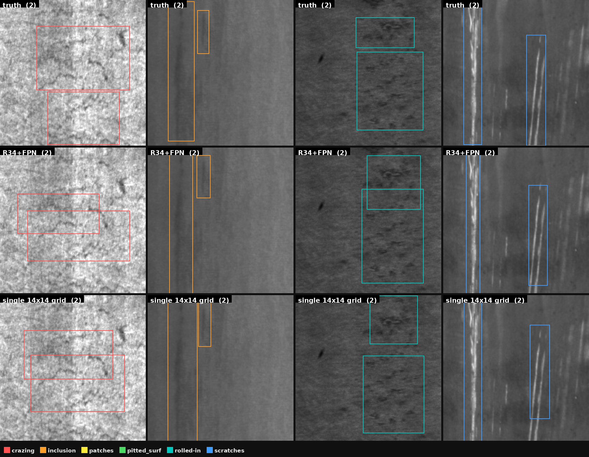
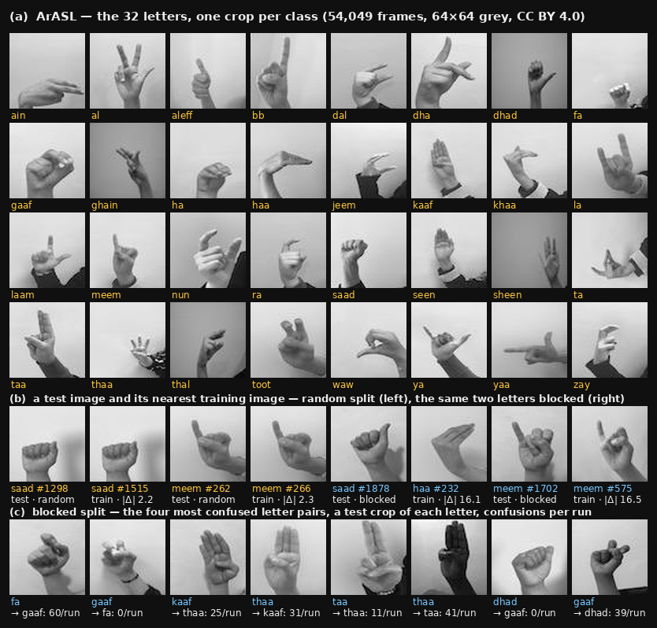
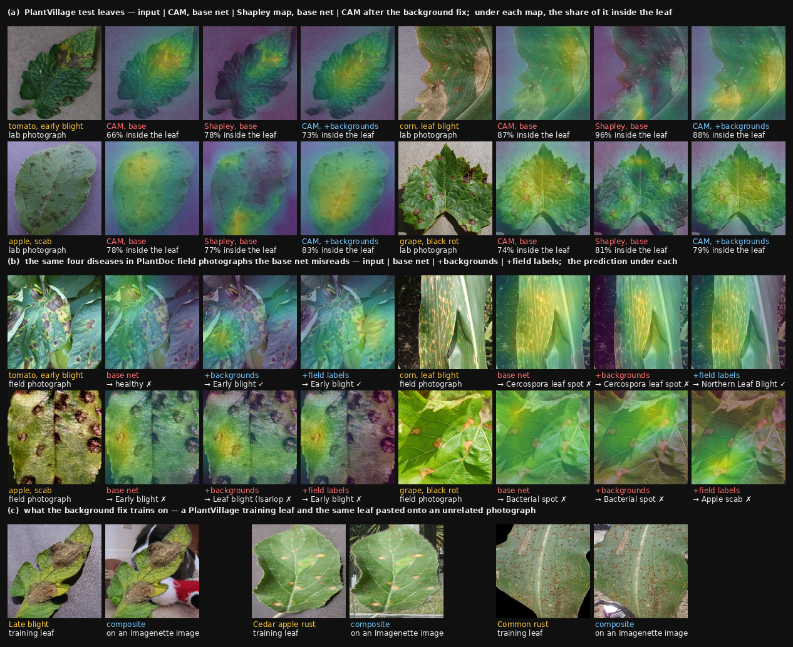
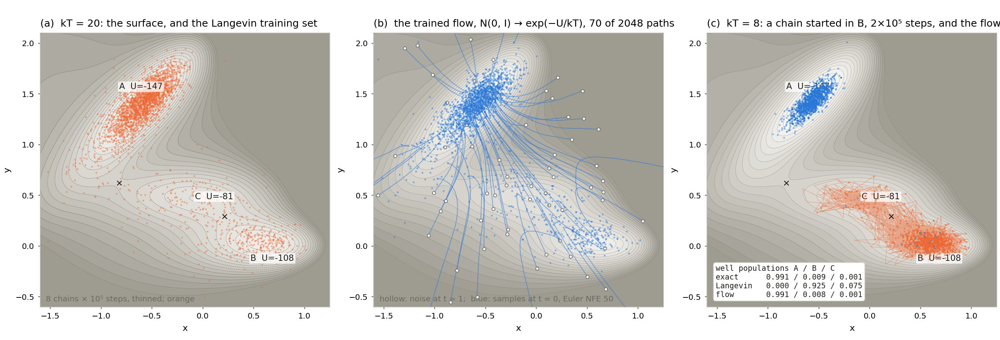
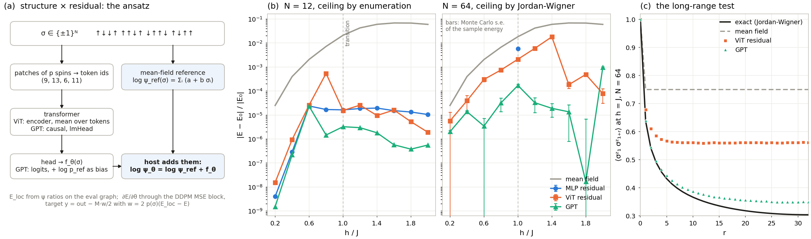

# Demos

Trainers and inference exes that ride on top of the chapter-aligned
classification stack. Top-level `Main*Train.lean` files are the
chapters themselves (MLP, CNN, ResNet, MobileNet, EfficientNet,
ConvNeXt, ViT); these demos extend the framework into adjacent
domains — segmentation, generative models, language modeling,
explainability — without changing the underlying codegen path.

Build any of these with `lake exe <name>` after the relevant
chapter trainer has produced its checkpoint.

---

## ResNet-34 UNet — brain-tumour segmentation (BraTS)

The segmentation demo. A ResNet-34 encoder (the Ch-5 architecture, reused
verbatim as the contracting path) + a UNet decoder, on MSD Task01_BrainTumour:
224×224 axial slices, 4 co-registered MRI modalities (FLAIR / T1w / T1gd / T2w)
→ 4 tumour classes. 24.5M params, plain per-pixel CE, 10 epochs.

`MainUnetBratsR34.lean`, `MainBratsPredict.lean`. See
`planning/archive/r34_brats_retrain.md`.

```bash
./download_brats.sh
python3 preprocess_brats.py data/brats/Task01_BrainTumour data/brats224 \
        --size 224 --seed 0            # same patient split as data/brats
./scripts/run_brats_r34_ab.sh 10 data/brats224 # both arms, one per GPU
lake exe brats-predict net=r34 arm=scratch,r34 out.ppm
```

| arm | mIoU | WT | TC | ET |
|---|---|---|---|---|
| `r34` (ImageNet bootstrap) | 0.742 | 0.911 | 0.870 | 0.858 |
| `scratch` (He-init) | 0.740 | 0.910 | 0.869 | 0.856 |


`T1gd | ground truth | +scratch | +r34`. Edema green, non-enhancing/necrotic
core red, enhancing tumour yellow — the yellow rim around a red core is a
textbook ring-enhancing glioblastoma.

**Two things this demo measures, and they are not the same size.**

*Skips are worth ~10 points.* Same backbone and schedule, decoder with and
without the encoder concat: **0.635 → 0.740 mIoU**, the largest gain on ET
(+0.12), the thinnest structure — a skipless decoder has to rebuild every
boundary from a 7×7 bottleneck. Run the ablation with `noskip`.

*Transfer buys one epoch, not a better model.* The two arms differ in exactly
one field (`bootstrapBackboneRange`), so 86.8% of params start pretrained vs
random and everything else is identical. At **epoch 1** the bootstrapped arm is
already at ET Dice 0.818 while the control sits at 0.184, still collapsed on
the hard classes. By epoch 2 the control has caught up, and the peaks above are
a tie (+0.002, noise at n=1). The honest claim is sample-efficiency: same
quality, one epoch sooner. Transfer's payoff scales inversely with dataset
size, and 14,415 slices is a lot — a data-fraction sweep is the experiment that
would show it properly.

The backbone is `.lake/build/jax_r34_imagenet.bin`, trained by this stack on
ImageNet to 72% top-1. Nothing is downloaded. Its stem is 3-channel RGB and
BraTS needs 4, so the transferable weights are not a prefix — hence
`bootstrapBackboneRange`, which patches a byte *range* and leaves the fresh
stem He-init. It self-checks on every run: the patched window must be
byte-equal to the checkpoint and the stem must be untouched, or it throws.

---

## FPN detector — object detection on VisDrone

Multi-scale detection on real drone-altitude imagery, and the best demo in this
repo for showing what the stack does end to end: a ResNet-34 backbone **trained
by this stack on ImageNet** feeds an FPN top-down neck into three anchor heads at
strides 8/16/32, with a DIoU box loss, focal objectness and focal class CE.
448 px input, 10 VisDrone classes.

VisDrone is the point: a median image holds **70 objects** and many are 2–5 px
after the resize, which is the regime where a single coarse grid structurally
cannot work and multi-scale detection stops being decoration.

`MainYolov1VisdroneFpn.lean`. See `planning/archive/visdrone_detector.md`.

```bash
./download_visdrone.sh
# ⚠ write the anchor priors from the values hardcoded in the demo — do NOT
# re-run k-means, or encoder and model silently disagree
python3 preprocess_visdrone.py data/visdrone data/visdrone_fpn \
    --size 448 --grid 14 --fpn data/visdrone
python3 preprocess_visdrone.py data/visdrone data/visdrone448 --size 448 --grid 14

# the current best recipe — ~2 h on one RTX 4060 Ti
CUDA_VISIBLE_DEVICES=0 FPN_BACKBONE=r34 FPN_TAG=run1 \
  FPN_AUG=1 FPN_CLSW=none FPN_CLSFOCAL=2 FPN_AFFINE=50 FPN_EPOCHS=30 \
  lake exe yolov1-visdrone-fpn data/visdrone_fpn

CUDA_VISIBLE_DEVICES=0 FPN_BACKBONE=r34 FPN_TAG=run1 \
  lake exe yolov1-visdrone-fpn infer data/visdrone_fpn runs/fpn_run1

python3 scripts/yolo_map_visdrone.py runs/fpn_run1/logits.bin \
    data/visdrone448/val.bin --fpn data/visdrone --grid 14 \
    --multilabel --topk 3000 --ml-k 3 --ml-floor 0.05

python3 scripts/fpn_render.py runs/fpn_run1/logits.bin data/visdrone_fpn/val.bin \
    --gt data/visdrone448/val.full_gt.bin --diverse --scale 2 --topk-per-gt \
    --layout cols --n 4 --out demos/figures/visdrone_fpn.png
```

⚠ Three flags that fail *silently* rather than loudly:
- **`FPN_TAG` must be set on `infer` too.** Without it the eval loads a different
  arm's weights, and the only tell is an epoch sweep whose rows are identical.
- **`FPN_BACKBONE` defaults to `r50`, not `r34`** — omit it and you train a
  different arm than the one these numbers come from.
- **`--topk` defaults to 1000**, which truncates the multilabel candidate list.
  The same checkpoint reads 0.1919 instead of 0.1961 at the default.

Knobs: `FPN_BACKBONE` (`r34`/`r50`), `FPN_AUG`, `FPN_AFFINE` (percent probability
of the box-aware scale/translate transform), `FPN_CLSW`, `FPN_CLSFOCAL`,
`FPN_EPOCHS`, `FPN_TOWER`, `FPN_NOBOOTSTRAP`.


Truth on top, prediction below, on four val frames. **mAP@0.5 = 0.2363**
(recall 0.769, class-agnostic AP 0.487) at 30 epochs, and 65 fps on one RTX
4060 Ti — or **35.7 fps on a 25 W Jetson Orin Nano** under TensorRT fp16, which
is the deployment this dataset implies. That beats a hand-written PyTorch replica
of this same architecture (0.1532) by **54%**.

⚠ Frames are picked with `--diverse`. Picking the *densest* frames selects
consecutive frames of one VisDrone sequence — val records are video — so the
figure ends up showing a single street corner four times.

⭐ **Augmentation and schedule length are one decision, not two.** At 50 epochs
*without* augmentation the same arm scores 0.1243 — worse than 12 epochs
(0.1526), with half the train loss: ordinary overfitting on 6,471 images.
Photometric augmentation recovers it, but at that strength 12 epochs still beats
50 (0.1961 vs 0.1674). Augmentation that changes object **scale** inverts the
ordering again, making 30 epochs worth 44% more than 12. A stronger augmentation
needs a longer schedule to absorb it, so the optimum epoch count is a property of
the augmentation pack — there is no schedule to tune once and carry across packs.

⭐ **The result is in the per-class split, not the mean.** Per-class AP runs from
car (0.685) to bicycle (0.036), and scale augmentation narrowed that spread from
43× to 19× by lifting exactly the classes that were worst: awning-tricycle +59%,
bicycle +41%, tricycle +40%, against car's +7%. Reweighting the loss toward rare
classes buys their recall at the expense of precision, and average precision
charges for the trade; supplying the scales those classes are missing raises both
at once. Detection on aerial imagery does not degrade uniformly — it collapses on
whatever is small *and* rare, and an averaged mAP hides exactly that.


The same frames coloured by **correctness** rather than class — green hit, red
false positive, yellow missed ground truth — with the 30-epoch arm on the left
and the 12-epoch one on the right. Read the per-frame counts in the labels: the
gain on any single dense frame is a few boxes, because most of the improvement is
rare-class ranking spread across all 548 val images and no one frame displays it.

A YOLOv8s at the same budget scores 0.140; its published-style 0.391 comes from
8× the epochs, higher resolution, full augmentation and COCO pretraining, so that
gap is recipe rather than architecture — and scale augmentation alone has closed
31% of it.

---

## Industrial inspection — the same detector on NEU-DET steel defects

The VisDrone detector above, unchanged — backbone, neck, heads, loss, bootstrap,
scorer — on the dataset the industrial-inspection literature reports on:
NEU-DET, 1,800 grayscale 200×200 crops of hot-rolled steel, six defect classes,
Pascal-VOC boxes. It is VisDrone's opposite regime: **2.3 defects per crop,
half of them spanning more than half the frame**, against seventy 20-px cars
per drone frame. 98% of NEU's boxes route to the coarsest level, so this is the
dataset on which a single 14×14 grid should *not* collapse — and running the
two heads on both datasets is what shows when multi-scale detection pays.

`MainYolov1NeuDetFpn.lean` (FPN) and `MainYolov1NeuDet448.lean` (single grid).
See `planning/neu_det_fpn_demo.md` and `runs/2026-09-17-neudet-fpn-run1/README.md`.

```bash
./download_neu.sh            # maintainer's Drive copy, 26 MB; fits anchors; writes both record formats

# the FPN arm — the 0.2363 recipe's flags are this binary's DEFAULTS; ~25 min on one 4060 Ti
CUDA_VISIBLE_DEVICES=0 FPN_TAG=run1 lake exe yolov1-neudet-fpn data/neu_det_fpn
# the single-grid arm beside it, same epochs
CUDA_VISIBLE_DEVICES=1 YOLO_TAG=run1 YOLO_EPOCHS=30 lake exe yolov1-neudet448 data/neu_det448

# every saved epoch, inferred and scored (VisDrone protocol + the plain argmax check)
scripts/neudet_eval_sweep.sh fpn  run1 0 val
scripts/neudet_eval_sweep.sh grid run1 1 val
scripts/neudet_eval_sweep.sh fpn  run1 0 test "28"      # the table's row, at the val-peak epoch

python3 scripts/fpn_render.py runs/2026-09-17-neudet-fpn-run1-sweep/e30_val/logits.bin \
    data/neu_det_fpn/val.bin --fpn data/neu_det --gt data/neu_det448/val.full_gt.bin \
    --classes neu --compare-grid runs/2026-09-17-neudet-grid-run1-sweep/e30_val/logits.bin \
    --indices 33,87,267,327 --topk-per-gt --layout cols --out demos/figures/neudet_fpn.png
```

What changed against the VisDrone binary: the anchor priors (k-means on NEU
boxes, `scripts/neu_anchors.py`), the class weights (off — 300 crops per class),
and six classes in ids 0–5 of the ten-slot one-hot (the 5+10 per-anchor width is
baked into the `fpnDetect` codegen; the scorer averages over classes present).
Defaults are the measured recipe, so `FPN_BACKBONE` is `r34` and `FPN_CLSW` is
`none` here. `FPN_TAG` still has to be set on `infer`; `FPN_EVAL_SPLIT=test` and
`FPN_EVAL_EPOCH=N` pick the split and the checkpoint.



Truth / R34+FPN / single 14×14 grid on a crazing, inclusion, rolled-in-scale and
scratches crop. **NEU-DET test (360 images), at each arm's val-peak epoch:**

| arm | mAP@0.5 | recall | class-agnostic AP |
|---|---|---|---|
| **R34+FPN**, VisDrone recipe (e28) | **0.623** | 0.992 | 0.625 |
| R34+FPN, HSV+hflip off (e30) | 0.630 | 0.987 | 0.640 |
| R34+FPN, no ImageNet bootstrap (e26) | 0.555 | 0.986 | 0.555 |
| **R34 single grid 14×14** (e28) | **0.607** | 0.917 | 0.609 |
| published stock detectors, 640 px, 300 ep | 0.73–0.78 | | |
| published improved variants | ~0.83 | | |

**The same two heads on VisDrone val** (548 images, uncapped GT): R34+FPN
**0.2363** / 0.769 / 0.487; single grid 14×14 **0.0391** / 0.184 / 0.107.

⭐ **On steel the grid head matches the FPN (0.61 vs 0.62); on drones it is six
times behind (0.04 vs 0.24, recall 0.18 vs 0.77).** Same backbone, bootstrap,
scorer and lowerer in all four cells. Multi-scale detection pays only where
objects are small; on NEU the neck runs three heads for one level's work.

⭐ Recall is 0.99 on NEU — the number is ranking, and it is two classes: crazing
(0.29) and rolled-in scale (0.41), the diffuse textures whose "box" is most of
the crop, worst for both heads and in every NEU paper. The ImageNet prefix is
worth +0.07 at 1,080 images. Photometric augmentation is within the n=1 noise
floor (+0.007). Both arms are still rising at e30 — 30 epochs here is 4,050
steps against VisDrone's 24,000 — and the gap to the published rows is
schedule, resolution and split before it is architecture.

The VisDrone single-grid row is `yolov1-visdrone448` (the archived 448/14 arm,
12 epochs) measured on the current data and lowerer:
`runs/2026-09-17-visdrone-grid448-remeasure/`.

---

## People watching — the chapter-4 CNN on Arabic sign-language letters, under two splits

Chapter 4's `CIFAR-CNN8-wide-BN` — one-channel stem, 32-way head, nothing else
changed — on ArASL: 54,049 grey 64×64 crops of hands spelling the 32 letters of
the Arabic alphabet (Latif et al. 2019, Mendeley `y7pckrw6z2`, CC BY 4.0), the
dataset the Arabic sign-language literature reports 96–99.6% on. The images
are **video bursts** (73.5% of consecutive files differ by under 6 grey levels;
14,336 chains of 3.8 frames) and the release records no signer, so the same
images are trained twice: under the literature's random split and under a
split that keeps each class's capture order together. The pair of numbers is
the demo; a leak audit (for every test image, the nearest training image) says
what each split did.

`MainAraslSigns.lean` (`lake exe arasl-signs`), copied from the GW demo's host
loop. See `planning/arasl_people_watching_demo.md` and `runs/2026-09-17-arasl/README.md`.

```bash
./download_arasl.sh          # Mendeley, URLs resolved from the public API, sha256-checked;
                             # writes both splits + census + chain statistic + leak audit

# the demo: the chapter net under each split, ~5 min per run on one 4060 Ti
CUDA_VISIBLE_DEVICES=0 lake exe arasl-signs net=cifar8w split=random  seed=1 tag=s1 out=runs/x
CUDA_VISIBLE_DEVICES=1 lake exe arasl-signs net=cifar8w split=blocked seed=1 tag=s1 out=runs/x
# the bracket: net=mlp | net=linear, and the chapter's own 32×32 input with size=32

# Wilson interval, leaked-vs-not accuracy, 1-NN floor, per class, confused pairs
python3 scripts/arasl_score.py runs/x/arasl_cifar8w_blocked_s{1,2,3}_logits_test.bin --split=blocked --top 8 --json runs/x/score.json
python3 scripts/arasl_figure.py --score runs/x/score.json --logits runs/x/arasl_cifar8w_blocked_s1_logits_test.bin
```



**ArASL test (80/10/10 per class), at the val-peak epoch, 3 seeds for the chapter net:**

| arm | random split | blocked split | |
|---|---|---|---|
| **CIFAR-CNN8-wide-BN**, 64×64 | **98.62** ± 0.10 | **77.94** ± 0.80 | the demo |
| — on test images with a near-duplicate in train | 99.73 | 98.46 | 92.3% / 6.4% of the test tenth |
| — on the rest | 85.26 | 76.53 | |
| CIFAR-CNN8-wide-BN at 32×32 | 98.21 | 71.03 | the chapter's own input |
| MLP 4096-512-512-32 | 94.86 | 42.09 | |
| linear 4096-32 | 53.20 | 15.37 | |
| 1-NN on 16×16 thumbnails | 95.65 | 28.60 | no parameters |
| published CNNs, random split | 96.6–97.6 | — | |
| published transfer / ViT, random split | 99.3–99.6 | — | |

⭐ **The published 96–99% is mostly the frame, not the hand.** Nine in ten
random-split test images have a training image within 6 grey levels; the net
is at 99.7% on those and 85.3% on the rest, and a parameter-free nearest-
neighbour lookup already gets 95.7%. Keep each hand's frames on one side of
the line and the same net, recipe and seeds score 77.9%.

⭐ The bracket loses more the less it can generalise: linear −38 points between
the columns, MLP −53, convolutions −21. Per class the blocked column runs 16.5%
(`fa`) to 100% (`sheen`); `fa`→`gaaf` 181 times in three runs, the reverse once.

⚠ The blocked split is a proxy, not a signer split: the val tenth is 37.5%
leaked (it neighbours train in capture order — hence val ≈ 92%, test ≈ 78% in
every blocked log) and 6% of test hands return from earlier in the numbering.

## Agriculture — chapter 6's ResNet-34 from lab leaves to field leaves

Chapter 6's ResNet-34 from the ImageNet prefix (the BraTS/VisDrone/NEU bootstrap),
with a 38-way head, on **PlantVillage** — 54,305 lab photographs of single picked
leaves on a grey background, the dataset the agriculture literature reports on most
(Mohanty et al. 2016, CC BY-SA 3.0) — and then, with the same weights, on
**PlantDoc** — 2,578 field photographs of the same crops, 28 classes that all map
into PlantVillage's 38 (Singh et al. 2020, CC BY 4.0). The lab number reproduces;
the field number is the demo. Three explainers say where the evidence was: the
closed-form CAM, an exact two-player Shapley value (leaf vs background, four
forward passes per image, efficiency to the float), and the counterfactuals
themselves — the same leaves on black, on their own background colour, the
background alone, a flat colour. Then three fixes, each scored on the same 2,578
field images.

`MainPlantLeaf.lean` (`lake exe plant-leaf`), `scripts/plant_score.py`,
`scripts/plant_shapley.py`, `scripts/plant_cam.py`, `scripts/plant_figure.py`. See
`planning/plant_lab_to_field_demo.md` and `runs/2026-09-17-plant/README.md`.

```bash
./download_plant.sh          # two git clones (4.8 + 1.9 GB), the maintainers' split lists, census,
                             # leaf grouping, the ArASL leak audit, masks, composites, augmentations

# Act 1–2: the base arm under the maintainers' leaf-grouped split (~40 min on one 4060 Ti);
# scores PlantVillage test, its four counterfactuals and all of PlantDoc in one run
CUDA_VISIBLE_DEVICES=0 lake exe plant-leaf split=grouped train=base init=imagenet seed=1 tag=s1 out=runs/x
python3 scripts/plant_score.py runs/x/plant_resnet34_grouped_base_imagenet_s1_logits_pd_all.bin --part pd_all --restrict

# Act 3: the CAM of every test image, and the exact two-player Shapley value
CUDA_VISIBLE_DEVICES=0 lake exe plant-leaf split=grouped train=base init=imagenet seed=1 tag=s1 out=runs/x eval cam=1
python3 scripts/plant_cam.py runs/x/plant_resnet34_grouped_base_imagenet_s1_cam_pvg_test.bin --split pvg
python3 scripts/plant_shapley.py two-player --split pvg --logits runs/x/plant_resnet34_grouped_base_imagenet_s1

# Act 4: train=comp (leaves on Imagenette backgrounds) | train=aug | field=<fold> from a checkpoint
CUDA_VISIBLE_DEVICES=1 lake exe plant-leaf split=grouped train=comp init=imagenet seed=1 tag=s1 out=runs/x
CUDA_VISIBLE_DEVICES=2 lake exe plant-leaf split=grouped init=runs/x/plant_resnet34_grouped_base_imagenet_s1 field=0 fieldn=250 epochs=5 out=runs/x
```



**All 2,578 PlantDoc images, argmax over the 28 mapped classes; PlantVillage is the
maintainers' 10,709-image grouped test:**

| arm | PlantVillage | PlantDoc | |
|---|---|---|---|
| **ResNet-34, ImageNet prefix**, 3 seeds | **99.57 ± 0.06** | **17.80 ± 1.77** | the literature's number, and the field's |
| — random split (the papers' protocol) | 99.72 | 16.56 | |
| — from scratch | 99.07 | 11.60 | |
| + every training leaf also on an Imagenette background, 3 seeds | 99.44 ± 0.15 | 21.48 ± 1.25 | the diagnosis, attacked |
| + photometric + geometric augmentation | 99.62 | 19.24 | |
| + 250 field labels, 5-fold | — | 22.69 | ten per class |
| + all field labels (2,062 per fold), 5-fold | — | **45.00** | |
| + backgrounds, then 250 / all field labels | — | 26.57 / 42.05 | the fixes stack at few labels, not at many |
| published, random split / other conditions | 99.35 | ≈ 31 | Mohanty et al. 2016 |

**The diagnosis, grouped test tenth, three seeds each (base → +backgrounds):**

| | base | +backgrounds |
|---|---|---|
| the same leaves on **black** (`segmented`) | **60** (49 / 59 / 72) | **96.3** |
| leaf on its own median background colour | 94.3 | 98.8 |
| background only (leaf filled with that colour) | 25.1 | 13.5 |
| a flat image of the colour, nothing else (chance 2.6) | 4.4 | 2.6 |
| exact two-player Shapley: leaf share of the class logit | 85.0% | 96.1% |
| — images where the background helps (φ_bg > 0) | 88.2% | 71.4% |
| CAM mass inside the leaf mask (uniform map: 58.9%) | 70.9% | 78.6% (seed 1) |

⭐ **The two attribution maps say "mostly the leaf" and the counterfactuals say the
background is decisive anyway** — black behind the same leaf costs ~50 points, a flat
colour alone scores above chance, and the background's marginal contribution is
positive for nine test images in ten. Saliency is not sensitivity. The background fix
moves every diagnostic the right way and the field number by +3.7 points (three seeds each, every fixed seed above every base seed); two thousand
field labels move it by 29.

⚠ The ArASL leak audit finds PlantVillage **pixel-clean** (0.1% of consecutive frames
within 6 grey levels; 1.3% of random-split test images with a near-twin) and the leaf
grouping does not move the lab number (99.64 vs 99.72): the split was never the leak
here, the laboratory was.

---

## DDPM — diffusion generative models

Denoising diffusion on MNIST. A tiny UNet predicts the noise
ε(x_t, t) that was added to an image; sampling runs that prediction backwards.
Cosine ᾱ schedule, DDIM (η=0) with 50 steps subsampled from T=1000, time
conditioning via a tiled `t/T_max` channel — which needs no new codegen
primitive, the UNet just sees one extra input channel.

`MainMnistDdpmTrain.lean` + `Sample`. Tiny UNet, base 16, 50 epochs.
See `planning/archive/ddpm_demo.md`.

```bash
lake exe mnist-ddpm-train data 50
lake exe mnist-ddpm-sample runs/mnist_samples.ppm          # 4x4 grid of samples

# the two-row trajectory figure below
lake exe mnist-ddpm-sample trajectory data=data img=7
python3 scripts/ddpm_trajectory_figure.py \
    runs/2026-09-02-mnist-ddpm/trajectory.ppm \
    --out demos/figures/ddpm_mnist_trajectory.png
```


**Top: the forward process.** A real MNIST training digit at nine points along
the schedule, x_t = √ᾱ_t·x₀ + √(1−ᾱ_t)·ε. Nothing is learned here — it is the
fixed corruption the model is trained to invert, and by the right-hand end the
digit is gone.

**Bottom: the reverse process**, read right to left. Sampling starts from fresh
N(0, I) noise and walks back down the same schedule, and a **different** digit
condenses out of it. That is the point of the row: it is not a reconstruction of
the 3 above it. The model never sees that image during sampling — it has learned
what MNIST digits look like at every noise level, and any noise seed lands
somewhere on that manifold.

⭐ **The two rows are aligned by noise level, not by step index.** Column *c* of
both rows sits at the same ᾱ, so reading down a column compares "a real digit
this corrupted" against "what the model can still recover from that much noise."
Indexing the bottom row by sampler step instead would have made the columns
incomparable and the figure decorative. Both rows are emitted by the sampler
itself (`mnist-ddpm-sample trajectory`), using the same ᾱ table and the same
`ddimStep` primitive as an ordinary run, so the picture cannot drift from the
process it illustrates; `scripts/ddpm_trajectory_figure.py` only upscales and
labels.

⚠ Most of the visible change happens in the last few columns. That is the cosine
schedule, not a rendering artifact — ᾱ stays low across most of the trajectory
and the image resolves late.

---

## Flow matching — a Boltzmann generator on the Müller-Brown surface

The second half of the diffusion demo, and the one whose ground truth is a
formula. The target is the density exp(−U/kT) on Müller-Brown's three-well
surface; the training set is what eight overdamped Langevin chains produce at
kT = 20 in 10⁵ steps each. The network is the 2-D toy demo's 18,178-param MLP
on the rank-2 DDPM MSE block; `flow` changes the interpolant to
x_t = (1−t)x₀ + tε with target ε − x₀ and the sampler to Euler on dx/dt = v.
Every sample carries its exact log-density (the Jacobian's log-determinant
integrated beside the state), so the model can be reweighted to any
temperature. Plan: `planning/boltzmann_generator_demo.md`.

`MainDiffusion2d.lean` (the four point-cloud targets of
`planning/archive/diffusion_2d_demo.md` are still in it).

```bash
python3 preprocess_boltzmann.py                                      # data + grid, ~1 min CPU
lake exe diffusion-2d muller_brown flow 20000 50 logp nll            # train 30 s, sample, densities
lake exe diffusion-2d muller_brown flow reuse 20000 10 logp          # NFE sweep on the checkpoint
lake exe diffusion-2d muller_brown ot 20000 50 logp                  # minibatch-OT coupling
lake exe diffusion-2d muller_brown reflow 20000 50 logp              # reflow on the flow's own pairs
lake exe diffusion-2d muller_brown 20000 50 ddim                     # the DDPM path, same target
python3 scripts/boltzmann_metrics.py score "flow NFE 50=<samples.bin>" --gate
python3 scripts/boltzmann_metrics.py transfer <samples.bin> --out=<run>
python3 scripts/boltzmann_figure.py <run> boltzmann_mb.png           # needs matplotlib
```



| kT = 20, n = 2048 | p_A / p_B / p_C | ⟨U⟩ | ΔF_AB | energy (× floor) |
|---|---|---|---|---|
| quadrature (exact) | 0.806 / 0.129 / 0.065 | −113.6 | −36.6 | 1× |
| Langevin training set | 0.844 / 0.101 / 0.054 | −112.6 | −42.4 | 4.1× |
| flow, Euler, NFE 50 | 0.834 / 0.103 / 0.063 | −112.4 | −41.9 | **3.2×** |
| ↳ reweighted by p₂₀/p_θ | 0.805 / 0.129 / 0.066 | −112.8 | −36.7 | — |
| DDPM, DDIM, NFE 50 | 0.895 / 0.059 / 0.046 | −114.7 | −54.4 | 18× |
| N(0, I) prior | 0.419 / 0.195 / 0.385 | 57.2 | −15.3 | 306× |

The model is faithful to its training set, not to the physics (it over-weights
A because the chains do), and the importance weights p₂₀/p_θ recover the
quadrature row from its own samples. Reweighted to kT = 8, where a Langevin
chain started in well B never crosses in 2×10⁵ steps, the model gives
0.991 / 0.008 / 0.001 against the exact 0.991 / 0.009 / 0.001 and ΔF within
0.3 units. Reflow makes a one-step generator at 4.9× the floor (independent
coupling: 233×). Numbers, gates and every artifact in
`runs/2026-09-11-boltzmann-generator/`.

---

## Neural quantum states — the transverse-field Ising chain

The science demo. The network *is* the wavefunction: ψ_θ(σ) maps a spin
configuration to a log-amplitude, the loss is the energy ⟨ψ|H|ψ⟩/⟨ψ|ψ⟩ of the
transverse-field Ising chain (H = −J Σ σᶻᵢσᶻᵢ₊₁ − h Σ σˣᵢ, periodic, a phase
transition at h = J), and there is no dataset: the training signal is the model's
own local energies. One design rule throughout: **structure first, the network
models the rest.** ψ_θ = ψ_ref · exp f_θ, where ψ_ref is the mean-field product
state at the optimal angle — a closed form the host adds to the network's output —
so f_θ = 0 is the floor row of every table and the network only learns what mean
field gets wrong. Three residuals climb the ladder: an MLP on ±1 spins, a ViT on
patches of p spins as token ids, and a GPT whose conditionals *are* the
wavefunction (|ψ|² = Π_k p(patch_k | <k)), sampled exactly by the TinyGPT loop.
Every rung is scored against a closed form: enumeration of all 4096 configurations
at N = 12, the Jordan-Wigner free-fermion solution at N = 64.

`MainNqsIsing.lean`, `scripts/nqs_metrics.py`, `scripts/nqs_figure.py`. Plan:
`planning/transformer_wavefunction_demo.md`. Zero new codegen: the energy
gradient ∂E/∂θ = 2 Σ_s p_s (E_loc(s) − E) ∂_θ log ψ(s) is one host weight per
configuration, handed to the rank-2 DDPM MSE block as the target y = out − M·w/2
(the blackjack DQN's trick with a physical target).

```bash
python3 scripts/nqs_metrics.py gate                              # enumeration vs Jordan-Wigner, 7e-15
export LEAN_MLIR_MEM_FRACTION=0.1
lake exe nqs-ising mlp N=12 h=1.0 steps=4000 lr=0.003 cosine     # 50 s, exact gradient
lake exe nqs-ising vit N=12 h=1.0 steps=4000 lr=0.001 cosine     # 82 s
lake exe nqs-ising gpt N=12 h=1.0 steps=4000 lr=0.003 cosine check   # 330 s, + the sampler gate
lake exe nqs-ising gpt N=64 h=1.0 p=4 steps=2000 lr=0.003 cosine  # ~20 min, 1024 chains
lake exe nqs-ising mlp model=j1j2 N=16 J2=0.5 steps=4000 lr=0.003 cosine   # rung 4, 45 s
python3 scripts/nqs_metrics.py score GPT=.lake/build/nqs_ising_gpt_n12_h100_metrics.json --gate
python3 scripts/nqs_figure.py runs/2026-09-11-nqs-ising nqs_ising.png
```



| N = 12, h = J | params | (E − E0)/\|E0\| | Var(E_loc) | ⟨σˣ⟩ | ⟨σᶻ₁σᶻ₇⟩ |
|---|---:|---:|---:|---:|---:|
| mean field (floor) | 0 | 2.1e-02 | 0 | 0.5000 | 0.7500 |
| MLP residual | 5,057 | 1.6e-05 | 4.3e-03 | 0.6383 | 0.4613 |
| ViT residual | 25,825 | 1.5e-05 | 2.5e-03 | 0.6381 | 0.4618 |
| GPT | 25,956 | 3.3e-06 | 5.2e-04 | 0.6384 | 0.4611 |
| exact (enumeration) | — | 0 | 0 | 0.6384 | 0.4610 |

| N = 64, h = J | params | (E − E0)/\|E0\| | Var(E_loc) | ⟨σˣ⟩ | ⟨σᶻ₁σᶻ₃₃⟩ |
|---|---:|---:|---:|---:|---:|
| mean field (floor) | 0 | 1.8e-02 | 0 | 0.5000 | 0.7500 |
| MLP residual, Metropolis | 8,385 | 5.9e-03 | 3.7 | 0.5660 | 0.6256 |
| ViT residual, Metropolis | 26,529 | 2.1e-03 | 4.8e-01 | 0.5921 | 0.5616 |
| GPT, exact sampling, 2000 steps | 27,056 | 1.7e-04 | 2.0e-02 | 0.6341 | 0.3498 |
| GPT, exact sampling, 4000 steps, lr 1e-3 | 27,056 | 1.5e-04 | 1.9e-02 | 0.6323 | 0.3374 |
| exact (Jordan-Wigner) | — | 0 | 0 | 0.6367 | 0.3036 |

At N = 12 every rung is four to six orders below the floor and the GPT, whose
conditionals are the wavefunction, is the best of them at every field. At N = 64 the
ceiling is the free-fermion solution and the ladder separates: the GPT's exact,
independent samples keep it at 1e-5 to 1e-4 across the whole sweep, while the ViT
on Metropolis chains is ten to a thousand times worse at the same parameter count
and step budget — the gap the plan's stochastic-reconfiguration rung was written
for.

⭐ **The reference decides the small-field rows, and the table says by how much.**
Same ViT, same steps, from the uniform state and from the mean-field state: at
h = 0.2 the reference is worth three orders of magnitude (3.0e-5 → 1.6e-8), at
h = 0.4 about two, and at h = J nothing at all (1.5e-5 either way) — there the
reference is as wrong as the uniform state and the network does all the work.

⚠ **Low variance plus a wrong energy means the wrong state, and here it means the
wrong symmetry.** The ViT at N = 12, h = 0.8 converges to a relative error of
5.4e-4 with a variance three times *lower* than its neighbours, and its excess
energy is Δ/2 to three digits (Δ the even–odd splitting): it sits in the
symmetry-broken half of the finite-N cat state that the product-state reference
imprints, and neither seeds, doubled steps, width, depth nor patch size move it.
The MLP restores the Z2 symmetry by itself; the GPT never breaks it. The fix is
more structure, not more network: `symref`, the symmetrised reference
ψ_MF(σ) + ψ_MF(−σ), is one `logaddexp` on the host and takes the point to 2.0e-5.

**Rung 4, the sign-structure chain.** `model=j1j2` swaps in the J1-J2 Heisenberg
chain, whose frustrated ground state has signs, and gives the head two slots,
(log|ψ|, φ), with the Marshall sign rule as the reference phase; the complex
gradient is two host weights per configuration through the same MSE block. At
N = 16 in the S_z = 0 sector (Lanczos ceiling; −3/8 per site exactly at the
Majumdar-Ghosh point) the phase head learns the Marshall signs from scratch at
J2 = 0, every arm finds the dimer state at J2 = J1/2 to 3e-6 with fidelity 1.000,
and past that point, where the sign rule breaks, every arm stalls at 1e-2 with a
fidelity below 0.5 — the row this rung exists for. A wider pass (hidden 256 / d 64,
8000 steps) takes the unfrustrated rows to 1e-5 and the frustrated one only to 6e-3
at fidelity 0.55, so the sign structure past the Majumdar-Ghosh point is the open
problem, not capacity. Table 3 and the figure are in the run folder.


⚠ A sampler check on a *trained* state scatters wider than N(0, 1) because the
local energy is heavy-tailed; the gate is the pooled test over draw seeds (eight
seeds: offset −1.3e-4 ± 3.4e-4), and the `check` output labels a single z as one
draw. Numbers, gates, every arm's log and the h = 0.8 investigation are in
`runs/2026-09-11-nqs-ising/`.

---

## TinyGPT — character-level language model

Char-level transformer on Karpathy's tinyshakespeare. Three new
codegen primitives shipped to support it:

- `tokenPositionEmbed` (one-hot → embed + learnable position)
- `lmHead` (per-position dense + reshape into `useSeg` loss path)
- `causalMask` flag on `transformerEncoder`

212K params (T=64, D=64, 4 layers, 2 heads). 10K Adam steps take ~3 min on
one RTX 4060 Ti through XLA, compile included, and reach 2.28 bits/char on
the held-out split (bigram baseline 3.56, uniform 6.02). Workings in
`runs/2026-09-09-tinygpt-nano-xla/`; plan in `planning/archive/tinygpt_demo_v2.md`.

```bash
./download_shakespeare.sh             # downloads tinyshakespeare.txt
python3 preprocess_shakespeare.py     # builds train.bin / val.bin / vocab.txt
lake exe tinygpt-shakespeare train nano 10000                    # 10K Adam steps, saves params
lake exe tinygpt-shakespeare sample nano 600 80 0 100 1 "ROMEO:"  # 600 chars, temp 0.8, seed 1
```

Sample output after 10K steps (val 2.28 bits/char, train 1.99):

```text
ROMEO:
O heaven farewell, upon thy hands.

NORTHUMBERLAND:
Then with clearing too forpully of his,
You are would not we love I have,
Which of you have I do foeble thy true king with odds
To desire her furrow'd the victory,
Hence that speak to be weak the way deal is.

EDWARD:
What, worse speed have more in himself inger's and thousand.
God come to Romeo
A sentence comfort to your throlds,
I think of thy souls to the merrolk, his life,
Some no paper brother hands than the tent up never
'Tis grace, O, blest thy headst jewel denied
To creass thy breaks wind to live:
And then to dark the you kin our par
```

Real Shakespeare character names (NORTHUMBERLAND and EDWARD here;
QUEEN MARGARET, MERCUTIO, JULIET, BRUTUS across the fixed-prompt suite
in `blueprint/src/figures/tinygpt/prompt_suite_nano.txt`), a Romeo
named inside another speaker's line, coherent multi-line dialog with
proper cadence and punctuation. Semantic coherence drops past the 64-char
context window — exactly what the planning doc predicted.

A `bigram-shakespeare` baseline (single dense V→V predicting next
char given current char) also lives here as a smoke test that the
data pipeline + sampler work end-to-end without the transformer.

---

## RL — blackjack from tabular Q to DQN, and the Pong environment

Two games written in Lean, no FFI, each with its own exact instrument. They are
rungs 1 and 3 of the reinforcement-learning ladder in
`planning/blackjack_dqn_demo.md` and `planning/pong_dqn_demo.md`; rung 2 is the
blackjack DQN, trained through the stack on the rank-2 DDPM MSE block.

```bash
lake exe blackjack-env 1000000 10000000   # Monte Carlo hands, tabular-Q hands
lake exe blackjack-env play 7 hs          # replay a hand from a seed with the DP's exact Q-values
lake exe blackjack-dqn 200000 1 double    # updates, seed; flags: double, lrdecay, tag=<name>
lake exe pong-env 100                     # games per baseline arm
```

The environment, the DP instrument and tabular Q live in
`LeanMlir/Blackjack.lean`, shared by both blackjack exes. It follows
Gymnasium's Blackjack-v1 with `sab=True` (the Sutton & Barto rules). A value iteration over the 200 decision states gives the
exact optimum, **−0.0431 per hand**, and the exact value of any policy, so
every arm is scored without sampling error; the Monte Carlo column is the
cross-check that the environment and the DP describe the same game.

| arm | exact value / hand | agrees with optimum |
|---|---|---|
| random | −0.394 | 110 / 200 |
| threshold heuristic | −0.240 | 164 / 200 |
| the old demo's published table | −0.097 | 162 / 200 |
| tabular Q, 10⁷ hands, step max(0.001, 1/(1+N)) | −0.044 | 195 / 200 |
| DQN, Double, 200k updates (`blackjack-dqn`) | −0.048 | 188 / 200 |
| exact optimum | −0.043 | 200 / 200 |

`MainBlackjackDqn.lean` is the 6,210-parameter dense net on a 29-float one-hot,
XLA backend, one GPU, about ten minutes for 200k updates. The host writes the
Bellman target into the taken action's slot of the net's own prediction and
hands that to the DDPM MSE train step, so the untaken slot's gradient is zero;
the greedy policy is read off the net every 50 updates for acting and scored
exactly every 1000. Run logs, curves and the figure script's inputs are in
`runs/2026-09-11-blackjack-dqn/`; `scripts/blackjack_figure.py` draws the
book's chart.

The DP's hit/stick chart is Sutton & Barto's Figure 5.2. The published table
from the old Swift demo is a casino-rules chart whose rows for 10 and 11 are a
doubling table transcribed as "stand"; the instrument found that on its first
run.

`MainPongEnv.lean` is Pong in ~150 lines: 84×84 render, frame skip 4, a scripted
opponent with a speed and a reaction-delay knob, deterministic from a seed, five
million raw frames per second single-threaded. Random scores −17.9 per game, a
reactive tracker +11.2 against the default opponent; the frame strip the
network will see is written to `.lake/build/pong_stack.pgm`.

## Layout

The four demos above are the maintained set. Everything else lives in one of two
subfolders — moving a file does **not** change its executable name, so every
`lake exe <name>` in this repo, in `scripts/` and in CI still works unchanged.

```
demos/
├── README.md                              # this file
├── figures/                               # rendered outputs for the README
│
│   # ── the four demos ──
├── MainUnetBratsR34.lean                  # R34-UNet on BraTS (segmentation)
├── MainUnetBratsTrain.lean                # from-scratch UNet on BraTS
├── MainBratsPredict.lean                  # render predicted masks from a checkpoint
├── MainYolov1VisdroneFpn.lean             # R34+FPN detector on VisDrone, train + infer
├── MainYolov1NeuDetFpn.lean               # the same detector on NEU-DET steel defects (industrial inspection)
├── MainYolov1NeuDet448.lean               #   and the single-grid arm beside it, out of the archive
├── MainAraslSigns.lean                    # chapter-4 CNN on ArASL sign-language letters, random vs blocked split (people watching)
├── MainPlantLeaf.lean                     # chapter-6 R34 on PlantVillage lab leaves → PlantDoc field leaves, CAM + Shapley (agriculture)
├── MainMnistDdpmTrain.lean / Sample       # DDPM on MNIST (Sample also writes the
│                                          #   two-row trajectory figure)
├── MainDiffusion2d.lean                   # 2-D diffusion + flow matching: the Boltzmann generator
├── MainNqsIsing.lean                      # neural quantum states: MLP/ViT/GPT wavefunctions on the Ising chain
├── MainTinyGptShakespeare.lean            # char-level transformer
├── MainBigramShakespeare.lean             # bigram baseline (validates the data pipeline)
├── MainTinyStories.lean                   # the same transformer at a larger corpus
├── MainBlackjackEnv.lean                  # blackjack tables, play/dump/curve modes (RL rung 1; env in LeanMlir/Blackjack.lean)
├── MainBlackjackDqn.lean                  # DQN on blackjack through the DDPM MSE block, scored exactly (RL rung 2)
├── MainPongEnv.lean                       # Pong in Lean, 84×84 frames, scripted opponent (RL rung 3, Phase 0)
│
├── probes/                                # gates and tools, not demos — these RUN IN CI
│   ├── MainFpnLossProbe.lean              #   finite-difference gate on the detector loss
│   ├── MainFpnNeckProbe.lean              #   FPN neck shapes
│   ├── MainFpnDetectProbe.lean            #   detector head
│   ├── MainFpnTrainEmit.lean              #   emit the detector train step
│   ├── MainAnchorLossProbe.lean           #   anchor loss
│   ├── MainDiouLossProbe.lean             #   DIoU box loss
│   ├── MainSegLossProbe.lean              #   segmentation losses
│   ├── MainGradFdProbe.lean               #   generic finite-difference gradient check
│   ├── MainFlashProbe.lean                #   flash-attention
│   ├── MainMnistDdpmScore.lean            #   DDPM sample scoring
│   ├── MainGradCAM.lean                   #   closed-form CAM for GAP+dense nets
│   └── MainInspectConvNeXt.lean           #   checkpoint diagnostics
│
└── archive/                               # superseded; kept building, not maintained
    ├── MainUnetPetsTrain.lean             #   UNet on Pets, superseded by BraTS
    ├── MainAutoencoderPetsTrain.lean      #   autoencoder baseline (no skips)
    ├── MainPetsPredict.lean               #   Pets mask rendering
    ├── MainYolov1PetsTrainBootstrap.lean  #   YOLOv1 on Pets, superseded by VisDrone
    ├── MainYolov1PetsInfer.lean           #   Pets detection dump
    ├── MainYolov1VisDrone448.lean         #   single-scale VisDrone arms, superseded
    ├── MainYolov1VisDrone448S16.lean      #     by the FPN detector
    ├── MainYolov1VisDroneAnchor.lean      #
    ├── MainCifarDdpmTrain.lean / Sample   #   DDPM on CIFAR-10
    ├── MainCifarDdpmAttnTrain.lean / …    #   bottleneck-attention variant (codegen ✓, recipe ✗)
    └── MainCifarDdpmSincosTrain.lean / …  #   sincos t-embed variant (small negative)
```

Per-demo planning docs live in `planning/archive/` at the repo root.
