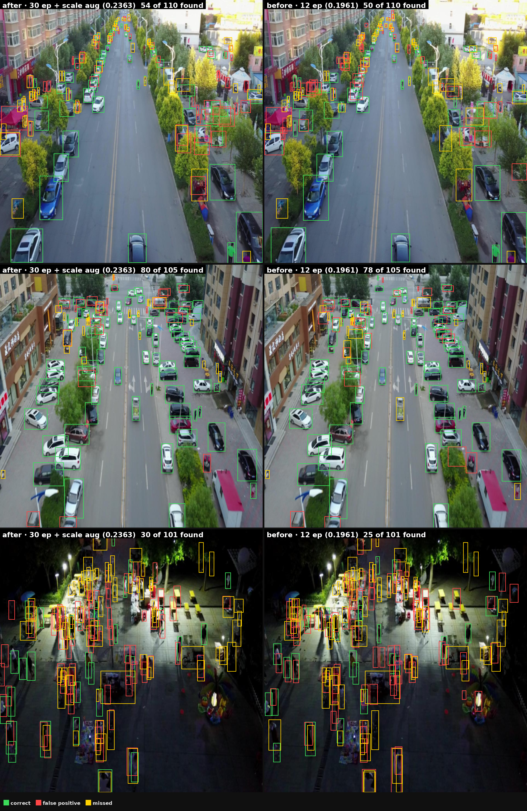
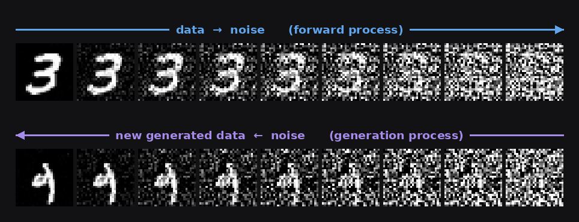

# Demos

Trainers and inference exes that ride on top of the chapter-aligned
classification stack. Top-level `Main*Train.lean` files are the
chapters themselves (MLP, CNN, ResNet, MobileNet, EfficientNet,
ConvNeXt, ViT); these demos extend the framework into adjacent
domains — segmentation, generative models, language modeling,
explainability — without changing the underlying codegen path.

Build any of these with `lake exe <name>` after the relevant
chapter trainer has produced its checkpoint.

---

## ResNet-34 UNet — brain-tumour segmentation (BraTS)

The segmentation demo. A ResNet-34 encoder (the Ch-5 architecture, reused
verbatim as the contracting path) + a UNet decoder, on MSD Task01_BrainTumour:
224×224 axial slices, 4 co-registered MRI modalities (FLAIR / T1w / T1gd / T2w)
→ 4 tumour classes. 24.5M params, plain per-pixel CE, 10 epochs.

`MainUnetBratsR34.lean`, `MainBratsPredict.lean`. See
`planning/archive/r34_brats_retrain.md`.

```bash
./download_brats.sh
python3 preprocess_brats.py data/brats/Task01_BrainTumour data/brats224 \
        --size 224 --seed 0            # same patient split as data/brats
./scripts/run_brats_r34_ab.sh 10 data/brats224 # both arms, one per GPU
lake exe brats-predict net=r34 arm=scratch,r34 out.ppm
```

| arm | mIoU | WT | TC | ET |
|---|---|---|---|---|
| `r34` (ImageNet bootstrap) | 0.742 | 0.911 | 0.870 | 0.858 |
| `scratch` (He-init) | 0.740 | 0.910 | 0.869 | 0.856 |


`T1gd | ground truth | +scratch | +r34`. Edema green, non-enhancing/necrotic
core red, enhancing tumour yellow — the yellow rim around a red core is a
textbook ring-enhancing glioblastoma.

**Two things this demo measures, and they are not the same size.**

*Skips are worth ~10 points.* Same backbone and schedule, decoder with and
without the encoder concat: **0.635 → 0.740 mIoU**, the largest gain on ET
(+0.12), the thinnest structure — a skipless decoder has to rebuild every
boundary from a 7×7 bottleneck. Run the ablation with `noskip`.

*Transfer buys one epoch, not a better model.* The two arms differ in exactly
one field (`bootstrapBackboneRange`), so 86.8% of params start pretrained vs
random and everything else is identical. At **epoch 1** the bootstrapped arm is
already at ET Dice 0.818 while the control sits at 0.184, still collapsed on
the hard classes. By epoch 2 the control has caught up, and the peaks above are
a tie (+0.002, noise at n=1). The honest claim is sample-efficiency: same
quality, one epoch sooner. Transfer's payoff scales inversely with dataset
size, and 14,415 slices is a lot — a data-fraction sweep is the experiment that
would show it properly.

The backbone is `.lake/build/jax_r34_imagenet.bin`, trained by this stack on
ImageNet to 72% top-1. Nothing is downloaded. Its stem is 3-channel RGB and
BraTS needs 4, so the transferable weights are not a prefix — hence
`bootstrapBackboneRange`, which patches a byte *range* and leaves the fresh
stem He-init. It self-checks on every run: the patched window must be
byte-equal to the checkpoint and the stem must be untouched, or it throws.

---

## FPN detector — object detection on VisDrone

Multi-scale detection on real drone-altitude imagery, and the best demo in this
repo for showing what the stack does end to end: a ResNet-34 backbone **trained
by this stack on ImageNet** feeds an FPN top-down neck into three anchor heads at
strides 8/16/32, with a DIoU box loss, focal objectness and focal class CE.
448 px input, 10 VisDrone classes.

VisDrone is the point: a median image holds **70 objects** and many are 2–5 px
after the resize, which is the regime where a single coarse grid structurally
cannot work and multi-scale detection stops being decoration.

`MainYolov1VisdroneFpn.lean`. See `planning/archive/visdrone_detector.md`.

```bash
./download_visdrone.sh
# ⚠ write the anchor priors from the values hardcoded in the demo — do NOT
# re-run k-means, or encoder and model silently disagree
python3 preprocess_visdrone.py data/visdrone data/visdrone_fpn \
    --size 448 --grid 14 --fpn data/visdrone
python3 preprocess_visdrone.py data/visdrone data/visdrone448 --size 448 --grid 14

# the current best recipe — ~2 h on one RTX 4060 Ti
CUDA_VISIBLE_DEVICES=0 FPN_BACKBONE=r34 FPN_TAG=run1 \
  FPN_AUG=1 FPN_CLSW=none FPN_CLSFOCAL=2 FPN_AFFINE=50 FPN_EPOCHS=30 \
  lake exe yolov1-visdrone-fpn data/visdrone_fpn

CUDA_VISIBLE_DEVICES=0 FPN_BACKBONE=r34 FPN_TAG=run1 \
  lake exe yolov1-visdrone-fpn infer data/visdrone_fpn runs/fpn_run1

python3 scripts/yolo_map_visdrone.py runs/fpn_run1/logits.bin \
    data/visdrone448/val.bin --fpn data/visdrone --grid 14 \
    --multilabel --topk 3000 --ml-k 3 --ml-floor 0.05

python3 scripts/fpn_render.py runs/fpn_run1/logits.bin data/visdrone_fpn/val.bin \
    --gt data/visdrone448/val.full_gt.bin --diverse --scale 2 --topk-per-gt \
    --layout cols --n 4 --out demos/figures/visdrone_fpn.png
```

⚠ Three flags that fail *silently* rather than loudly:
- **`FPN_TAG` must be set on `infer` too.** Without it the eval loads a different
  arm's weights, and the only tell is an epoch sweep whose rows are identical.
- **`FPN_BACKBONE` defaults to `r50`, not `r34`** — omit it and you train a
  different arm than the one these numbers come from.
- **`--topk` defaults to 1000**, which truncates the multilabel candidate list.
  The same checkpoint reads 0.1919 instead of 0.1961 at the default.

Knobs: `FPN_BACKBONE` (`r34`/`r50`), `FPN_AUG`, `FPN_AFFINE` (percent probability
of the box-aware scale/translate transform), `FPN_CLSW`, `FPN_CLSFOCAL`,
`FPN_EPOCHS`, `FPN_TOWER`, `FPN_NOBOOTSTRAP`.


Truth on top, prediction below, on four val frames. **mAP@0.5 = 0.2363**
(recall 0.769, class-agnostic AP 0.487) at 30 epochs, and 65 fps on one RTX
4060 Ti — or **35.7 fps on a 25 W Jetson Orin Nano** under TensorRT fp16, which
is the deployment this dataset implies. That beats a hand-written PyTorch replica
of this same architecture (0.1532) by **54%**.

⚠ Frames are picked with `--diverse`. Picking the *densest* frames selects
consecutive frames of one VisDrone sequence — val records are video — so the
figure ends up showing a single street corner four times.

⭐ **Augmentation and schedule length are one decision, not two.** At 50 epochs
*without* augmentation the same arm scores 0.1243 — worse than 12 epochs
(0.1526), with half the train loss: ordinary overfitting on 6,471 images.
Photometric augmentation recovers it, but at that strength 12 epochs still beats
50 (0.1961 vs 0.1674). Augmentation that changes object **scale** inverts the
ordering again, making 30 epochs worth 44% more than 12. A stronger augmentation
needs a longer schedule to absorb it, so the optimum epoch count is a property of
the augmentation pack — there is no schedule to tune once and carry across packs.

⭐ **The result is in the per-class split, not the mean.** Per-class AP runs from
car (0.685) to bicycle (0.036), and scale augmentation narrowed that spread from
43× to 19× by lifting exactly the classes that were worst: awning-tricycle +59%,
bicycle +41%, tricycle +40%, against car's +7%. Reweighting the loss toward rare
classes buys their recall at the expense of precision, and average precision
charges for the trade; supplying the scales those classes are missing raises both
at once. Detection on aerial imagery does not degrade uniformly — it collapses on
whatever is small *and* rare, and an averaged mAP hides exactly that.



The same frames coloured by **correctness** rather than class — green hit, red
false positive, yellow missed ground truth — with the 30-epoch arm on the left
and the 12-epoch one on the right. Read the per-frame counts in the labels: the
gain on any single dense frame is a few boxes, because most of the improvement is
rare-class ranking spread across all 548 val images and no one frame displays it.

A YOLOv8s at the same budget scores 0.140; its published-style 0.391 comes from
8× the epochs, higher resolution, full augmentation and COCO pretraining, so that
gap is recipe rather than architecture — and scale augmentation alone has closed
31% of it.

---

## DDPM — diffusion generative models

Denoising diffusion on MNIST. A tiny UNet predicts the noise
ε(x_t, t) that was added to an image; sampling runs that prediction backwards.
Cosine ᾱ schedule, DDIM (η=0) with 50 steps subsampled from T=1000, time
conditioning via a tiled `t/T_max` channel — which needs no new codegen
primitive, the UNet just sees one extra input channel.

`MainMnistDdpmTrain.lean` + `Sample`. Tiny UNet, base 16, 50 epochs.
See `planning/archive/ddpm_demo.md`.

```bash
lake exe mnist-ddpm-train data 50
lake exe mnist-ddpm-sample runs/mnist_samples.ppm          # 4x4 grid of samples

# the two-row trajectory figure below
lake exe mnist-ddpm-sample trajectory data=data img=7
python3 scripts/ddpm_trajectory_figure.py \
    runs/2026-09-02-mnist-ddpm/trajectory.ppm \
    --out demos/figures/ddpm_mnist_trajectory.png
```



**Top: the forward process.** A real MNIST training digit at nine points along
the schedule, x_t = √ᾱ_t·x₀ + √(1−ᾱ_t)·ε. Nothing is learned here — it is the
fixed corruption the model is trained to invert, and by the right-hand end the
digit is gone.

**Bottom: the reverse process**, read right to left. Sampling starts from fresh
N(0, I) noise and walks back down the same schedule, and a **different** digit
condenses out of it. That is the point of the row: it is not a reconstruction of
the 3 above it. The model never sees that image during sampling — it has learned
what MNIST digits look like at every noise level, and any noise seed lands
somewhere on that manifold.

⭐ **The two rows are aligned by noise level, not by step index.** Column *c* of
both rows sits at the same ᾱ, so reading down a column compares "a real digit
this corrupted" against "what the model can still recover from that much noise."
Indexing the bottom row by sampler step instead would have made the columns
incomparable and the figure decorative. Both rows are emitted by the sampler
itself (`mnist-ddpm-sample trajectory`), using the same ᾱ table and the same
`ddimStep` primitive as an ordinary run, so the picture cannot drift from the
process it illustrates; `scripts/ddpm_trajectory_figure.py` only upscales and
labels.

⚠ Most of the visible change happens in the last few columns. That is the cosine
schedule, not a rendering artifact — ᾱ stays low across most of the trajectory
and the image resolves late.

---

## TinyGPT — character-level language model

Char-level transformer on Karpathy's tinyshakespeare. Three new
codegen primitives shipped to support it:

- `tokenPositionEmbed` (one-hot → embed + learnable position)
- `lmHead` (per-position dense + reshape into `useSeg` loss path)
- `causalMask` flag on `transformerEncoder`

212K params (T=64, D=64, 4 layers, 2 heads). 10K Adam steps take ~3 min on
one RTX 4060 Ti through XLA, compile included, and reach 2.28 bits/char on
the held-out split (bigram baseline 3.56, uniform 6.02). Workings in
`runs/2026-09-09-tinygpt-nano-xla/`; plan in `planning/archive/tinygpt_demo_v2.md`.

```bash
./download_shakespeare.sh             # downloads tinyshakespeare.txt
python3 preprocess_shakespeare.py     # builds train.bin / val.bin / vocab.txt
lake exe tinygpt-shakespeare train nano 10000                    # 10K Adam steps, saves params
lake exe tinygpt-shakespeare sample nano 600 80 0 100 1 "ROMEO:"  # 600 chars, temp 0.8, seed 1
```

Sample output after 10K steps (val 2.28 bits/char, train 1.99):

```text
ROMEO:
O heaven farewell, upon thy hands.

NORTHUMBERLAND:
Then with clearing too forpully of his,
You are would not we love I have,
Which of you have I do foeble thy true king with odds
To desire her furrow'd the victory,
Hence that speak to be weak the way deal is.

EDWARD:
What, worse speed have more in himself inger's and thousand.
God come to Romeo
A sentence comfort to your throlds,
I think of thy souls to the merrolk, his life,
Some no paper brother hands than the tent up never
'Tis grace, O, blest thy headst jewel denied
To creass thy breaks wind to live:
And then to dark the you kin our par
```

Real Shakespeare character names (NORTHUMBERLAND and EDWARD here;
QUEEN MARGARET, MERCUTIO, JULIET, BRUTUS across the fixed-prompt suite
in `blueprint/src/figures/tinygpt/prompt_suite_nano.txt`), a Romeo
named inside another speaker's line, coherent multi-line dialog with
proper cadence and punctuation. Semantic coherence drops past the 64-char
context window — exactly what the planning doc predicted.

A `bigram-shakespeare` baseline (single dense V→V predicting next
char given current char) also lives here as a smoke test that the
data pipeline + sampler work end-to-end without the transformer.

---

## RL — blackjack from tabular Q to DQN, and the Pong environment

Two games written in Lean, no FFI, each with its own exact instrument. They are
rungs 1 and 3 of the reinforcement-learning ladder in
`planning/blackjack_dqn_demo.md` and `planning/pong_dqn_demo.md`; rung 2 is the
blackjack DQN, trained through the stack on the rank-2 DDPM MSE block.

```bash
lake exe blackjack-env 1000000 10000000   # Monte Carlo hands, tabular-Q hands
lake exe blackjack-env play 7 hs          # replay a hand from a seed with the DP's exact Q-values
lake exe blackjack-dqn 200000 1 double    # updates, seed; flags: double, lrdecay, tag=<name>
lake exe pong-env 100                     # games per baseline arm
```

The environment, the DP instrument and tabular Q live in
`LeanMlir/Blackjack.lean`, shared by both blackjack exes. It follows
Gymnasium's Blackjack-v1 with `sab=True` (the Sutton & Barto rules). A value iteration over the 200 decision states gives the
exact optimum, **−0.0431 per hand**, and the exact value of any policy, so
every arm is scored without sampling error; the Monte Carlo column is the
cross-check that the environment and the DP describe the same game.

| arm | exact value / hand | agrees with optimum |
|---|---|---|
| random | −0.394 | 110 / 200 |
| threshold heuristic | −0.240 | 164 / 200 |
| the old demo's published table | −0.097 | 162 / 200 |
| tabular Q, 10⁷ hands, step max(0.001, 1/(1+N)) | −0.044 | 195 / 200 |
| DQN, Double, 200k updates (`blackjack-dqn`) | −0.048 | 188 / 200 |
| exact optimum | −0.043 | 200 / 200 |

`MainBlackjackDqn.lean` is the 6,210-parameter dense net on a 29-float one-hot,
XLA backend, one GPU, about ten minutes for 200k updates. The host writes the
Bellman target into the taken action's slot of the net's own prediction and
hands that to the DDPM MSE train step, so the untaken slot's gradient is zero;
the greedy policy is read off the net every 50 updates for acting and scored
exactly every 1000. Run logs, curves and the figure script's inputs are in
`runs/2026-09-11-blackjack-dqn/`; `scripts/blackjack_figure.py` draws the
book's chart.

The DP's hit/stick chart is Sutton & Barto's Figure 5.2. The published table
from the old Swift demo is a casino-rules chart whose rows for 10 and 11 are a
doubling table transcribed as "stand"; the instrument found that on its first
run.

`MainPongEnv.lean` is Pong in ~150 lines: 84×84 render, frame skip 4, a scripted
opponent with a speed and a reaction-delay knob, deterministic from a seed, five
million raw frames per second single-threaded. Random scores −17.9 per game, a
reactive tracker +11.2 against the default opponent; the frame strip the
network will see is written to `.lake/build/pong_stack.pgm`.

## Layout

The four demos above are the maintained set. Everything else lives in one of two
subfolders — moving a file does **not** change its executable name, so every
`lake exe <name>` in this repo, in `scripts/` and in CI still works unchanged.

```
demos/
├── README.md                              # this file
├── figures/                               # rendered outputs for the README
│
│   # ── the four demos ──
├── MainUnetBratsR34.lean                  # R34-UNet on BraTS (segmentation)
├── MainUnetBratsTrain.lean                # from-scratch UNet on BraTS
├── MainBratsPredict.lean                  # render predicted masks from a checkpoint
├── MainYolov1VisdroneFpn.lean             # R34+FPN detector on VisDrone, train + infer
├── MainMnistDdpmTrain.lean / Sample       # DDPM on MNIST (Sample also writes the
│                                          #   two-row trajectory figure)
├── MainTinyGptShakespeare.lean            # char-level transformer
├── MainBigramShakespeare.lean             # bigram baseline (validates the data pipeline)
├── MainTinyStories.lean                   # the same transformer at a larger corpus
├── MainBlackjackEnv.lean                  # blackjack tables, play/dump/curve modes (RL rung 1; env in LeanMlir/Blackjack.lean)
├── MainBlackjackDqn.lean                  # DQN on blackjack through the DDPM MSE block, scored exactly (RL rung 2)
├── MainPongEnv.lean                       # Pong in Lean, 84×84 frames, scripted opponent (RL rung 3, Phase 0)
│
├── probes/                                # gates and tools, not demos — these RUN IN CI
│   ├── MainFpnLossProbe.lean              #   finite-difference gate on the detector loss
│   ├── MainFpnNeckProbe.lean              #   FPN neck shapes
│   ├── MainFpnDetectProbe.lean            #   detector head
│   ├── MainFpnTrainEmit.lean              #   emit the detector train step
│   ├── MainAnchorLossProbe.lean           #   anchor loss
│   ├── MainDiouLossProbe.lean             #   DIoU box loss
│   ├── MainSegLossProbe.lean              #   segmentation losses
│   ├── MainGradFdProbe.lean               #   generic finite-difference gradient check
│   ├── MainFlashProbe.lean                #   flash-attention
│   ├── MainMnistDdpmScore.lean            #   DDPM sample scoring
│   ├── MainGradCAM.lean                   #   closed-form CAM for GAP+dense nets
│   └── MainInspectConvNeXt.lean           #   checkpoint diagnostics
│
└── archive/                               # superseded; kept building, not maintained
    ├── MainUnetPetsTrain.lean             #   UNet on Pets, superseded by BraTS
    ├── MainAutoencoderPetsTrain.lean      #   autoencoder baseline (no skips)
    ├── MainPetsPredict.lean               #   Pets mask rendering
    ├── MainYolov1PetsTrainBootstrap.lean  #   YOLOv1 on Pets, superseded by VisDrone
    ├── MainYolov1PetsInfer.lean           #   Pets detection dump
    ├── MainYolov1VisDrone448.lean         #   single-scale VisDrone arms, superseded
    ├── MainYolov1VisDrone448S16.lean      #     by the FPN detector
    ├── MainYolov1VisDroneAnchor.lean      #
    ├── MainCifarDdpmTrain.lean / Sample   #   DDPM on CIFAR-10
    ├── MainCifarDdpmAttnTrain.lean / …    #   bottleneck-attention variant (codegen ✓, recipe ✗)
    ├── MainCifarDdpmSincosTrain.lean / …  #   sincos t-embed variant (small negative)
    └── MainDiffusion2d.lean               #   2-D toy diffusion
```

Per-demo planning docs live in `planning/archive/` at the repo root.
