# Demos

Trainers and inference exes that ride on the chapter nets. The top-level `Main*Train.lean` files
are the chapters themselves (MLP, CNN, ResNet, MobileNet, EfficientNet, ConvNeXt, ViT); these
extend the same codegen path into the domains Chapter 10 of the book walks — recognition first
(detection, industrial inspection, people, agriculture, segmentation), then beyond it
(language, diffusion, physics, signal processing, a quantum ground state), and last the games
(blackjack, Pong, tic-tac-toe, the book's closing section) — in the chapter's order, each under
the chapter's figure. Nothing here changes the codegen: every
demo is the ordinary train step on a new input, loss or host loop.

Build any of these with `lake exe <name>`; the ImageNet-bootstrapped ones need the relevant
chapter trainer's checkpoint first.

---

## Object detection — R34+FPN on VisDrone

Multi-scale detection on real drone-altitude imagery, and the best demo in this
repo for showing what the stack does end to end: a ResNet-34 backbone **trained
by this stack on ImageNet** feeds an FPN top-down neck into three anchor heads at
strides 8/16/32, with a DIoU box loss, focal objectness and focal class CE.
448 px input, 10 VisDrone classes.

VisDrone is the point: a median image holds **70 objects** and many are 2–5 px
after the resize, which is the regime where a single coarse grid structurally
cannot work and multi-scale detection stops being decoration.

`MainYolov1VisdroneFpn.lean`. See `planning/archive/visdrone_detector.md`.

```bash
./scripts/datasets/download_visdrone.sh
# ⚠ write the anchor priors from the values hardcoded in the demo — do NOT
# re-run k-means, or encoder and model silently disagree
python3 scripts/datasets/preprocess_visdrone.py data/visdrone data/visdrone_fpn \
    --size 448 --grid 14 --fpn data/visdrone
python3 scripts/datasets/preprocess_visdrone.py data/visdrone data/visdrone448 --size 448 --grid 14

# the current best recipe — ~2 h on one RTX 4060 Ti
CUDA_VISIBLE_DEVICES=0 FPN_BACKBONE=r34 FPN_TAG=run1 \
  FPN_AUG=1 FPN_CLSW=none FPN_CLSFOCAL=2 FPN_AFFINE=50 FPN_EPOCHS=30 \
  lake exe yolov1-visdrone-fpn data/visdrone_fpn

CUDA_VISIBLE_DEVICES=0 FPN_BACKBONE=r34 FPN_TAG=run1 \
  lake exe yolov1-visdrone-fpn infer data/visdrone_fpn runs/fpn_run1

python3 scripts/demos/yolo_map_visdrone.py runs/fpn_run1/logits.bin \
    data/visdrone448/val.bin --fpn data/visdrone --grid 14 \
    --multilabel --topk 3000 --ml-k 3 --ml-floor 0.05

python3 scripts/demos/fpn_render.py runs/fpn_run1/logits.bin data/visdrone_fpn/val.bin \
    --fpn data/visdrone --gt data/visdrone448/val.full_gt.bin --diverse --scale 2 \
    --topk-per-gt --layout cols --n 4 \
    --labels "ground truth,R34+FPN — 30 ep + scale aug (mAP 0.2363)" --out fpn.png
# the figure below is that sheet at 1800 px wide, as a JPEG
python3 -c "from PIL import Image; im = Image.open('fpn.png'); \
    im.resize((1800, round(im.height * 1800 / im.width)), Image.LANCZOS).save('demos/figures/visdrone_fpn.jpg', quality=90)"

# the correctness figure: after vs before (the 12-epoch cfoc2 arm), three frames
python3 scripts/demos/fpn_render.py runs/fpn_run1/logits.bin data/visdrone_fpn/val.bin \
    --fpn data/visdrone --gt data/visdrone448/val.full_gt.bin --compare <12-ep logits.bin> \
    --diverse --n 3 --scale 2 --topk-per-gt --match --layout rows \
    --labels "truth,after · 30 ep + scale aug (0.2363),before · 12 ep (0.1961)" \
    --out demos/figures/visdrone_fpn_match.png
```

⚠ Three flags that fail *silently* rather than loudly:
- **`FPN_TAG` must be set on `infer` too.** Without it the eval loads a different
  arm's weights, and the only tell is an epoch sweep whose rows are identical.
- **`FPN_BACKBONE` defaults to `r50`, not `r34`** — omit it and you train a
  different arm than the one these numbers come from.
- **`--topk` defaults to 1000**, which truncates the multilabel candidate list.
  The same checkpoint reads 0.1919 instead of 0.1961 at the default.

Knobs: `FPN_BACKBONE` (`r34`/`r50`), `FPN_AUG`, `FPN_AFFINE` (percent probability
of the box-aware scale/translate transform), `FPN_CLSW`, `FPN_CLSFOCAL`,
`FPN_EPOCHS`, `FPN_TOWER`, `FPN_NOBOOTSTRAP`.

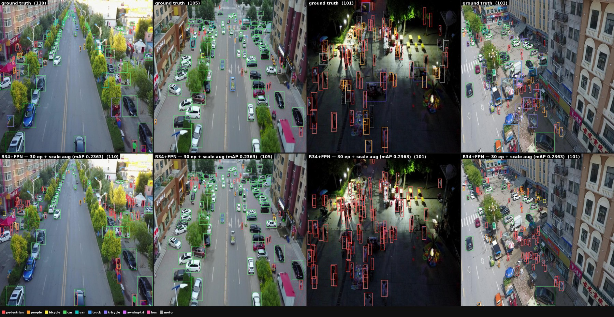

Ground truth above, the R34+FPN's boxes below, on four val frames (30 epochs, scale
augmentation). Box colour is the class, keyed along the bottom edge, and each frame's box count
follows its label. The night market and the street market are where the misses live — the small
and the rare, exactly what the per-class spread predicts.

**mAP@0.5 = 0.2363** (recall 0.769, class-agnostic AP 0.487) at 30 epochs, and 65 fps on one RTX
4060 Ti — or **35.7 fps on a 25 W Jetson Orin Nano** under TensorRT fp16, which is the deployment
this dataset implies. That beats a hand-written PyTorch replica of this same architecture (0.1532)
by **54%**.

⚠ Frames are picked with `--diverse`. Picking the *densest* frames selects
consecutive frames of one VisDrone sequence — val records are video — so the
figure ends up showing a single street corner four times.

⭐ **Augmentation and schedule length are one decision, not two.** At 50 epochs
*without* augmentation the same arm scores 0.1243 — worse than 12 epochs
(0.1526), with half the train loss: ordinary overfitting on 6,471 images.
Photometric augmentation recovers it, but at that strength 12 epochs still beats
50 (0.1961 vs 0.1674). Augmentation that changes object **scale** inverts the
ordering again, making 30 epochs worth 44% more than 12. A stronger augmentation
needs a longer schedule to absorb it, so the optimum epoch count is a property of
the augmentation pack — there is no schedule to tune once and carry across packs.

⭐ **The result is in the per-class split, not the mean.** Per-class AP runs from
car (0.685) to bicycle (0.036), and scale augmentation narrowed that spread from
43× to 19× by lifting exactly the classes that were worst: awning-tricycle +59%,
bicycle +41%, tricycle +40%, against car's +7%. Reweighting the loss toward rare
classes buys their recall at the expense of precision, and average precision
charges for the trade; supplying the scales those classes are missing raises both
at once. Detection on aerial imagery does not degrade uniformly — it collapses on
whatever is small *and* rare, and an averaged mAP hides exactly that.

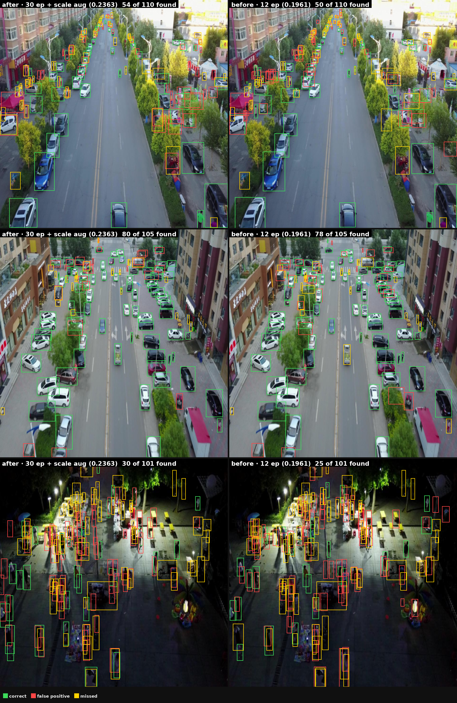

Three of those frames coloured by **correctness** rather than class — green hit, red false
positive, yellow missed ground truth — with the 30-epoch arm on the left and the 12-epoch one on
the right. Each arm draws its K best boxes, K = the frame's ground-truth count, so red and yellow
boxes always come in equal numbers and the label's "found" count is the whole score. The gain on any
single dense frame is a few boxes (54 vs 50, 80 vs 78, 30 vs 25), because most of the improvement
is rare-class ranking spread across all 548 val images and no one frame displays it.

A YOLOv8s at the same budget scores 0.140; its published-style 0.391 comes from
8× the epochs, higher resolution, full augmentation and COCO pretraining, so that
gap is recipe rather than architecture — and scale augmentation alone has closed
31% of it.

---

## Industrial inspection — the same detector on NEU-DET steel defects

The VisDrone detector above, unchanged — backbone, neck, heads, loss, bootstrap,
scorer — on the dataset the industrial-inspection literature reports on:
NEU-DET, 1,800 grayscale 200×200 crops of hot-rolled steel, six defect classes,
Pascal-VOC boxes. It is VisDrone's opposite regime: **2.3 defects per crop,
half of them spanning more than half the frame**, against seventy 20-px cars
per drone frame. 98% of NEU's boxes route to the coarsest level, so this is the
dataset on which a single 14×14 grid should *not* collapse — and running the
two heads on both datasets is what shows when multi-scale detection pays.

`MainYolov1NeuDetFpn.lean` (FPN) and `MainYolov1NeuDet448.lean` (single grid).
See `planning/neu_det_fpn_demo.md` and `runs/2026-09-17-neudet-fpn-run1/README.md`.

```bash
./scripts/datasets/download_neu.sh            # maintainer's Drive copy, 26 MB; fits anchors; writes both record formats

# the FPN arm — the 0.2363 recipe's flags are this binary's DEFAULTS; ~25 min on one 4060 Ti
CUDA_VISIBLE_DEVICES=0 FPN_TAG=run1 lake exe yolov1-neudet-fpn data/neu_det_fpn
# the single-grid arm beside it, same epochs
CUDA_VISIBLE_DEVICES=1 YOLO_TAG=run1 YOLO_EPOCHS=30 lake exe yolov1-neudet448 data/neu_det448

# every saved epoch, inferred and scored (VisDrone protocol + the plain argmax check)
scripts/sweeps/neudet_eval_sweep.sh fpn  run1 0 val
scripts/sweeps/neudet_eval_sweep.sh grid run1 1 val
scripts/sweeps/neudet_eval_sweep.sh fpn  run1 0 test "28"      # the table's row, at the val-peak epoch

python3 scripts/demos/fpn_render.py runs/2026-09-17-neudet-fpn-run1-sweep/e30_val/logits.bin \
    data/neu_det_fpn/val.bin --fpn data/neu_det --gt data/neu_det448/val.full_gt.bin \
    --classes neu --compare-grid runs/2026-09-17-neudet-grid-run1-sweep/e30_val/logits.bin \
    --indices 33,87,267,327 --topk-per-gt --layout cols --out demos/figures/neudet_fpn.png
```

What changed against the VisDrone binary: the anchor priors (k-means on NEU
boxes, `scripts/probes/neu_anchors.py`), the class weights (off — 300 crops per class),
and six classes in ids 0–5 of the ten-slot one-hot (the 5+10 per-anchor width is
baked into the `fpnDetect` codegen; the scorer averages over classes present).
Defaults are the measured recipe, so `FPN_BACKBONE` is `r34` and `FPN_CLSW` is
`none` here. `FPN_TAG` still has to be set on `infer`; `FPN_EVAL_SPLIT=test` and
`FPN_EVAL_EPOCH=N` pick the split and the checkpoint.

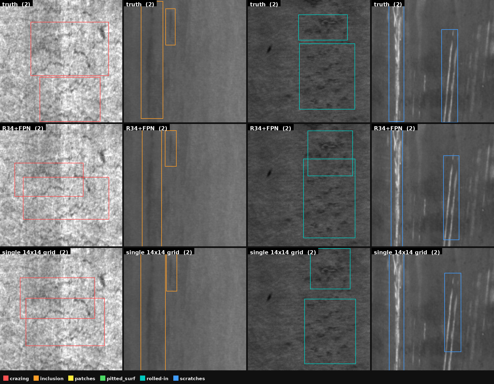

Truth / R34+FPN / single 14×14 grid on a crazing, inclusion, rolled-in-scale and
scratches crop. **NEU-DET test (360 images), at each arm's val-peak epoch:**

| arm | mAP@0.5 | recall | class-agnostic AP |
|---|---|---|---|
| **R34+FPN**, VisDrone recipe (e28) | **0.623** | 0.992 | 0.625 |
| R34+FPN, HSV+hflip off (e30) | 0.630 | 0.987 | 0.640 |
| R34+FPN, no ImageNet bootstrap (e26) | 0.555 | 0.986 | 0.555 |
| **R34 single grid 14×14** (e28) | **0.607** | 0.917 | 0.609 |
| published stock detectors, 640 px, 300 ep | 0.73–0.78 | | |
| published improved variants | ~0.83 | | |

**The same two heads on VisDrone val** (548 images, uncapped GT): R34+FPN
**0.2363** / 0.769 / 0.487; single grid 14×14 **0.0391** / 0.184 / 0.107.

⭐ **On steel the grid head matches the FPN (0.61 vs 0.62); on drones it is six
times behind (0.04 vs 0.24, recall 0.18 vs 0.77).** Same backbone, bootstrap,
scorer and lowerer in all four cells. Multi-scale detection pays only where
objects are small; on NEU the neck runs three heads for one level's work.

⭐ Recall is 0.99 on NEU — the number is ranking, and it is two classes: crazing
(0.29) and rolled-in scale (0.41), the diffuse textures whose "box" is most of
the crop, worst for both heads and in every NEU paper. The ImageNet prefix is
worth +0.07 at 1,080 images. Photometric augmentation is within the n=1 noise
floor (+0.007). Both arms are still rising at e30 — 30 epochs here is 4,050
steps against VisDrone's 24,000 — and the gap to the published rows is
schedule, resolution and split before it is architecture.

The VisDrone single-grid row is `yolov1-visdrone448` (the archived 448/14 arm,
12 epochs) measured on the current data and lowerer:
`runs/2026-09-17-visdrone-grid448-remeasure/`.

---

## People watching — the chapter-4 CNN on Arabic sign-language letters, under two splits

Chapter 4's `CIFAR-CNN8-wide-BN` — one-channel stem, 32-way head, nothing else
changed — on ArASL: 54,049 grey 64×64 crops of hands spelling the 32 letters of
the Arabic alphabet (Latif et al. 2019, Mendeley `y7pckrw6z2`, CC BY 4.0), the
dataset the Arabic sign-language literature reports 96–99.6% on. The images
are **video bursts** (73.5% of consecutive files differ by under 6 grey levels;
14,336 chains of 3.8 frames) and the release records no signer, so the same
images are trained twice: under the literature's random split and under a
split that keeps each class's capture order together. The pair of numbers is
the demo; a leak audit (for every test image, the nearest training image) says
what each split did.

`MainAraslSigns.lean` (`lake exe arasl-signs`), copied from the GW demo's host
loop. See `planning/arasl_people_watching_demo.md` and `runs/2026-09-17-arasl/README.md`.

```bash
./scripts/datasets/download_arasl.sh          # Mendeley, URLs resolved from the public API, sha256-checked;
                             # writes both splits + census + chain statistic + leak audit

# the demo: the chapter net under each split, ~5 min per run on one 4060 Ti
CUDA_VISIBLE_DEVICES=0 lake exe arasl-signs net=cifar8w split=random  seed=1 tag=s1 out=runs/x
CUDA_VISIBLE_DEVICES=1 lake exe arasl-signs net=cifar8w split=blocked seed=1 tag=s1 out=runs/x
# the bracket: net=mlp | net=linear, and the chapter's own 32×32 input with size=32

# Wilson interval, leaked-vs-not accuracy, 1-NN floor, per class, confused pairs
python3 scripts/demos/arasl_score.py runs/x/arasl_cifar8w_blocked_s{1,2,3}_logits_test.bin --split=blocked --top 8 --json runs/x/score.json
python3 scripts/demos/arasl_figure.py --score runs/x/score.json --logits runs/x/arasl_cifar8w_blocked_s1_logits_test.bin
```

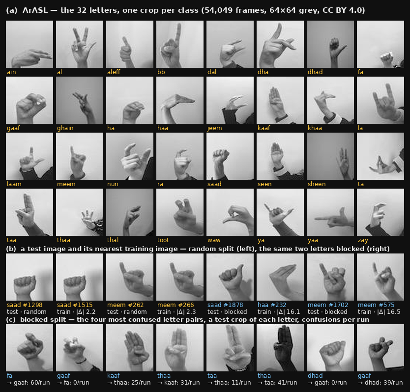

**ArASL test (80/10/10 per class), at the val-peak epoch, 3 seeds for the chapter net:**

| arm | random split | blocked split | |
|---|---|---|---|
| **CIFAR-CNN8-wide-BN**, 64×64 | **98.62** ± 0.10 | **77.94** ± 0.80 | the demo |
| — on test images with a near-duplicate in train | 99.73 | 98.46 | 92.3% / 6.4% of the test tenth |
| — on the rest | 85.26 | 76.53 | |
| CIFAR-CNN8-wide-BN at 32×32 | 98.21 | 71.03 | the chapter's own input |
| MLP 4096-512-512-32 | 94.86 | 42.09 | |
| linear 4096-32 | 53.20 | 15.37 | |
| 1-NN on 16×16 thumbnails | 95.65 | 28.60 | no parameters |
| published CNNs, random split | 96.6–97.6 | — | |
| published transfer / ViT, random split | 99.3–99.6 | — | |

⭐ **The published 96–99% is mostly the frame, not the hand.** Nine in ten
random-split test images have a training image within 6 grey levels; the net
is at 99.7% on those and 85.3% on the rest, and a parameter-free nearest-
neighbour lookup already gets 95.7%. Keep each hand's frames on one side of
the line and the same net, recipe and seeds score 77.9%.

⭐ The bracket loses more the less it can generalise: linear −38 points between
the columns, MLP −53, convolutions −21. Per class the blocked column runs 16.5%
(`fa`) to 100% (`sheen`); `fa`→`gaaf` 181 times in three runs, the reverse once.

⚠ The blocked split is a proxy, not a signer split: the val tenth is 37.5%
leaked (it neighbours train in capture order — hence val ≈ 92%, test ≈ 78% in
every blocked log) and 6% of test hands return from earlier in the numbering.

## Agriculture — chapter 6's ResNet-34 from lab leaves to field leaves

Chapter 6's ResNet-34 from the ImageNet prefix (the BraTS/VisDrone/NEU bootstrap),
with a 38-way head, on **PlantVillage** — 54,305 lab photographs of single picked
leaves on a grey background, the dataset the agriculture literature reports on most
(Mohanty et al. 2016, CC BY-SA 3.0) — and then, with the same weights, on
**PlantDoc** — 2,578 field photographs of the same crops, 28 classes that all map
into PlantVillage's 38 (Singh et al. 2020, CC BY 4.0). The lab number reproduces;
the field number is the demo. Three explainers say where the evidence was: the
closed-form CAM, an exact two-player Shapley value (leaf vs background, four
forward passes per image, efficiency to the float), and the counterfactuals
themselves — the same leaves on black, on their own background colour, the
background alone, a flat colour. Then three fixes, each scored on the same 2,578
field images.

`MainPlantLeaf.lean` (`lake exe plant-leaf`), `scripts/demos/plant_score.py`,
`scripts/demos/plant_shapley.py`, `scripts/demos/plant_cam.py`, `scripts/demos/plant_figure.py`. See
`planning/plant_lab_to_field_demo.md` and `runs/2026-09-17-plant/README.md`.

```bash
./scripts/datasets/download_plant.sh          # two git clones (4.8 + 1.9 GB), the maintainers' split lists, census,
                             # leaf grouping, the ArASL leak audit, masks, composites, augmentations

# Act 1–2: the base arm under the maintainers' leaf-grouped split (~40 min on one 4060 Ti);
# scores PlantVillage test, its four counterfactuals and all of PlantDoc in one run
CUDA_VISIBLE_DEVICES=0 lake exe plant-leaf split=grouped train=base init=imagenet seed=1 tag=s1 out=runs/x
python3 scripts/demos/plant_score.py runs/x/plant_resnet34_grouped_base_imagenet_s1_logits_pd_all.bin --part pd_all --restrict

# Act 3: the CAM of every test image, and the exact two-player Shapley value
CUDA_VISIBLE_DEVICES=0 lake exe plant-leaf split=grouped train=base init=imagenet seed=1 tag=s1 out=runs/x eval cam=1
python3 scripts/demos/plant_cam.py runs/x/plant_resnet34_grouped_base_imagenet_s1_cam_pvg_test.bin --split pvg
python3 scripts/demos/plant_shapley.py two-player --split pvg --logits runs/x/plant_resnet34_grouped_base_imagenet_s1

# Act 4: train=comp (leaves on Imagenette backgrounds) | train=aug | field=<fold> from a checkpoint
CUDA_VISIBLE_DEVICES=1 lake exe plant-leaf split=grouped train=comp init=imagenet seed=1 tag=s1 out=runs/x
CUDA_VISIBLE_DEVICES=2 lake exe plant-leaf split=grouped init=runs/x/plant_resnet34_grouped_base_imagenet_s1 field=0 fieldn=250 epochs=5 out=runs/x
```

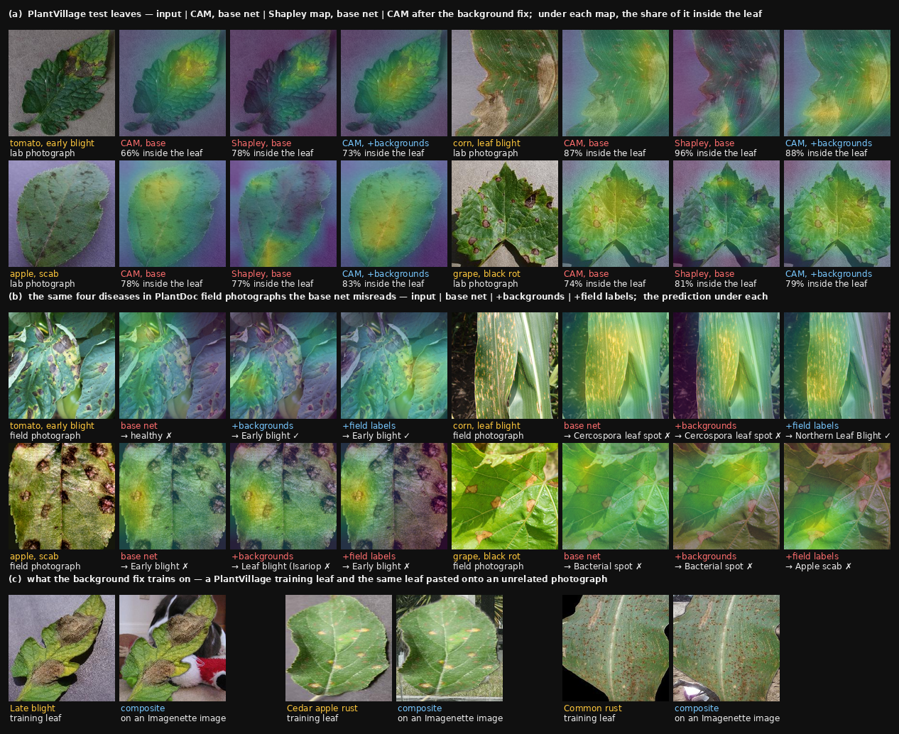

**All 2,578 PlantDoc images, argmax over the 28 mapped classes; PlantVillage is the
maintainers' 10,709-image grouped test:**

| arm | PlantVillage | PlantDoc | |
|---|---|---|---|
| **ResNet-34, ImageNet prefix**, 3 seeds | **99.57 ± 0.06** | **17.80 ± 1.77** | the literature's number, and the field's |
| — random split (the papers' protocol) | 99.72 | 16.56 | |
| — from scratch | 99.07 | 11.60 | |
| + every training leaf also on an Imagenette background, 3 seeds | 99.44 ± 0.15 | 21.48 ± 1.25 | the diagnosis, attacked |
| + photometric + geometric augmentation | 99.62 | 19.24 | |
| + 250 field labels, 5-fold | — | 22.69 | ten per class |
| + all field labels (2,062 per fold), 5-fold | — | **45.00** | |
| + backgrounds, then 250 / all field labels | — | 26.57 / 42.05 | the fixes stack at few labels, not at many |
| published, random split / other conditions | 99.35 | ≈ 31 | Mohanty et al. 2016 |

**The diagnosis, grouped test tenth, three seeds each (base → +backgrounds):**

| | base | +backgrounds |
|---|---|---|
| the same leaves on **black** (`segmented`) | **60** (49 / 59 / 72) | **96.3** |
| leaf on its own median background colour | 94.3 | 98.8 |
| background only (leaf filled with that colour) | 25.1 | 13.5 |
| a flat image of the colour, nothing else (chance 2.6) | 4.4 | 2.6 |
| exact two-player Shapley: leaf share of the class logit | 85.0% | 96.1% |
| — images where the background helps (φ_bg > 0) | 88.2% | 71.4% |
| CAM mass inside the leaf mask (uniform map: 58.9%) | 70.9% | 78.6% (seed 1) |

⭐ **The two attribution maps say "mostly the leaf" and the counterfactuals say the
background is decisive anyway** — black behind the same leaf costs ~50 points, a flat
colour alone scores above chance, and the background's marginal contribution is
positive for nine test images in ten. Saliency is not sensitivity. The background fix
moves every diagnostic the right way and the field number by +3.7 points (three seeds each, every fixed seed above every base seed); two thousand
field labels move it by 29.

⚠ The ArASL leak audit finds PlantVillage **pixel-clean** (0.1% of consecutive frames
within 6 grey levels; 1.3% of random-split test images with a near-twin) and the leaf
grouping does not move the lab number (99.64 vs 99.72): the split was never the leak
here, the laboratory was.

---

## Remote sensing — the chapter-4 CNN on thirteen Sentinel-2 bands, from Europe to Brazil

Chapter 4's CIFAR-CNN8-wide-BN on **EuroSAT** — 27,000 Sentinel-2 chips over 34 European
countries, 64 × 64 at 10 m (a 640 m square), all 13 bands from 443 to 2190 nm, ten land-cover
classes (Helber et al. 2019, MIT) — trained five times with a different part of the spectrum
at the stem: `rgb`, `rgbn` (+ NIR), `ms10` (the 10 m + 20 m bands), `all`, and `ir` (red edge,
NIR and SWIR, no visible light). The same weights are then scored, unchanged, on chips cut for
this demo from Sentinel-2 L1C scenes over Rondônia (June) and western Bahia (September, and the
same chips in March), labelled from MapBiomas Collection 4 (10 m, CC BY 4.0) through the
seven classes the two continents share. In Europe the invisible bands are worth a point; in
the Amazon they are worth ten (pasture recall 74 → 95); in the dry Cerrado every arm fails on
the seven-class map, because a September paddock is "herbaceous" to a European net and
savanna has no European name; and no arm is season-stable — the multispectral arms are better
in both seasons, not stabler. A five-player exact Shapley value over band groups says the
three atmospheric bands carry Europe's atmosphere (negative value in Brazil), which is why the
ten-band arm travels best.

`MainRsBands.lean` (`lake exe rs-bands`), `scripts/datasets/{download_rs.sh, preprocess_rs_eurosat.py,
preprocess_rs_brazil.py, rs_folds.py}`, `scripts/demos/{rs_score.py, rs_table.py, rs_shapley.py,
rs_figure.py}`. See `planning/remote_sensing_wavelengths_demo.md` and the READMEs under
`runs/2026-09-29-rs-phase{1,2,3}/` (phase 2's is how the Brazil chips were made).

```bash
./scripts/datasets/download_rs.sh                  # EuroSAT MS (2 GB) + torchgeo's split lists → data/rs/eurosat_*.bin; Gate 0

# Phase 1: an arm on EuroSAT, 80 epochs, ~5 min on one 4060 Ti; five arms × three seeds is the table
CUDA_VISIBLE_DEVICES=0 lake exe rs-bands arm=all epochs=80 seed=1 tag=s1 out=runs/x
.venv-rs/bin/python scripts/demos/rs_score.py runs/x/rs_cifar8w_all_s1_logits_eurosat_test.bin --part eurosat_test

# Phase 2: the Brazil chips (a free CDSE account; keys in the environment, never on disk; ~8 GB of scenes once)
export CDSE_S3_ACCESS_KEY=… CDSE_S3_SECRET_KEY=…
.venv-rs/bin/python scripts/datasets/preprocess_rs_brazil.py --tiles 6 --cands 1500 --cap 2000
.venv-rs/bin/python scripts/datasets/rs_folds.py

# Phase 3: the same weights on the Brazil parts, the wet/dry pair, the tables
CUDA_VISIBLE_DEVICES=0 lake exe rs-bands arm=all eval tag=s1 out=runs/x score=amazon_dry,cerrado_dry,cerrado_wet
.venv-rs/bin/python scripts/demos/rs_score.py runs/x/rs_cifar8w_all_s1_logits_cerrado_dry.bin --part cerrado_dry \
    --pair runs/x/rs_cifar8w_all_s1_logits_cerrado_wet.bin --pair-part cerrado_wet
CUDA_VISIBLE_DEVICES=0 lake exe rs-bands arm=all train=brazil_all val=brazil_all score=brazil_all classes=7 fold=0 epochs=80 tag=ceil out=runs/x
.venv-rs/bin/python scripts/demos/rs_table.py runs/x

# Phase 4: five-group Shapley (32 coalitions, exact) and the figure's dense chip grids
.venv-rs/bin/python scripts/demos/rs_shapley.py make --part amazon_dry --n 300
CUDA_VISIBLE_DEVICES=0 lake exe rs-bands arm=all eval tag=s1 out=runs/x score=shap_amazon_dry
.venv-rs/bin/python scripts/demos/rs_shapley.py score --part amazon_dry --logits runs/x/rs_cifar8w_all_s1_logits_shap_amazon_dry.bin
.venv-rs/bin/python scripts/demos/rs_figure.py make --name rondonia --scene <scene id> --center=-9.0994,-61.2937
```

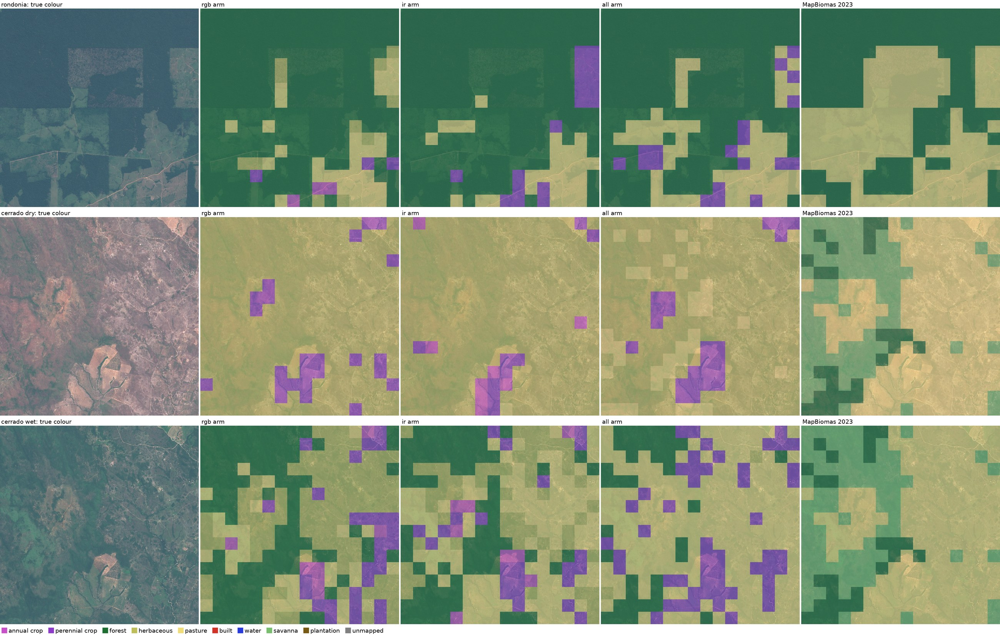

Rows: Rondônia in June, western Bahia in September, the same window in March. Columns: the
scene in true colour, then the 640 m chip grid coloured by the `rgb`, `ir` and `all` arms'
predictions, then MapBiomas 2023. The `rgb` column turns a third of the Cerrado to "forest"
between September and March.

## Semantic segmentation — a ResNet-34 UNet on BraTS

The segmentation demo. A ResNet-34 encoder (the Ch-5 architecture, reused
verbatim as the contracting path) + a UNet decoder, on MSD Task01_BrainTumour:
224×224 axial slices, 4 co-registered MRI modalities (FLAIR / T1w / T1gd / T2w)
→ 4 tumour classes. 24.5M params, plain per-pixel CE, 10 epochs.

`MainUnetBratsR34.lean`, `MainBratsPredict.lean`. See
`planning/archive/r34_brats_retrain.md`; logs and per-epoch curves in
`runs/2026-09-25-brats-r34-xla/`.

```bash
./scripts/datasets/download_brats.sh
python3 scripts/datasets/preprocess_brats.py data/brats/Task01_BrainTumour data/brats224 \
        --size 224 --seed 0            # same patient split as data/brats
./scripts/sweeps/run_brats_r34_ab.sh 10 data/brats224 # both arms, one per GPU, ~50 min
lake exe brats-predict net=r34 arm=scratch,r34 best out.ppm   # best-by-val checkpoints
python3 scripts/demos/brats_figure.py out.ppm demos/figures/brats_r34_skip_transfer.png \
    --labels "T1gd,ground truth,from scratch,ImageNet R34"
lake exe brats-eval net=r34 arm=r34 best out=pervol.csv        # per-patient Dice, the literature's protocol
```

Best-by-val checkpoint (epoch 9 in both arms), 2,569 held-out slices from 73 patients, pooled:

| arm | mIoU | WT | TC | ET |
|---|---|---|---|---|
| `r34` (ImageNet bootstrap) | 0.743 | 0.912 | 0.869 | 0.856 |
| `scratch` (He-init) | 0.741 | 0.910 | 0.867 | 0.856 |

The same checkpoints scored the way BraTS papers score — one Dice per patient over every slice
of the volume, mean over the 73 patients (`brats-eval`, from `preprocess_brats.py --val-full`):

| arm | WT | TC | ET |
|---|---|---|---|
| `r34` (ImageNet bootstrap) | 0.893 | 0.821 | 0.790 |
| `scratch` (He-init) | 0.889 | 0.819 | 0.783 |
| `scratch noskip` | 0.843 | 0.749 | 0.620 |

Two to seven points below the pooled numbers, with medians at the pooled values: a tail of
small-tumour patients pulls the means down, which is what the per-patient protocol is for. The
tumour-free slices themselves cost under 0.003.

**Through-plane context, measured two ways** (`runs/2026-09-29-brats-25d/`). `unet-brats-r34
ctx=1` is the same net fed the slice above and below as eight extra channels, from a 2.5D build
(`preprocess_brats.py --context 1`), everything else matched to the 2D run: it ties, +0.001 to
+0.004 on every metric, pooled and per patient. A 3D UNet on 128³ patches in JAX
(`jax/scripts/unet3d_brats.py`, the reference a Lean 3D port would tie to) reaches per-patient
WT 0.894 / TC 0.810 / ET 0.790 after one hour on one card, level with the anchor and still
improving; rank-5 convolution runs at 77% of the 2D per-voxel rate (`jax/scripts/unet3d_gate0.py`).
Whether 3D goes past the slice model on this data is a longer-schedule question, and the 3D
codegen port waits on it (`planning/brats_25d_3d.md`).

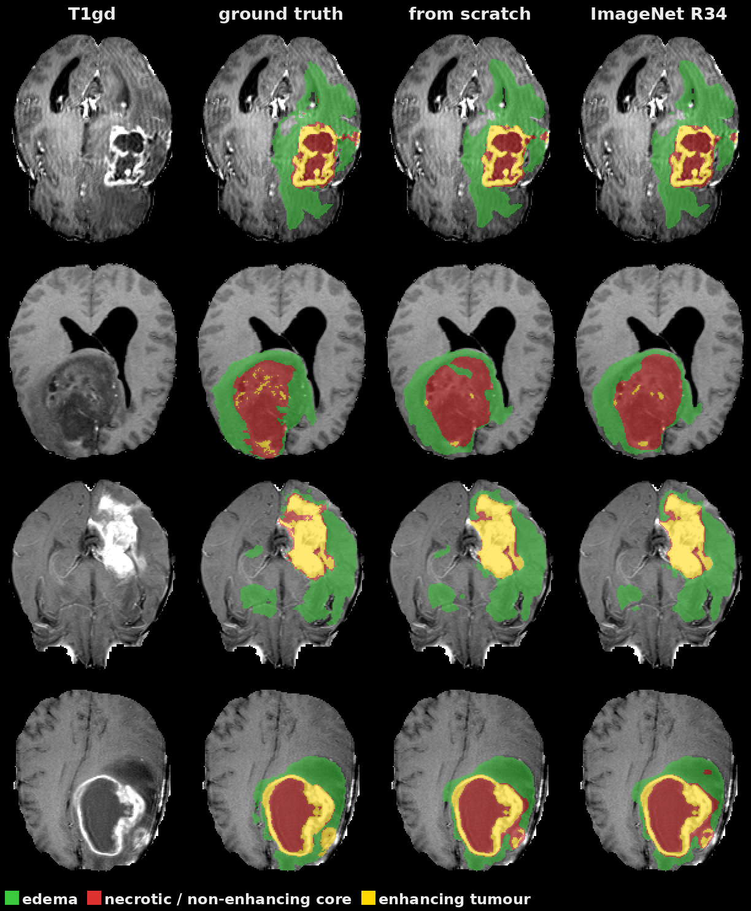

One held-out patient per row: the T1gd slice, the ground truth, and each arm's prediction on the
same slice. Background is 97% of the voxels, which is why this picture carries more than the pixel
accuracy does. The yellow rim around a red core in the first and last rows is a textbook
ring-enhancing glioblastoma.

**Two things this demo measures, and they are not the same size.**

*Skips are worth ~10 points.* Same backbone and schedule, decoder with and
without the encoder concat: **0.633 → 0.741 mIoU**, the largest gain on ET
(+0.12), the thinnest structure — a skipless decoder has to rebuild every
boundary from a 7×7 bottleneck. Run the ablation with `noskip`.

*Transfer buys a head start of a few points, not a better model.* The two arms
differ in exactly one field (`bootstrapBackboneRange`), so 86.8% of params start
pretrained vs random and everything else is identical. After **epoch 1** the
bootstrapped arm is at ET Dice 0.805 against the control's 0.742 (mIoU 0.631
against 0.616); by epoch 2 the control is level, and the peaks above are a tie
(+0.002, noise at n=1). Transfer's payoff scales inversely with dataset size,
and 14,415 slices is a lot — a data-fraction sweep is the experiment that would
show it properly.

The backbone is `.lake/build/jax_r34_imagenet.bin`, trained by this stack on
ImageNet to 72% top-1. Nothing is downloaded. Its stem is 3-channel RGB and
BraTS needs 4, so the transferable weights are not a prefix — hence
`bootstrapBackboneRange`, which patches a byte *range* and leaves the fresh
stem He-init. It self-checks on every run: the patched window must be
byte-equal to the checkpoint and the stem must be untouched, or it throws.

---

## Natural language processing — TinyGPT on Shakespeare

Char-level transformer on Karpathy's tinyshakespeare. Three new
codegen primitives shipped to support it:

- `tokenPositionEmbed` (one-hot → embed + learnable position)
- `lmHead` (per-position dense + reshape into `useSeg` loss path)
- `causalMask` flag on `transformerEncoder`

212K params (T=64, D=64, 4 layers, 2 heads). 10K Adam steps take ~3 min on
one RTX 4060 Ti through XLA, compile included, and reach 2.28 bits/char on
the held-out split (bigram baseline 3.56, uniform 6.02). Workings in
`runs/2026-09-09-tinygpt-nano-xla/`; plan in `planning/archive/tinygpt_demo_v2.md`.

```bash
./scripts/datasets/download_shakespeare.sh             # downloads tinyshakespeare.txt
python3 scripts/datasets/preprocess_shakespeare.py     # builds train.bin / val.bin / vocab.txt
lake exe tinygpt-shakespeare train nano 10000                    # 10K Adam steps, saves params
lake exe tinygpt-shakespeare sample nano 600 80 0 100 1 "ROMEO:"  # 600 chars, temp 0.8, seed 1
```

Sample output after 10K steps (val 2.28 bits/char, train 1.99):

```text
ROMEO:
O heaven farewell, upon thy hands.

NORTHUMBERLAND:
Then with clearing too forpully of his,
You are would not we love I have,
Which of you have I do foeble thy true king with odds
To desire her furrow'd the victory,
Hence that speak to be weak the way deal is.

EDWARD:
What, worse speed have more in himself inger's and thousand.
God come to Romeo
A sentence comfort to your throlds,
I think of thy souls to the merrolk, his life,
Some no paper brother hands than the tent up never
'Tis grace, O, blest thy headst jewel denied
To creass thy breaks wind to live:
And then to dark the you kin our par
```

Real Shakespeare character names (NORTHUMBERLAND and EDWARD here;
QUEEN MARGARET, MERCUTIO, JULIET, BRUTUS across the fixed-prompt suite
in `blueprint/src/figures/tinygpt/prompt_suite_nano.txt`), a Romeo
named inside another speaker's line, coherent multi-line dialog with
proper cadence and punctuation. Semantic coherence drops past the 64-char
context window — exactly what the planning doc predicted.

A `bigram-shakespeare` baseline (single dense V→V predicting next
char given current char) also lives here as a smoke test that the
data pipeline + sampler work end-to-end without the transformer.

---

## Diffusion — DDPM on MNIST

Denoising diffusion on MNIST. A tiny UNet predicts the noise
ε(x_t, t) that was added to an image; sampling runs that prediction backwards.
Cosine ᾱ schedule, ancestral sampling (DDIM at η = 1) with 50 steps subsampled from
T = 1000, time conditioning via a tiled `t/T_max` channel — which needs no new codegen
primitive, the UNet just sees one extra input channel.

`MainMnistDdpmTrain.lean` + `Sample`. Tiny UNet, base 16, 50 epochs.
See `planning/archive/ddpm_demo.md`.

```bash
lake exe mnist-ddpm-train                                  # data/, 50 epochs
lake exe mnist-ddpm-sample runs/mnist_samples.ppm          # 4x4 grid, ancestral; eta=0 for deterministic DDIM

# the two-row trajectory figure below — drawn with deterministic DDIM, whose reverse
# row denoises smoothly; the ancestral row re-injects noise at every step
lake exe mnist-ddpm-sample trajectory data=data img=7 eta=0
python3 scripts/demos/ddpm_trajectory_figure.py \
    runs/2026-09-02-mnist-ddpm/trajectory.ppm \
    --out demos/figures/ddpm_mnist_trajectory.png
```

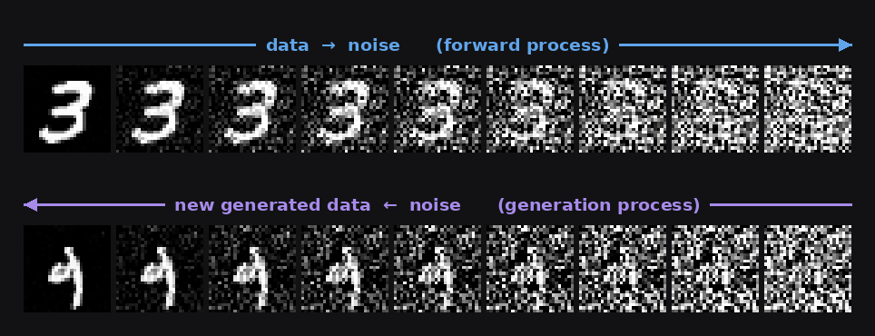

**Top: the forward process.** A real MNIST training digit at nine points along
the schedule, x_t = √ᾱ_t·x₀ + √(1−ᾱ_t)·ε. Nothing is learned here — it is the
fixed corruption the model is trained to invert, and by the right-hand end the
digit is gone.

**Bottom: the reverse process**, read right to left. Sampling starts from fresh
N(0, I) noise and walks back down the same schedule, and a **different** digit
condenses out of it. That is the point of the row: it is not a reconstruction of
the 3 above it. The model never sees that image during sampling — it has learned
what MNIST digits look like at every noise level, and any noise seed lands
somewhere on that manifold.

⭐ **The two rows are aligned by noise level, not by step index.** Column *c* of
both rows sits at the same ᾱ, so reading down a column compares "a real digit
this corrupted" against "what the model can still recover from that much noise."
Indexing the bottom row by sampler step instead would have made the columns
incomparable and the figure decorative. Both rows are emitted by the sampler
itself (`mnist-ddpm-sample trajectory`), using the same ᾱ table and the same
`ddimStep` primitive as an ordinary run, so the picture cannot drift from the
process it illustrates; `scripts/demos/ddpm_trajectory_figure.py` only upscales and
labels.

⚠ Most of the visible change happens in the last few columns. That is the cosine
schedule, not a rendering artifact — ᾱ stays low across most of the trajectory
and the image resolves late.

**Scored, not squinted at.** Chapter 3's verified CNN (98.66% on the real test split) classifies
1024 samples, and the samples are compared with real digits on three axes: how many classes appear
(coverage), how sure the classifier is, and the energy distance to 1024 real images as a multiple
of the real-vs-real floor.

```bash
LEAN_MLIR_DUMP_PARAMS=.lake/build/cnn_verified_params.bin \
  lake exe mnist-cnn-verified data                   # the scorer's classifier, ~50 s
lake exe mnist-ddpm-score 1024 50                    # 1024 samples, 50 steps, ancestral, ~13 s
lake exe mnist-ddpm-score 1024 50 0                  # the same at η = 0 (deterministic DDIM)
python3 scripts/demos/mnist_ddpm_score.py                  # exits non-zero below 10/10 coverage
```

| arm | sampler (50 steps) | coverage | confidence | energy (× floor) |
|---|---|---|---|---|
| real MNIST, scored as if generated | — | 10/10 | 99.40% | 1× |
| **50 epochs, centred to [−1, 1]** (the recipe above) | **ancestral, η = 1** | **10/10** | 92.98% | **4×** |
| 50 epochs, uncentred | ancestral, η = 1 | 10/10 | **93.60%** | 6× |
| 50 epochs, centred | deterministic, η = 0 | 10/10 | 90.94% | 15× |
| 50 epochs, uncentred | deterministic, η = 0 | 9/10 | 92.82% | 33× |
| 3 epochs, centred | deterministic, η = 0 | 8/10 | 84.19% | 73× |
| 3 epochs, uncentred | deterministic, η = 0 | 9/10 | 63.89% | 119× |
| unstructured pixels with MNIST's moments | — | 4/10 | 58.47% | 231× |

⭐ **The sampler is worth as much as the training.** The same 50-epoch checkpoint goes from 15× to
4× the floor at the same 50 network evaluations when the reverse process re-injects noise, and
ancestral sampling also restores the class the uncentred arm dropped. The book's η sweep has the
whole curve: ancestral at 50 evaluations (0.0067) beats deterministic DDIM at 200 (0.0188).

⭐ **Confidence alone would pick the wrong model.** Under the deterministic sampler the uncentred
50-epoch arm is the more confident of the two while dropping a class ("1" gets 0.8% of the mass) and
doubling the distance to the data; under the ancestral one it is again the more confident and again
the farther. The classifier is 58% confident on noise, so its usable range starts there, not at 0.
Epochs do most of the work (3 → 50 is 3.6–4.9× on energy), centring the rest (1.6–2.2×). The η = 0
arms and the per-class masses are in `runs/2026-08-28-mnist-ddpm-verified-score/`.

---

## Physics — a flow-matching Boltzmann generator on the Müller-Brown surface

The second half of the diffusion demo, and the one whose ground truth is a
formula. The target is the density exp(−U/kT) on Müller-Brown's three-well
surface; the training set is what eight overdamped Langevin chains produce at
kT = 20 in 10⁵ steps each. The network is the 2-D toy demo's 18,178-param MLP
on the rank-2 DDPM MSE block; `flow` changes the interpolant to
x_t = (1−t)x₀ + tε with target ε − x₀ and the sampler to Euler on dx/dt = v.
Every sample carries its exact log-density (the Jacobian's log-determinant
integrated beside the state), so the model can be reweighted to any
temperature. Plan: `planning/boltzmann_generator_demo.md`.

`MainDiffusion2d.lean` (the four point-cloud targets of
`planning/archive/diffusion_2d_demo.md` are still in it).

```bash
python3 scripts/datasets/preprocess_boltzmann.py                                      # data + grid, ~1 min CPU
lake exe diffusion-2d muller_brown flow 20000 50 logp nll            # train 30 s, sample, densities
lake exe diffusion-2d muller_brown flow reuse 20000 10 logp          # NFE sweep on the checkpoint
lake exe diffusion-2d muller_brown ot 20000 50 logp                  # minibatch-OT coupling
lake exe diffusion-2d muller_brown reflow 20000 50 logp              # reflow on the flow's own pairs
lake exe diffusion-2d muller_brown 20000 50 ddim                     # the DDPM path, same target
python3 scripts/demos/boltzmann_metrics.py score "flow NFE 50=<samples.bin>" --gate
python3 scripts/demos/boltzmann_metrics.py transfer <samples.bin> --out=<run>
python3 scripts/demos/boltzmann_figure.py <run> boltzmann_mb.png           # needs matplotlib
```

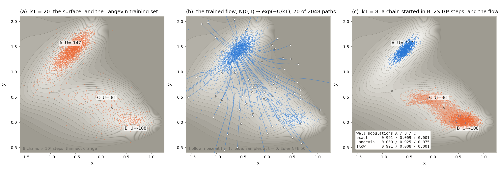

| kT = 20, n = 2048 | p_A / p_B / p_C | ⟨U⟩ | ΔF_AB | energy (× floor) |
|---|---|---|---|---|
| quadrature (exact) | 0.806 / 0.129 / 0.065 | −113.6 | −36.6 | 1× |
| Langevin training set | 0.844 / 0.101 / 0.054 | −112.6 | −42.4 | 4.1× |
| flow, Euler, NFE 50 | 0.834 / 0.103 / 0.063 | −112.4 | −41.9 | **3.2×** |
| ↳ reweighted by p₂₀/p_θ | 0.805 / 0.129 / 0.066 | −112.8 | −36.7 | — |
| DDPM, DDIM, NFE 50 | 0.895 / 0.059 / 0.046 | −114.7 | −54.4 | 18× |
| N(0, I) prior | 0.419 / 0.195 / 0.385 | 57.2 | −15.3 | 306× |

The model is faithful to its training set, not to the physics (it over-weights
A because the chains do), and the importance weights p₂₀/p_θ recover the
quadrature row from its own samples. Reweighted to kT = 8, where a Langevin
chain started in well B never crosses in 2×10⁵ steps, the model gives
0.991 / 0.008 / 0.001 against the exact 0.991 / 0.009 / 0.001 and ΔF within
0.3 units. Reflow makes a one-step generator at 4.9× the floor (independent
coupling: 233×). Numbers, gates and every artifact in
`runs/2026-09-11-boltzmann-generator/`.

---

## Signal processing — gravitational-wave detection on LIGO strain

A chapter-4 CNN against the detector its field already has. Advanced LIGO's strain is a time
series at audio rates; a binary-black-hole merger is a chirp sweeping from 25 Hz to a few hundred
in under a second; and the detector to beat is the matched filter, whose detection probability in
stationary Gaussian noise is a closed form (a Marcum Q-function). So, like blackjack's value
iteration and the Boltzmann generator's quadrature, this demo has a theorem for a ceiling.

`MainGwDetect.lean` (`gw-detect`). The net is `CIFAR-CNN8-wide-BN` from chapter 4 with a
two-channel stem and a two-way head, 0.83M parameters, on a 2 × 64 × 128 input: one constant-Q
spectrogram per detector (64 log-spaced bands over 20–500 Hz, 128 frames) of a whitened 2 s
window. Adam at 10⁻³ with one warm-up epoch and cosine decay, batch 64, six epochs — under two
minutes on one card. Zero new codegen: the ordinary train step with integer labels, the
blackjack/2-D pattern of a host loop around it. See `planning/gw_detection_demo.md`.

```bash
python3 scripts/datasets/preprocess_gw.py --pairs=26 --val-pairs=6 --out=data/gw    # O3a H1+L1 from GWOSC, whitened; IMRPhenomD chirps injected at SNR 4–20
lake exe gw-detect arm=real  net=cifar8w epochs=6 tag=real          # trained on the real strain
lake exe gw-detect arm=gauss net=cifar8w epochs=6 tag=gauss         # trained on Gaussian noise coloured by the same PSD
python3 scripts/demos/gw_metrics.py table --gate                          # the matched filter against its closed form (Gate 1)
python3 scripts/demos/gw_metrics.py matrix gauss=<prefix> real=<prefix>   # the 2 × 2 of trained-on × tested-on
python3 scripts/demos/gw_figure.py <table_val.json> gw_detect.png --cnn-real=<table_val.json> --net=CNN
```

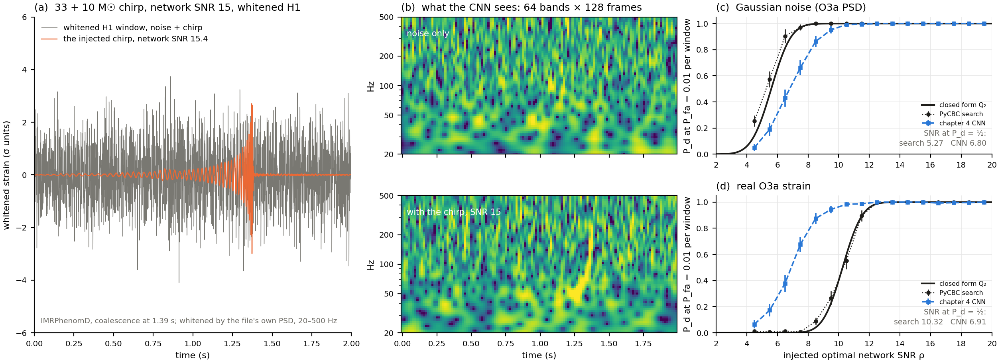

(a) A whitened 2 s H1 window from the validation set with its injected chirp overlaid; (b) the
spectrograms the CNN sees, a noise-only window and the injected one; (c) detection probability
against injected network SNR in Gaussian noise — the closed form at the search's own threshold,
PyCBC's coherent matched-filter search on the same windows, and the CNN; (d) the same in real O3a
noise.

**The data is real detector noise with the signal we chose.** Twenty-six file pairs of O3a strain
from H1 and L1, science-mode and free of hardware injections, cut into 2 s windows and whitened by
each file's own median-Welch PSD over 20–500 Hz. Half the windows carry an IMRPhenomD chirp from
PyCBC, masses uniform in [10, 50] M☉, random sky position, projected onto both detectors and
scaled to a network SNR uniform in [4, 20]. Two noise sets share every window and every injection:
Gaussian noise coloured by the same PSD, the theorem's regime, and the strain itself. 40,760
training and 12,228 validation windows.

**The instrument is a closed form, and the filter is checked against it first.** PyCBC's matched
filter with the injected template at the known arrival time reproduces Q₁(ρ, ρ*) on the Gaussian
set to within binomial error in every SNR bin — half detection at SNR 4.68 against the theorem's
4.75 for H1 at a false-alarm rate of 10⁻² per window — so the injection's SNR and the whitening
agree on one PSD. The search statistic then maximises over the window and the ±10 ms
inter-detector delay, exactly as a search must, and the CNN, which sees no time, is compared to
that. Every row's threshold is set empirically on the split's noise-only windows so that exactly
the stated fraction of them exceeds it.

| trained on | ρ½ tested on Gaussian, FAR 10⁻² | ρ½ tested on real, 10⁻² | ρ½ tested on real, 10⁻³ |
|---|---|---|---|
| CNN, Gaussian noise | 6.80 | 7.17 | 18.7 |
| CNN, real O3a strain | 6.65 | **6.91** | **7.52** |
| PyCBC coherent search | **5.27** | 10.32 | — |

ρ½ is the injected network SNR at which half the injections are detected. Each network is best on
the noise it trained on, by a few tenths, and in Gaussian noise the filter is the optimum it is
supposed to be. **Real noise costs the filter, not the network:** the filter loses five units of
SNR to glitches at 10⁻², and at 10⁻³ its threshold is 417 — eight validation windows hold a glitch
that loud, and without a veto the filter has no row — while the network trained on real strain
still reaches half detection at 7.5. Training on the real detector is what teaches the glitch
tail. Runs and the figure script's inputs are under `runs/2026-09-11-gw-*/`.

## Beyond vision — neural quantum states on the transverse-field Ising chain

The science demo. The network *is* the wavefunction: ψ_θ(σ) maps a spin
configuration to a log-amplitude, the loss is the energy ⟨ψ|H|ψ⟩/⟨ψ|ψ⟩ of the
transverse-field Ising chain (H = −J Σ σᶻᵢσᶻᵢ₊₁ − h Σ σˣᵢ, periodic, a phase
transition at h = J), and there is no dataset: the training signal is the model's
own local energies. One design rule throughout: **structure first, the network
models the rest.** ψ_θ = ψ_ref · exp f_θ, where ψ_ref is the mean-field product
state at the optimal angle — a closed form the host adds to the network's output —
so f_θ = 0 is the floor row of every table and the network only learns what mean
field gets wrong. Three residuals climb the ladder: an MLP on ±1 spins, a ViT on
patches of p spins as token ids, and a GPT whose conditionals *are* the
wavefunction (|ψ|² = Π_k p(patch_k | <k)), sampled exactly by the TinyGPT loop.
Every rung is scored against a closed form: enumeration of all 4096 configurations
at N = 12, the Jordan-Wigner free-fermion solution at N = 64.

`MainNqsIsing.lean`, `scripts/demos/nqs_metrics.py`, `scripts/demos/nqs_figure.py`. Plan:
`planning/transformer_wavefunction_demo.md`. Zero new codegen: the energy
gradient ∂E/∂θ = 2 Σ_s p_s (E_loc(s) − E) ∂_θ log ψ(s) is one host weight per
configuration, handed to the rank-2 DDPM MSE block as the target y = out − M·w/2
(the blackjack DQN's trick with a physical target).

```bash
python3 scripts/demos/nqs_metrics.py gate                              # enumeration vs Jordan-Wigner, 7e-15
export LEAN_MLIR_MEM_FRACTION=0.1
lake exe nqs-ising mlp N=12 h=1.0 steps=4000 lr=0.003 cosine     # 50 s, exact gradient
lake exe nqs-ising vit N=12 h=1.0 steps=4000 lr=0.001 cosine     # 82 s
lake exe nqs-ising gpt N=12 h=1.0 steps=4000 lr=0.003 cosine check   # 330 s, + the sampler gate
lake exe nqs-ising gpt N=64 h=1.0 p=4 steps=2000 lr=0.003 cosine  # ~20 min, 1024 chains
lake exe nqs-ising mlp model=j1j2 N=16 J2=0.5 steps=4000 lr=0.003 cosine   # rung 4, 45 s
python3 scripts/demos/nqs_metrics.py score GPT=.lake/build/nqs_ising_gpt_n12_h100_metrics.json --gate
python3 scripts/demos/nqs_figure.py runs/2026-09-11-nqs-ising nqs_ising.png
```

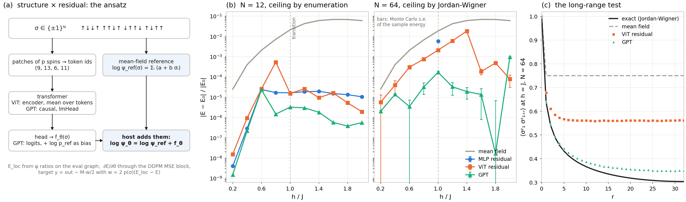

| N = 12, h = J | params | (E − E0)/\|E0\| | Var(E_loc) | ⟨σˣ⟩ | ⟨σᶻ₁σᶻ₇⟩ |
|---|---:|---:|---:|---:|---:|
| mean field (floor) | 0 | 2.1e-02 | 0 | 0.5000 | 0.7500 |
| MLP residual | 5,057 | 1.6e-05 | 4.3e-03 | 0.6383 | 0.4613 |
| ViT residual | 25,825 | 1.5e-05 | 2.5e-03 | 0.6381 | 0.4618 |
| GPT | 25,956 | 3.3e-06 | 5.2e-04 | 0.6384 | 0.4611 |
| exact (enumeration) | — | 0 | 0 | 0.6384 | 0.4610 |

| N = 64, h = J | params | (E − E0)/\|E0\| | Var(E_loc) | ⟨σˣ⟩ | ⟨σᶻ₁σᶻ₃₃⟩ |
|---|---:|---:|---:|---:|---:|
| mean field (floor) | 0 | 1.8e-02 | 0 | 0.5000 | 0.7500 |
| MLP residual, Metropolis | 8,385 | 5.9e-03 | 3.7 | 0.5660 | 0.6256 |
| ViT residual, Metropolis | 26,529 | 2.1e-03 | 4.8e-01 | 0.5921 | 0.5616 |
| GPT, exact sampling, 2000 steps | 27,056 | 1.7e-04 | 2.0e-02 | 0.6341 | 0.3498 |
| GPT, exact sampling, 4000 steps, lr 1e-3 | 27,056 | 1.5e-04 | 1.9e-02 | 0.6323 | 0.3374 |
| exact (Jordan-Wigner) | — | 0 | 0 | 0.6367 | 0.3036 |

At N = 12 every rung is four to six orders below the floor and the GPT, whose
conditionals are the wavefunction, is the best of them at every field. At N = 64 the
ceiling is the free-fermion solution and the ladder separates: the GPT's exact,
independent samples keep it at 1e-5 to 1e-4 across the whole sweep, while the ViT
on Metropolis chains is ten to a thousand times worse at the same parameter count
and step budget — the gap the plan's stochastic-reconfiguration rung was written
for.

⭐ **The reference decides the small-field rows, and the table says by how much.**
Same ViT, same steps, from the uniform state and from the mean-field state: at
h = 0.2 the reference is worth three orders of magnitude (3.0e-5 → 1.6e-8), at
h = 0.4 about two, and at h = J nothing at all (1.5e-5 either way) — there the
reference is as wrong as the uniform state and the network does all the work.

⚠ **Low variance plus a wrong energy means the wrong state, and here it means the
wrong symmetry.** The ViT at N = 12, h = 0.8 converges to a relative error of
5.4e-4 with a variance three times *lower* than its neighbours, and its excess
energy is Δ/2 to three digits (Δ the even–odd splitting): it sits in the
symmetry-broken half of the finite-N cat state that the product-state reference
imprints, and neither seeds, doubled steps, width, depth nor patch size move it.
The MLP restores the Z2 symmetry by itself; the GPT never breaks it. The fix is
more structure, not more network: `symref`, the symmetrised reference
ψ_MF(σ) + ψ_MF(−σ), is one `logaddexp` on the host and takes the point to 2.0e-5.

**Rung 4, the sign-structure chain.** `model=j1j2` swaps in the J1-J2 Heisenberg
chain, whose frustrated ground state has signs, and gives the head two slots,
(log|ψ|, φ), with the Marshall sign rule as the reference phase; the complex
gradient is two host weights per configuration through the same MSE block. At
N = 16 in the S_z = 0 sector (Lanczos ceiling; −3/8 per site exactly at the
Majumdar-Ghosh point) the phase head learns the Marshall signs from scratch at
J2 = 0, every arm finds the dimer state at J2 = J1/2 to 3e-6 with fidelity 1.000,
and past that point, where the sign rule breaks, every arm stalls at 1e-2 with a
fidelity below 0.5 — the row this rung exists for. A wider pass (hidden 256 / d 64,
8000 steps) takes the unfrustrated rows to 1e-5 and the frustrated one only to 6e-3
at fidelity 0.55, so the sign structure past the Majumdar-Ghosh point is the open
problem, not capacity. Table 3 and the figure are in the run folder.

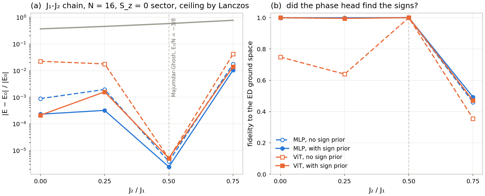

⚠ A sampler check on a *trained* state scatters wider than N(0, 1) because the
local energy is heavy-tailed; the gate is the pooled test over draw seeds (eight
seeds: offset −1.3e-4 ± 3.4e-4), and the `check` output labels a single z as one
draw. Numbers, gates, every arm's log and the h = 0.8 investigation are in
`runs/2026-09-11-nqs-ising/`.

---

## Reinforcement learning — blackjack from tabular Q to DQN, the Pong environment, and AlphaZero on tic-tac-toe

Three games written in Lean, each with its own exact instrument — the book's closing
section, Bestiary entries: game theory. They are the reinforcement-learning
ladder of `planning/blackjack_dqn_demo.md`,
`planning/pong_dqn_demo.md` and `planning/alphazero_ttt_demo.md`: rung 1 tabular Q on
blackjack, rung 2 the blackjack DQN, rung 3 DQN from pixels on Pong, rung 4 self-play
and tree search on tic-tac-toe — every trained rung through the stack on the rank-2
DDPM MSE block, zero new codegen.

```bash
lake exe blackjack-env 1000000 10000000   # Monte Carlo hands, tabular-Q hands
lake exe blackjack-env play 7 hs          # replay a hand from a seed with the DP's exact Q-values
lake exe blackjack-dqn 200000 1 double    # updates, seed; flags: double, lrdecay, tag=<name>
lake exe pong-env 100                     # games per baseline arm
lake exe pong-dqn mode=pixels k=4         # DQN from frames; mode=state is the ceiling row
lake exe ttt-env n=4                      # the solved game: counts, scripted pairings, the solver's gates
lake exe alphazero-ttt n=3                # 20 iterations, 2.5 min on one card
lake exe alphazero-ttt n=4 iters=40 sims=100 sweep=50000 epochs=5    # the same binary, 10 min
```

The environment, the DP instrument and tabular Q live in
`LeanMlir/Blackjack.lean`, shared by both blackjack exes. It follows
Gymnasium's Blackjack-v1 with `sab=True` (the Sutton & Barto rules). A value iteration over the 200 decision states gives the
exact optimum, **−0.0431 per hand**, and the exact value of any policy, so
every arm is scored without sampling error; the Monte Carlo column is the
cross-check that the environment and the DP describe the same game.

| arm | exact value / hand | agrees with optimum |
|---|---|---|
| random | −0.394 | 110 / 200 |
| threshold heuristic | −0.240 | 164 / 200 |
| the old demo's published table | −0.097 | 162 / 200 |
| tabular Q, 10⁷ hands, step max(0.001, 1/(1+N)) | −0.044 | 195 / 200 |
| DQN, Double, 200k updates (`blackjack-dqn`) | −0.048 | 188 / 200 |
| exact optimum | −0.043 | 200 / 200 |

`MainBlackjackDqn.lean` is the 6,210-parameter dense net on a 29-float one-hot,
XLA backend, one GPU, about ten minutes for 200k updates. The host writes the
Bellman target into the taken action's slot of the net's own prediction and
hands that to the DDPM MSE train step, so the untaken slot's gradient is zero;
the greedy policy is read off the net every 50 updates for acting and scored
exactly every 1000. Run logs, curves and the figure script's inputs are in
`runs/2026-09-11-blackjack-dqn/`; `scripts/demos/blackjack_figure.py` draws the
book's chart.

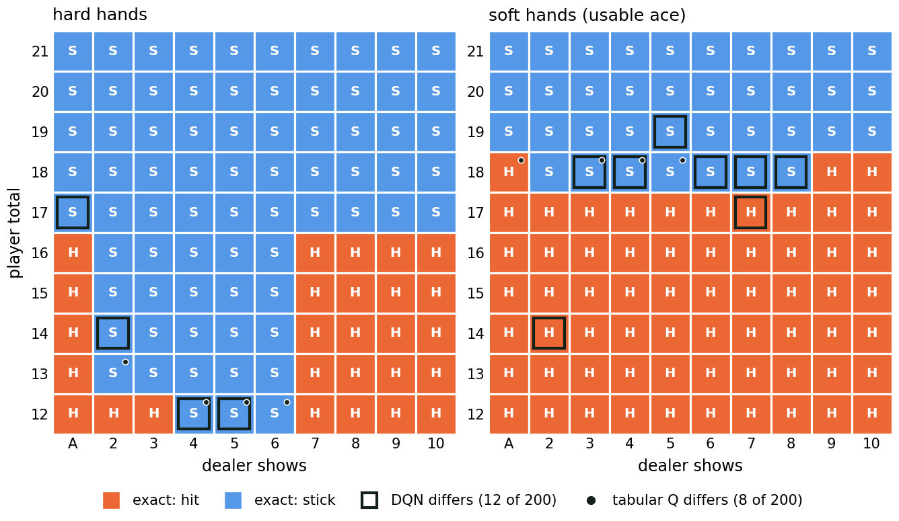

The exact hit/stick policy under the Sutton & Barto rules, player total against the dealer's
showing card, hard hands and soft. Rings mark the twelve cells where the trained DQN disagrees
with the theorem, dots the eight where tabular Q does. Both learners miss on the knife edges:
hard 12 against a 4, where hitting and sticking differ by a quarter of a cent a hand, and the
soft-18 row, where the casino card is wrong too.

The DP's hit/stick chart is Sutton & Barto's Figure 5.2. The published table
from the old Swift demo is a casino-rules chart whose rows for 10 and 11 are a
doubling table transcribed as "stand"; the instrument found that on its first
run.

`MainPongEnv.lean` is Pong in ~150 lines: 84×84 render, frame skip 4, a scripted
opponent with a speed and a reaction-delay knob, deterministic from a seed, five
million raw frames per second single-threaded. Random scores −17.9 per game, a
reactive tracker +11.2 against the default opponent; the frame strip the
network will see is written to `.lake/build/pong_stack.pgm`.

`MainPongDqn.lean` is Mnih et al.'s loop on that Pong: replay 100k, ε 1 → 0.1 over 100k
agent steps, target copy every 1,000 updates, one update per four agent steps, batch 32,
Adam 1e-4, 500k agent steps (2M frames); `mode=state` is the six-number twin (the
blackjack MLP with six inputs), `mode=pixels k=4` chapter 3's CNN kit at 84×84 on a stack
of four frames, `k=1` the ablation. Runs in `runs/2026-09-25-pong-dqn/`.

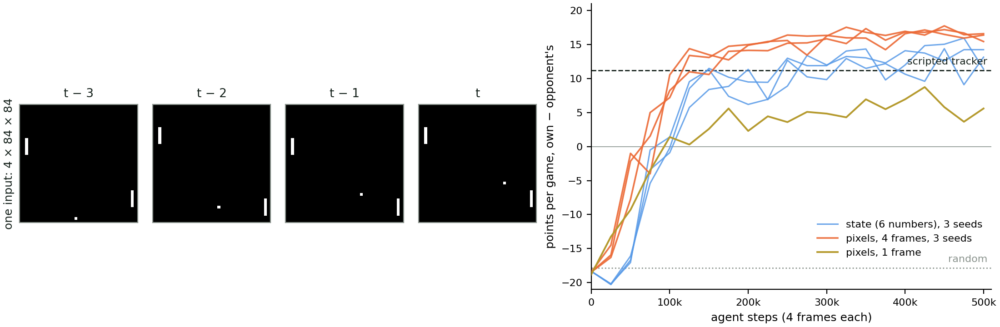

| arm | points per game (20 games, ε 0.05) | first positive eval |
|---|---|---|
| random (`pong-env 100`) | −17.88 ± 0.20 | — |
| scripted tracker (`pong-env 100`) | +11.18 ± 0.37 | — |
| pixels, 1 frame | +4.60 ± 1.48 | 100k |
| state, 6 numbers, seeds 1–3 | +14.15 / +12.70 / +13.50 | 100–125k |
| pixels, 4 frames, seeds 1–3 | +15.60 / +15.90 / +14.90 | 75–100k |

⭐ **Pixels beat the state twin on every seed** (+15.47 vs +13.45) and at every opponent
speed (1.0 / 1.5 / 2.0 px per frame: state +14.45 / +13.45 / +9.80, pixels +17.75 /
+15.60 / +14.45); the twin was meant to be the ceiling. One frame cannot see velocity:
+4.6. A pixel run is 27 min on one card with [θ|m|v] resident on the device
(`trainStepAdamF32DdpmR`, 24 → 14.6 ms per update).

### AlphaZero on tic-tac-toe, scored against the solved game

`MainAlphaZeroTtt.lean` is Silver et al.'s self-play loop on tic-tac-toe written in
Lean (`LeanMlir/TicTacToe.lean`), n×n with k in a row, `n=` the one knob. Each
iteration plays 256 games in lockstep: at every move a PUCT search of 25 (3×3) or 100
(4×4) simulations over the net's priors and value — the trees are flat per-game arrays
in C (`lean_mcts_*`), the lockstep stays in Lean — one batched forward over the games'
pending leaves per simulation, Dirichlet noise at the root, the move drawn from the
visit counts; the visit distribution π and the outcome z are the targets, and the next
iteration plays with the new net. The net is AlphaGo's plain conv + ReLU stack
(`Bestiary/AlphaGo.lean`) at tic-tac-toe width — three 3×3 convs at 64, a 1×1 at 4, a
dense 64 — with the policy and value heads merged into one dense output of n² + 1
slots: 78k params at 3×3, 155k at 4×4. The loss `(z − v)² − πᵀ log p` goes through the
DDPM MSE block as a host-built target (`lean_ttt_targets` in `ffi/f32_helpers.c`): the
host asks for the output cotangent it wants, the NQS demo's move.

The instrument is the solved game. A position is a base-3 number over the cells, so a
memoised minimax in C fills one byte per index — 5,478 reachable positions at 3×3,
9,722,011 at 4×4 (43 MB, 0.6 s) — with the exact value and the optimal-move set of
every position. `ttt-env` runs the solver's gates before anything trains (perfect
draws itself 1000/1000, loses to nobody), and the trainer scores every iteration three
ways: the argmax of the net's masked logits against the optimal set over **every**
reachable decision position (4,520 and 9,062,619), the value head against the exact
value, and 256 games each side against a perfect player that draws uniformly from the
optimal set. Run logs, curves, sweeps and the figure's inputs are in
`runs/2026-09-29-alphazero-ttt/`; `scripts/demos/ttt_figure.py` draws the figure and
`scripts/demos/ttt_sweep_stats.py` the miss breakdown.

At **5×5, four in a row** there is no table (3²⁵ bytes): the instrument is an on-demand
exact solver (`lean_ttt_solver_*`, alpha-beta with a symmetry-canonical transposition table
whose entries carry both bounds and the principal move), gated against the dense table on
every reachable 3×3 and 4×4 position — 0 value mismatches, 0 principal moves outside the
optimal set. It says (5,5,4) is a draw (the root as the max over its 25 openings, 33 s;
2.6 GB cache under `.lake/build/`, reloaded by later runs), that after X centre O's only
drawing replies are the four diagonal neighbours, and that an inner-corner opening leaves O
one. The sweep there is a fixed random-play sample of 20,000 decision positions with at
least six stones (`sweepMin=6`; a fresh 3-stone subtree costs seconds, a 6-stone one
milliseconds) — exact per position, not exhaustive, and off the self-play distribution —
and the perfect player takes the search's principal move from the third stone on (one solve
a move; valuing every child was 40 min an iteration). `ttt-env n=5 k=4`: random loses all
400 games to perfect, win-or-block draws 8, perfect draws itself 400/400.

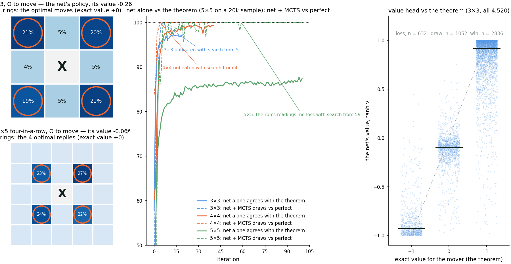

Left: X in the centre, O to move — the trained 3×3 net's move probabilities over the
empty cells with the solved game's optimal moves ringed (the corners draw, the edges
lose; the net puts 81% on the corners), and the same position at 5×5 below it, where O's
only drawing replies are the four diagonal neighbours and the net puts 24% on each.
Middle: the net alone's agreement with the solved game against iteration — every decision
position at 3×3 and 4×4, a 20k sample at 5×5 — with the draw rate of net + search against
the perfect player dashed. Right: the value head against the exact value of all 4,520 3×3
decision positions.

| arm | 3×3 agree | vs perfect X · O (W/D/L) | 4×4 agree | vs perfect X · O | 5×5 (k=4) agree | vs perfect X · O |
|---|---|---|---|---|---|---|
| random | 58.0% | 0/207/793 · 0/33/967 | 60.4% | 0/487/513 · 0/341/659 | 45.0% | 0/0/200 · 0/0/200 |
| win-or-block | 94.0% | 0/831/169 · 0/215/785 | 95.6% | 0/930/70 · 0/840/160 | 77.0% | 0/7/193 · 0/1/199 |
| **net alone** | **97.3%** | 0/768/0 · 0/768/0 | **99.4%** | 0/768/0 · 0/768/0 | **87.4%** | 0/768/0 · 0/708/60 |
| net + search | — | 0/768/0 · 0/768/0 | — | 0/768/0 · 0/768/0 | — | 0/768/0 · 0/745/23 |
| perfect | 100% | 0/1000/0 · 0/1000/0 | 100% | 0/1000/0 · 0/1000/0 | 100% | 0/200/0 · 0/200/0 |

Scripted rows play 1,000 games each way (200 at 5×5) and "agree" is their expected
agreement over the same positions (every decision position at 3×3 and 4×4, the 20k
sample at 5×5); net rows pool three independent evaluations of the saved net
(`alphazero-ttt … iters=0 params=<file>`, seeds 2–4, 256 games each). 3×3: 20 iterations, **2.5 min** on one 4060 Ti;
4×4: 40 iterations, **10.0 min** — the Python implementation this loop follows
([alpha-zero-general](https://github.com/suragnair/alpha-zero-general), Nair) was expected to take a day on that board; 5×5: 100 iterations at
400 sims, **64 min**. The untrained net's sweep, 57.9% and 60.3%, is the random
player's 58.0% and 60.4%.

⭐ **99.4% of 9.06 million positions from 1.2% of them.** Self-play stood at 108,483 of
the 4×4 decision positions and at 2,035 of the 4,520 at 3×3 (45.0%); the sweep scores
all of them. One 4×4 miss in the 50,000-position subsample lies inside the visited set,
and 289 of the 308 are forced wins not taken — positions at 7–14 stones a competent
opponent never produces; the 3×3 misses (122) are the same kind, 98 missed wins and 24
losing moves, at 3–6 stones. The search closes them: with 25 or 100 simulations the net
is unbeaten from iteration 5 (3×3) and 4 (4×4), before the net alone is (11 and 10).

⭐ **The value head estimates self-play, not the theorem.** Its sign agrees with the
exact value on 90% (3×3) and 96% (4×4) of positions, worst at 4×4 on lost ones (59%),
which 4×4 self-play almost never produces (242 of the last iteration's 256 games drew).
The root ends at +0.32 at 3×3 and +0.03 at 4×4 against the theorem's 0: 3×3 self-play
under root noise stays X-favoured (99 X wins / 141 draws / 16 O wins in the last
iteration).

⭐ **At 5×5 the net never loses as X and still loses as O: 60 of 768 alone, 23 with
search.** The run's own readings had net + search unbeaten from iteration 59 to 100; three
independent evaluations of the saved net say otherwise, because the perfect player draws
different optimal lines each time. The 60-iteration run at 200 sims (`n5_run1.log`) reached
the same 86% on the sample and lost far more as O (243/13 with search at its last reading):
the search closes the second player's games and has not closed them yet. Sample agreement
plateaus at 87.4% — the sample is random play, which self-play never visits (4 of the 20k),
and 1,849 of the 2,525 misses are forced wins not taken — while over the **exhaustive
opening** (`opening=3`: every decision position with at most three stones, 7,526 of them)
the net alone agrees with the solved game on **92.1%**, value sign 82.8%: best where the
theory is. The root's value settles at +0.04.

⭐ **The search was the wall clock, and it was Lean.** With the tree in Lean (a
`HashMap` of nodes per game, ~90 µs a descent) the same 4×4 run took 34.9 min: 18.5 s of
self-play and 17.8 s of matches per iteration. Flat per-game arrays in C take 0.7 and
0.8 s, the run 10.0 min, and what is left is the train step — 18–20 s of every 4×4
iteration at the full replay window. The Lean-tree runs are kept beside the C-tree
ones (`n3_run2.log`, `n4_run1.log`: 97.9% / 99.2%, unbeaten alone from 14 / 38).

⚠ **Not the bestiary's tower.** The first run used the conv-BN-residual body of
`Bestiary/AlphaZero.lean`, was unbeaten from iteration 4 and diverged at iteration 11
(loss 1.26 → 10.8 in three iterations, `n3_convbn_collapse.txt`). BatchNorm's batch
statistics over nine binary cells are a liability — a channel whose batch variance
vanishes is divided by √1e-5 — and with BN the eval forward the loss trick reads and the
train step's forward are different functions. Blackjack and Pong made the same call.

## Layout

The demos above are the maintained set. Everything else lives in one of two
subfolders — moving a file does **not** change its executable name, so every
`lake exe <name>` in this repo, in `scripts/` and in CI still works unchanged.

```
demos/
├── README.md                              # this file
├── figures/                               # rendered outputs for the README
│
│   # ── the demos, in chapter 10's order ──
├── MainUnetBratsR34.lean                  # R34-UNet on BraTS (segmentation)
├── MainUnetBratsTrain.lean                # from-scratch UNet on BraTS
├── MainBratsPredict.lean                  # render predicted masks from a checkpoint
├── MainYolov1VisdroneFpn.lean             # R34+FPN detector on VisDrone, train + infer
├── MainYolov1NeuDetFpn.lean               # the same detector on NEU-DET steel defects (industrial inspection)
├── MainYolov1NeuDet448.lean               #   and the single-grid arm beside it, out of the archive
├── MainAraslSigns.lean                    # chapter-4 CNN on ArASL sign-language letters, random vs blocked split (people watching)
├── MainPlantLeaf.lean                     # chapter-6 R34 on PlantVillage lab leaves → PlantDoc field leaves, CAM + Shapley (agriculture)
├── MainRsBands.lean                       # chapter-4 CNN on EuroSAT's 13 Sentinel-2 bands under five stems, scored on Amazon / Cerrado chips (remote sensing)
├── MainMnistDdpmTrain.lean / Sample       # DDPM on MNIST (Sample also writes the
│                                          #   two-row trajectory figure)
├── MainDiffusion2d.lean                   # 2-D diffusion + flow matching: the Boltzmann generator
├── MainGwDetect.lean                      # chapter-4 CNN vs the matched filter on LIGO O3a strain (signal processing)
├── MainNqsIsing.lean                      # neural quantum states: MLP/ViT/GPT wavefunctions on the Ising chain
├── MainTinyGptShakespeare.lean            # char-level transformer
├── MainBigramShakespeare.lean             # bigram baseline (validates the data pipeline)
├── MainBlackjackEnv.lean                  # blackjack tables, play/dump/curve modes (RL rung 1; env in LeanMlir/Blackjack.lean)
├── MainBlackjackDqn.lean                  # DQN on blackjack through the DDPM MSE block, scored exactly (RL rung 2)
├── MainPongEnv.lean                       # Pong in Lean, 84×84 frames, scripted opponent (RL rung 3, Phase 0)
├── MainPongDqn.lean                       # DQN from the six-number state or 84×84 frames on that Pong (RL rung 3)
├── MainTttEnv.lean                        # tic-tac-toe n×n: the solved game, scripted players, the solver's gates (RL rung 4, no GPU)
├── MainAlphaZeroTtt.lean                  # AlphaZero self-play + PUCT on that game, scored against the solved game (RL rung 4)
│
├── probes/                                # gates and tools, not demos — these RUN IN CI
│   ├── MainFpnLossProbe.lean              #   finite-difference gate on the detector loss
│   ├── MainFpnNeckProbe.lean              #   FPN neck shapes
│   ├── MainFpnDetectProbe.lean            #   detector head
│   ├── MainFpnTrainEmit.lean              #   emit the detector train step
│   ├── MainAnchorLossProbe.lean           #   anchor loss
│   ├── MainDiouLossProbe.lean             #   DIoU box loss
│   ├── MainSegLossProbe.lean              #   segmentation losses
│   ├── MainGradFdProbe.lean               #   generic finite-difference gradient check
│   ├── MainFlashProbe.lean                #   flash-attention
│   ├── MainMnistDdpmScore.lean            #   DDPM sample scoring
│   └── MainGradCAM.lean                   #   closed-form CAM for GAP+dense nets
│
└── archive/                               # superseded; kept building, not maintained
    └── MainYolov1VisDrone448.lean         #   the single-grid VisDrone detector the FPN replaced
```

Each section links its plan: the active ones sit at `planning/` top level, the finished ones in
`planning/archive/`.
