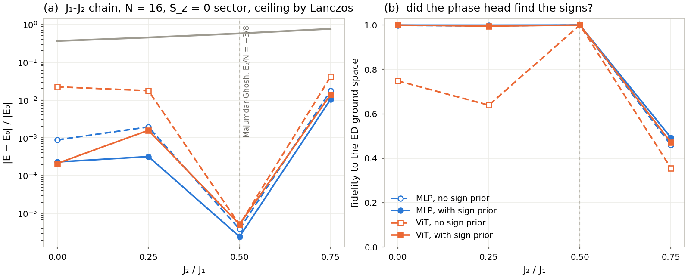

# 2026-09-11 Neural quantum states — planning/transformer_wavefunction_demo.md, phases 0–4

`lake exe nqs-ising` on the transverse-field Ising chain, periodic,
H = −J Σ σᶻᵢσᶻᵢ₊₁ − h Σ σˣᵢ. XLA backend, one RTX 4060 Ti per run,
`LEAN_MLIR_MEM_FRACTION=0.1–0.15`. Every number below is bracketed by a closed
form: enumeration of all 4096 configurations at N = 12, Jordan-Wigner at N = 64
(`scripts/nqs_metrics.py`; the two agree to 7e-15 at N = 12, `gate`).

The ansatz is ψ_θ(σ) = ψ_ref(σ) · exp f_θ(σ) with ψ_ref the mean-field product
state at the optimal angle (a fixed visible bias, linear in σ) and f_θ one of

| arm | network | params | input |
|---|---|---:|---|
| MLP residual | `.dense N 64 .relu, .dense 64 64 .relu, .dense 64 1` | 5,057 (N = 12) | σ as ±1 floats |
| ViT residual | `tokenPositionEmbed` → 2 encoder blocks, d = 32, 2 heads, mlp 128 (`keepSequence`) → mean over tokens → `.dense 32 1` | 25,825 | patches of p spins as token ids (p = 2 at N = 12, p = 4 at N = 64) |
| GPT | the same tokens with a BOS → 2 causal blocks → `lmHead`; \|ψ\|² = Π_k p(patch_k \| <k), log ψ = ½ Σ log p, the reference as a fixed logit bias | 25,956 | patch ids |

Zero new codegen. The energy gradient ∂E/∂θ = 2 Σ_s p_s (E_loc(s) − E) ∂_θ log ψ(s)
enters through the rank-2 DDPM MSE block with the target y = out − M·w/2, so the
block's output cotangent is exactly w_s = 2 p_s (E_loc(s) − E) (for the GPT the host
chains the softmax Jacobian first). Every ψ evaluation is the eval graph. Adam, cosine
decay to 5 %; the head is zeroed at init so step 0 *is* the reference.

Samples: exact weights at N = 12 (no Monte Carlo anywhere in the gradient);
at N = 64, Metropolis single-spin flips on 1024 chains (MLP, ViT; 2 sweeps between
steps, acceptance off ψ² ratios from the batched eval graph) and exact
autoregressive draws for the GPT. E_loc needs ψ at the N single-flip neighbours of
every sample: one forward at batch B·N = 65,536.

## Gates (§8)

- **Phase 0.** Enumeration vs Jordan-Wigner at N = 12, h = 0.2 … 2.0: E0, ⟨σˣ⟩ and
  every C(r) agree to 7e-15 (`python3 scripts/nqs_metrics.py gate`).
- **R1 at f_θ = 0 prints the mean-field row.** Step 0 of every run: E = −15.000000
  at h = J, N = 12 (E_MF/N = −J cos²φ − h sin φ = −1.25), Var(E_loc) = 0.75.
- **The samplers, where the answer is known** (`check`, `checks/`): after training at
  N = 12, draw with the N = 64 machinery and score E_loc by table lookup.
  Autoregressive: 16,384 independent draws, E within 0.1 s.e. and ⟨σˣ⟩ within 1.1 s.e.
  of the enumerated values of the same wavefunction. Metropolis (ViT): z = 0.0 and 0.1.
  ⚠ On a trained state single checks scatter wider than N(0, 1) (eight draw seeds on
  one state: z from −1.7 to +2.3, pooled offset −1.3e-4 ± 3.4e-4) because E_loc is
  heavy-tailed; the pooled test is the one that decides, and it passes.
- **Regression gate** (§5): MLP residual at h = J, N = 12: rel err 1.6e-5 ≤ 1e-4,
  Var 4.3e-3 ≤ 1e-2 — PASS (`score --gate`).

## Table 1 — the ladder at h = J

N = 12, 4000 steps each (MLP lr 3e-3, ViT 1e-3, GPT 3e-3, cosine). `n12/table.md`.

| N = 12, h/J = 1 | params | (E − E0)/\|E0\| | Var(E_loc) | ⟨σˣ⟩ | C(6) |
|---|---:|---:|---:|---:|---:|
| mean field (floor) | 0 | 2.1e-02 | 0 | 0.5000 | 0.7500 |
| MLP residual | 5,057 | 1.6e-05 | 4.3e-03 | 0.6383 | 0.4613 |
| ViT residual | 25,825 | 1.5e-05 | 2.5e-03 | 0.6381 | 0.4618 |
| GPT | 25,956 | 3.3e-06 | 5.2e-04 | 0.6384 | 0.4611 |
| exact (enumeration) | — | 0 | 0 | 0.6384 | 0.4610 |

N = 64, p = 4 (16 tokens of vocabulary 16), 2000 steps, 1024 chains, the final
row from 8 × 1024 samples. `n64/table.md`.

| N = 64, h/J = 1 | params | (E − E0)/\|E0\| | Var(E_loc) | ⟨σˣ⟩ | C(32) |
|---|---:|---:|---:|---:|---:|
| mean field (floor) | 0 | 1.8e-02 | 0 | 0.5000 | 0.7500 |
| MLP residual, Metropolis | 8,385 | 5.9e-03 ± 2.6e-04 | 3.7 | 0.5660 | 0.6256 |
| ViT residual, Metropolis | 26,529 | 2.1e-03 ± 9.4e-05 | 4.8e-01 | 0.5921 | 0.5616 |
| GPT, exact sampling | 27,056 | 1.7e-04 ± 1.9e-05 | 2.0e-02 | 0.6341 | 0.3498 |
| GPT, lr 1e-3, 4000 steps | 27,056 | 1.5e-04 ± 1.9e-05 | 1.9e-02 | 0.6323 | 0.3374 |
| exact (Jordan-Wigner) | — | 0 | 0 | 0.6367 | 0.3036 |

The ± is the Monte Carlo standard error of the sample energy over the 8,192 final
samples (independent for the GPT; a lower bound for the chains). At the critical
point the GPT's long-range correlation is still short of exact after 2000 steps
(0.350 against 0.304, panel (c) of the figure); the ViT's Metropolis rows carry
the broken-symmetry signature (C above exact) below h = J and a variance of order
one above it.

## The field sweep, N = 12 (`n12/sweep.md`)

| h/J | E0 (enumeration) | mean field | MLP | ViT | GPT | Var, MLP | Var, ViT | Var, GPT | C(6) exact | C(6), MLP | C(6), ViT | C(6), GPT |
|---:|---:|---:|---:|---:|---:|---:|---:|---:|---:|---:|---:|---:|
| 0.2 | -12.1203 | 2.5e-05 | 4.0e-09 | 1.6e-08 | 1.5e-09 | 4.4e-07 | 9.6e-07 | 9.0e-08 | 0.9898 | 0.9898 | 0.9898 | 0.9898 |
| 0.4 | -12.4850 | 4.0e-04 | 2.9e-07 | 9.5e-07 | 2.2e-07 | 1.0e-05 | 6.3e-05 | 7.0e-07 | 0.9573 | 0.9574 | 0.9574 | 0.9573 |
| 0.6 | -13.1072 | 2.1e-03 | 2.4e-05 | 2.6e-05 | 2.3e-05 | 1.0e-04 | 3.0e-04 | 9.2e-06 | 0.8939 | 0.8944 | 0.8945 | 0.8944 |
| 0.8 | -14.0211 | 7.2e-03 | 1.7e-05 | 5.4e-04 | 1.5e-06 | 3.4e-03 | 1.1e-03 | 2.2e-04 | 0.7622 | 0.7626 | 0.7761 | 0.7622 |
| 1 | -15.3226 | 2.1e-02 | 1.6e-05 | 1.5e-05 | 3.3e-06 | 4.3e-03 | 2.5e-03 | 5.2e-04 | 0.4610 | 0.4613 | 0.4618 | 0.4611 |
| 1.2 | -17.0490 | 4.3e-02 | 1.9e-05 | 2.6e-05 | 3.0e-06 | 6.3e-03 | 6.6e-03 | 5.8e-04 | 0.1787 | 0.1787 | 0.1792 | 0.1786 |
| 1.4 | -19.0253 | 6.0e-02 | 1.9e-05 | 9.6e-06 | 1.8e-06 | 8.1e-03 | 2.7e-03 | 4.3e-04 | 0.0686 | 0.0686 | 0.0688 | 0.0684 |
| 1.6 | -21.1269 | 6.8e-02 | 1.5e-05 | 1.6e-05 | 5.7e-07 | 7.8e-03 | 6.5e-03 | 1.7e-04 | 0.0297 | 0.0298 | 0.0297 | 0.0297 |
| 1.8 | -23.3019 | 6.8e-02 | 1.3e-05 | 5.3e-06 | 3.8e-07 | 8.3e-03 | 2.5e-03 | 1.4e-04 | 0.0143 | 0.0143 | 0.0144 | 0.0143 |
| 2 | -25.5251 | 6.0e-02 | 1.1e-05 | 1.9e-06 | 5.6e-07 | 7.7e-03 | 1.0e-03 | 1.9e-04 | 0.0075 | 0.0075 | 0.0075 | 0.0075 |

Reading the table: the reference's error grows with h and peaks past the transition
at seven percent; the residual networks sit four to nine orders lower. At h ≤ 0.4 the
errors are 1e-7 to 1e-9 — not because the networks are better there, but because the
finite-N splitting between the symmetric ground state and the reference's
symmetry-broken product state is that small, so the floor is already almost the
answer (see the ablation).

**⚠ The ViT at h = 0.8 sits at exactly half the gap.** 5.4e-4 with a *low* variance
(1.1e-3) and C(6) = 0.776 against the exact 0.762: low variance plus a wrong energy is
the §8 "converged to the wrong state" signature. The excess 0.00759 equals Δ/2 =
0.00760 (Δ = 0.01521, the even–odd splitting at N = 12, h = 0.8): the ViT converged to
the symmetry-broken component (|even⟩ + |odd⟩)/√2 that the product-state reference
imprints, and never restored the Z2 symmetry the finite-N ground state has. Seeds 2
and 3, 8000 steps, d = 64, 4 blocks and p = 3 all land on the same E (`ablation/`).
The MLP restores the symmetry on its own (1.7e-5); the GPT does not need to. The fix
is more structure, not more network: `symref`, the Z2-symmetrised reference
ψ_MF(σ) + ψ_MF(−σ), a host-side `logaddexp`, takes the ViT to 2.0e-5 and the MLP to
9.2e-6 at that point (`sym12/` runs the whole sweep with it).

## The field sweep, N = 64 (`n64/sweep.md`)

ViT and GPT at every h (p = 4, 2000 steps, 1024 chains; MLP at h = J only). Errors
carry the Monte Carlo s.e.; a negative entry is an estimate below E0 by less than
its error.

| h/J | E0 (Jordan-Wigner) | mean field | MLP | ViT | GPT | Var, MLP | Var, ViT | Var, GPT | C(32) exact | C(32), MLP | C(32), ViT | C(32), GPT |
|---:|---:|---:|---:|---:|---:|---:|---:|---:|---:|---:|---:|---:|
| 0.2 | -64.6416 | 2.5e-05 | · | 5.7e-06 ± 7.3e-06 | 2.0e-06 ± 2.9e-07 | · | 1.8e-03 | 2.8e-06 | 0.9898 | · | 0.9898 | 0.9901 |
| 0.4 | -66.5867 | 4.0e-04 | · | 3.9e-05 ± 2.5e-05 | 1.4e-05 ± 1.4e-06 | · | 2.2e-02 | 7.0e-05 | 0.9573 | · | 0.9578 | 0.9568 |
| 0.6 | -69.9033 | 2.0e-03 | · | 3.0e-04 ± 5.3e-05 | -3.5e-06 ± 3.7e-06 | · | 1.1e-01 | 5.6e-04 | 0.8944 | · | 0.8995 | 0.8934 |
| 0.8 | -74.7398 | 6.7e-03 | · | 7.5e-04 ± 6.7e-05 | 3.2e-05 ± 1.8e-05 | · | 2.0e-01 | 1.5e-02 | 0.7746 | · | 0.7911 | 0.7727 |
| 1 | -81.4955 | 1.8e-02 | 5.9e-03 ± 2.6e-04 | 2.1e-03 ± 9.4e-05 | 1.7e-04 ± 1.9e-05 | 3.7e+00 | 4.8e-01 | 2.0e-02 | 0.3036 | 0.6256 | 0.5616 | 0.3498 |
| 1.2 | -90.8556 | 4.2e-02 | · | 6.0e-03 ± 1.5e-04 | 3.3e-05 ± 2.0e-05 | · | 1.4e+00 | 2.6e-02 | 0.0008 | · | 0.1351 | 0.0001 |
| 1.4 | -101.4521 | 6.0e-02 | · | 1.8e-02 ± 3.4e-04 | 1.9e-05 ± 1.1e-05 | · | 9.6e+00 | 9.9e-03 | 0.0000 | · | 0.0625 | 0.0043 |
| 1.6 | -112.6725 | 6.8e-02 | · | 1.8e-04 ± 5.4e-05 | 1.4e-05 ± 1.3e-05 | · | 3.0e-01 | 1.7e-02 | 0.0000 | · | -0.0034 | -0.0008 |
| 1.8 | -124.2755 | 6.8e-02 | · | 4.9e-04 ± 6.9e-05 | 1.7e-08 ± 6.8e-06 | · | 6.0e-01 | 5.8e-03 | 0.0000 | · | 0.0050 | -0.0004 |
| 2 | -136.1337 | 6.0e-02 | · | 7.8e-05 ± 4.8e-05 | 9.6e-04 ± 8.1e-05 | · | 3.4e-01 | 1.0e+00 | 0.0000 | · | -0.0014 | 0.0029 |

Three things the N = 64 sweep says. **Exact sampling wins.** The GPT, whose draws
are independent and whose gradient noise is only the batch's, sits at 1e-5 to 1e-4
at every field but the critical point; the ViT on Metropolis chains is ten to a
thousand times worse at the same parameter count and step budget, and at h = 1.4
its local-energy variance never drops below 10. **The reference's broken symmetry
survives at N = 64 too.** For h ≤ 0.8 the ViT's C(32) sits above exact (0.791 vs
0.775 at h = 0.8) — the same state as the N = 12 outlier — while the GPT's
correlation matches. **Budget matters on the paramagnetic side.** The GPT at h = 2
plateaued at 9.6e-4 with Var 1.0 at lr 3e-3; the same net at lr 1e-3 for 4000 steps
reaches −2.2e-6 ± 3.7e-6 with Var 4.8e-3 (`n64/reruns/`). Reruns at the two weakest
points:

| N = 64 rerun | recipe | (E − E0)/\|E0\| | Var(E_loc) | C(32) (exact) |
|---|---|---:|---:|---:|
| GPT, h = 2.0 | lr 3e-3, 2000 steps (sweep) | 9.6e-04 ± 8.1e-05 | 1.0 | 0.0029 (0) |
| GPT, h = 2.0 | lr 1e-3, 4000 steps | −2.2e-06 ± 3.7e-06 | 4.8e-03 | −0.0029 (0) |
| GPT, h = 1.0 | lr 3e-3, 2000 steps (sweep) | 1.7e-04 ± 1.9e-05 | 2.0e-02 | 0.350 (0.304) |
| GPT, h = 1.0 | lr 1e-3, 4000 steps | 1.5e-04 ± 1.9e-05 | 1.9e-02 | 0.337 (0.304) |
| ViT, h = 1.4 | lr 1e-3, 2000 steps, 1024 chains (sweep) | 1.8e-02 ± 3.4e-04 | 9.6 | 0.063 (0) |
| ViT, h = 1.4 | lr 1e-3, 4000 steps, 2048 chains | 1.8e-01 ± 2.1e-03 (diverged) | 7.1e+02 | 0.415 (0) |

Budget fixes the h = 2 plateau and nothing else: at the critical point the GPT with
twice the steps and a third of the learning rate lands where it was (1.5e-4, C(32)
0.337 against 0.304), and the ViT at h = 1.4 with twice the chains and steps
*diverges* (Var 7e2 from step ~2000 on; `n64/reruns/`). Both are the regime the
plan's R5 (stochastic reconfiguration) was written for; nothing at N = 12 needed it.

## Table 2 — the structure ablation (`ablation/table2.md`)

Same network, same steps, from the uniform start (`noref`) and from the reference.

| N = 12 | h/J | uniform start | mean-field reference | ratio |
|---|---:|---:|---:|---:|
| GPT | 0.2 | 3.7e-06 | 1.5e-09 | 2,424× |
| MLP residual | 0.2 | 4.1e-06 | 4.0e-09 | 1,030× |
| ViT residual | 0.2 | 3.0e-05 | 1.6e-08 | 1,955× |
| GPT | 0.4 | 3.6e-05 | 2.2e-07 | 168× |
| MLP residual | 0.4 | 9.1e-06 | 2.9e-07 | 31× |
| ViT residual | 0.4 | 4.2e-05 | 9.5e-07 | 45× |
| MLP residual | 1 | 3.9e-05 | 1.6e-05 | 2× |
| ViT residual | 1 | 1.5e-05 | 1.5e-05 | 1× |

Structure buys three orders of magnitude at h = 0.2 and about two at h = 0.4; at
h = J it buys nothing, because there the reference is as wrong as the uniform state
(2.1e-2 against 2.7e-2) and the network does all the work either way. The mock's
prediction that the uniform start *stalls* in the polarised state did not
reproduce for these networks: from the uniform state Adam reaches 1e-5 everywhere.
The honest sentence is "structure buys X orders where the reference is nearly
right", with X read off the ratio column.

## Table 3 — rung R4, the J1-J2 chain with a phase head (`j1j2/table3.md`)

`model=j1j2`: H = J1 Σ Sᵢ·Sᵢ₊₁ + J2 Σ Sᵢ·Sᵢ₊₂ in the S_z = 0 sector by enumeration
(12,870 configurations at N = 16), a two-slot head (log|ψ|, φ) on the MLP (hidden 64)
and the ViT (d = 32, p = 2), the amplitude reference uniform and the phase reference
the Marshall sign (−1)^(up spins on the even sublattice), 4000 steps (MLP lr 3e-3,
ViT 2e-3, cosine). The complex gradient is two host weights per configuration,
2p·Re(E_loc − E) on the amplitude slot and 2p·Im(E_loc − E) on the phase slot,
through the same MSE block (`ddpmOutShape := [M, 2, 1, 1]`); the local energies with
their bond exchanges are `lean_nqs_j1j2_eloc`. Ceiling: Lanczos in the sector
(`nqs_metrics.py j1j2`), which reproduces −3/8 per site at the Majumdar-Ghosh point to
2e-16. Fidelity is the projection onto the ED ground *space* (two-dimensional at
J2 = J1/2, the two dimerisations). Without the prior (`noref`) the head keeps its He
init: a zero head there is the uniform positive state, the S = N/2 eigenstate of
the sector, where the gradient vanishes exactly.

| N = 16 | J2/J1 | sign prior | (E − E0)/\|E0\| | Var(E_loc) | fidelity | C(8) (exact) |
|---|---:|---|---:|---:|---:|---:|
| uniform × Marshall (floor) | 0 | yes | 3.7e-01 | · | · | · |
| MLP | 0 | yes | 2.3e-04 | 9.2e-03 | 0.9997 | 0.1127 (0.1117) |
| MLP | 0 | no | 8.9e-04 | 3.2e-02 | 0.9985 | 0.1149 (0.1117) |
| ViT | 0 | yes | 2.1e-04 | 8.6e-03 | 0.9997 | 0.1119 (0.1117) |
| ViT | 0 | no | 2.2e-02 | 3.4e-01 | 0.7485 | 0.1562 (0.1117) |
| exact (Lanczos, 12870 states) | 0 | — | 0 | 0 | 1 | 0.1117 |
| uniform × Marshall (floor) | 0.25 | yes | 4.5e-01 | · | · | · |
| MLP | 0.25 | yes | 3.2e-04 | 9.1e-03 | 0.9995 | 0.0811 (0.0811) |
| MLP | 0.25 | no | 2.0e-03 | 5.3e-02 | 0.9962 | 0.0844 (0.0811) |
| ViT | 0.25 | yes | 1.6e-03 | 4.3e-02 | 0.9954 | 0.0844 (0.0811) |
| ViT | 0.25 | no | 1.8e-02 | 1.3e-01 | 0.6391 | 0.0402 (0.0811) |
| exact (Lanczos, 12870 states) | 0.25 | — | 0 | 0 | 1 | 0.0811 |
| uniform × Marshall (floor) | 0.5 | yes | 5.8e-01 | · | · | · |
| MLP | 0.5 | yes | 2.4e-06 | 3.8e-05 | 1.0000 | 0.0001 (0.0058) |
| MLP | 0.5 | no | 3.9e-06 | 8.5e-05 | 1.0000 | 0.0002 (0.0058) |
| ViT | 0.5 | yes | 5.2e-06 | 1.4e-04 | 1.0000 | -0.0000 (0.0058) |
| ViT | 0.5 | no | 5.0e-06 | 1.4e-04 | 1.0000 | -0.0001 (0.0058) |
| exact (Lanczos, 12870 states) | 0.5 | — | 0 | 0 | 1 | 0.0058 |  (Majumdar-Ghosh: exactly −3/8 per site)
| uniform × Marshall (floor) | 0.75 | yes | 7.7e-01 | · | · | · |
| MLP | 0.75 | yes | 1.0e-02 | 8.0e-02 | 0.4928 | -0.0058 (-0.0468) |
| MLP | 0.75 | no | 1.8e-02 | 1.2e-01 | 0.4595 | -0.0069 (-0.0468) |
| ViT | 0.75 | yes | 1.4e-02 | 1.4e-01 | 0.4717 | -0.0030 (-0.0468) |
| ViT | 0.75 | no | 4.1e-02 | 3.1e-01 | 0.3556 | -0.0018 (-0.0468) |
| exact (Lanczos, 12870 states) | 0.75 | — | 0 | 0 | 1 | -0.0468 |

Gates: step 0 of every prior run prints the floor to six digits (−4.533333 at N = 16,
J2 = 0, −3.545455 at N = 12); Im E stays at 1e-11 or below throughout.

What the rung says. **The mechanics work**: a complex ψ trains through the real
MSE block with two weights per configuration, and the phase head learns the Marshall
signs from scratch at J2 = 0 (MLP without the prior: Marshall weight 0.99997,
fidelity 0.9985). **The Majumdar-Ghosh point is easy** for every arm — 3e-6, fidelity
1.0000, with or without the prior — because the dimer state is a product of
singlets and the sign rule holds there. **The frustrated side is the hard part**:
past the MG point the Marshall rule breaks (the exact state puts only half its weight
on it), and at J2 = 0.75 every arm stalls at 1e-2 with a fidelity of 0.35–0.49, the
prior helping by a factor of two in energy and nothing more. That is the row the
phase head was built for, and at this width and budget it does not find the sign
structure. The ViT without the prior also stalls at J2 ≤ 0.25 (fidelity 0.64–0.75,
Var 0.1–0.3) where the MLP does not. Phase-4 numbers with the prior at J2 ≤ 0.25 sit
at 2e-4 rather than the Ising rungs' 2e-5: a wider pass (`j1j2/wide/`) tests whether
that is capacity.

**The wider pass** (`j1j2/wide/`, MLP hidden 256 and ViT d = 64 with 4 heads, 8000
steps, with the prior) settles the capacity question for the unfrustrated rows and
not for the frustrated one:

| N = 16 | J2/J1 | sign prior | (E − E0)/\|E0\| | Var(E_loc) | fidelity | C(8) (exact) |
|---|---:|---|---:|---:|---:|---:|
| uniform × Marshall (floor) | 0 | yes | 3.7e-01 | · | · | · |
| MLP | 0 | yes | 4.4e-06 | 2.0e-04 | 1.0000 | 0.1117 (0.1117) |
| ViT | 0 | yes | 7.8e-06 | 3.5e-04 | 1.0000 | 0.1121 (0.1117) |
| exact (Lanczos, 12870 states) | 0 | — | 0 | 0 | 1 | 0.1117 |
| uniform × Marshall (floor) | 0.25 | yes | 4.5e-01 | · | · | · |
| MLP | 0.25 | yes | 1.3e-05 | 3.8e-04 | 1.0000 | 0.0812 (0.0811) |
| ViT | 0.25 | yes | 1.1e-05 | 3.4e-04 | 1.0000 | 0.0813 (0.0811) |
| exact (Lanczos, 12870 states) | 0.25 | — | 0 | 0 | 1 | 0.0811 |
| uniform × Marshall (floor) | 0.5 | yes | 5.8e-01 | · | · | · |
| MLP | 0.5 | yes | 4.5e-07 | 7.6e-06 | 1.0000 | -0.0000 (0.0058) |
| ViT | 0.5 | yes | 2.3e-07 | 6.3e-06 | 1.0000 | 0.0000 (0.0058) |
| exact (Lanczos, 12870 states) | 0.5 | — | 0 | 0 | 1 | 0.0058 |  (Majumdar-Ghosh: exactly −3/8 per site)
| uniform × Marshall (floor) | 0.75 | yes | 7.7e-01 | · | · | · |
| MLP | 0.75 | yes | 5.6e-03 | 2.2e-02 | 0.5844 | -0.0199 (-0.0468) |
| ViT | 0.75 | yes | 6.1e-03 | 2.3e-02 | 0.5369 | -0.0145 (-0.0468) |
| exact (Lanczos, 12870 states) | 0.75 | — | 0 | 0 | 1 | -0.0468 |

At J2 ≤ 0.25 the wider nets reach 4e-6 to 1e-5 with fidelity 1.0000, the Ising
rungs' level; at the MG point 2e-7 to 5e-7; at J2 = 0.75 the error halves to 6e-3 and
the fidelity moves from 0.47–0.49 to 0.54–0.58. The frustrated sign structure is a
different problem from the rest of the rung, and width and budget only nibble at it.



## Timing

N = 12 (enumeration, batch 4096): MLP 12 ms/step, ViT 20 ms, GPT 80 ms — 4000 steps
in 50 s / 82 s / 330 s including XLA compile. N = 64 (1024 chains): ViT ~0.7 s/step
alone (128 Metropolis forwards at batch 1024 + the 65,536-row flip forward), GPT
~0.5 s/step (16 autoregressive forwards + the flip forward), MLP 0.3 s/step — after
the host-side input building, up-spin counts, patch ids and the categorical draw moved
into `ffi/f32_helpers.c` (`lean_nqs_*`). In Lean those loops cost ~1.5 µs per
pushed float, 11 s/step for the MLP at N = 64. The N = 64 runs here were two to three
per GPU, so their logs show 1.1–1.5 s/step.

## Layout

```
n12/        <arch>_h<h>_metrics.json + _curve.csv for the sweep; sweep.md, table.md; logs/
n64/        the same at N = 64 (ViT, GPT at every h; MLP at h = J)
sym12/      the N = 12 sweep with the Z2-symmetrised reference (MLP, ViT)
ablation/   the noref runs (Table 2) and the h = 0.8 investigation; logs/
checks/     the sampler gates (`check` runs)
j1j2/       rung R4: the J1-J2 chain at N = 16, metrics + psi dumps + curves, table3.md, logs/, wide/
samples/    the GPT `_samples.bin` dumps the figure reads: every configuration with its p(σ) at N = 12, h = J (`g2_h100`),
            and the first 256 of the 8,192 autoregressive draws at N = 64 for h = 0.2 (`q1_h20`), 1.0 (`q3_h100`) and 2.0 (`r2_h200`, the lr 1e-3 rerun)
nqs_j1j2.png    the rung-4 figure (scripts/nqs_j1j2_figure.py)
nqs_ising.png   the figure (scripts/nqs_figure.py): samples at three fields, network vs exact p(σ), the N = 64 sweep
```

Reproduce one row:

```bash
export LEAN_MLIR_MEM_FRACTION=0.1
lake exe nqs-ising gpt N=12 h=1.0 steps=4000 lr=0.003 cosine          # 330 s
lake exe nqs-ising vit N=64 h=1.0 p=4 steps=2000 lr=0.001 cosine      # ~25 min
python3 scripts/nqs_metrics.py score GPT=.lake/build/nqs_ising_gpt_n12_h100_metrics.json --gate
```
